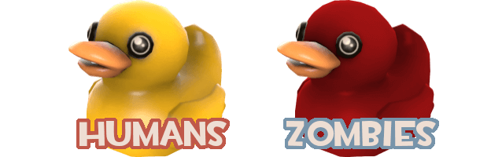

# Items

On certain maps, there will be little red and yellow ducks like TF2's old Bonus Ducks scattered throughout the environments. These ducks will have particles or separate models attached and represent items that players can pick up and use. <mark style="color:yellow;">**Yellow**</mark> ducks can only be picked up by <mark style="color:blue;">**Humans**</mark> whereas <mark style="color:red;">**Red**</mark> ducks can only be picked up <mark style="color:red;">**Zombies.**</mark> _`Smaller note, some maps might use different colors for the ducks!`_


## <mark style="color:red;">If you pick up a zombie item as a Zombie, you are unable to use your Enzyme or use any Demo shields!</mark>


## How to Use Them


* ### <mark style="color:yellow;">To use an item, press</mark> <mark style="color:yellow;"></mark><mark style="color:yellow;">**E**</mark>
* ### <mark style="color:yellow;">To drop an item, press</mark> <mark style="color:yellow;"></mark><mark style="color:yellow;">**L**</mark>


Note that ( **L** ) is mentioned as that is your default dropitem command in TF2. If it is not working, try rebinding it.&#x20;

`bind L dropitem`

Similarly can be said about your item use key in TF2, ( E ).\
`bind E "voicemenu 0 0" // Note that this is your Medic! call!`

If these keys are bound to something else, feel free to bind the commands to different ones. If you'd rather avoid binding keys, you can also simply type out the bound command in your TF2 console.

Also know that some item effects are bound to the physical item itself. As a result, you can drop items whose effect follows you if you need it to stay in a specific area.

## What Do They Do?

They can do a **wide variety** of things - anything the mapper can successfully implement. They are primarily meant to assist the human team in defending, retreating from zombies, fighting bosses, etc.

For the zombie team, they help with killing humans usually through self or team buffs or by negatively affecting humans. While there is a plethora of items scattered throughout all ZE maps, most items can primarily be categorized as the following:

### Pushes

Push items grant the team spacing from the zombies by some force. They can also be used to bolster a hold by pushing zombies into kill or teleport triggers thus easing the pressure on defenders. The strength of the pushes and pulls depend on the item and can range from being very weak to very strong depending on map balance or intended utility. If specific item names are hard to memorize, most people would just refer to anything that pushes as **Wind**.

### Pulls

Pull items will pull zombies into specific areas or allow zombies to pull humans towards them. For humans, they may seem counterintuitive given that you are effectively closing the distance between yourselves and zombies near instantaneously. However, if used right, they can act similar to wind by pulling zombies into kill or teleport triggers to help defenses or stall out for retreats. For zombies, it's helpful for killing humans due to this "close-the-distance" aspect. Any stray humans you find overdefending can be quickly pulled in and killed. Most commonly, since these items usually pull players into themselves within a radius, they are called **Gravity**.

### Slows

Slow items can come in a wide variety. They are meant to stall the zombies during retreats or to provide some hold time during defenses. Against the humans, slows can allow zombies to reach overdefenders and take them out.

### Freezes

Freeze items also come in a wide variety. For humans, they are meant to hold zombies in place for safety on retreats or assist in holding during defenses. Against the humans, freezes can perform the same effect as slows for reaching overdefenders to take them out.

### Walls

One could consider this as a form of Freezes or a subset of them. These type of items are meant to act like blockades and prevent zombies from breaking through holds. They usually rely on player/object collision allowing humans to delay zombies by getting them stuck in spawned objects. Across different maps, people may simply refer to it as "**Earth**" or "**Wall**" items.

In only a few cases do these affect only the opposing team. In most, you'll find that the human versions also affect fellow humans. As such, these have the alternative use of trolling your team by getting them stuck (griefing if you end up killing them) or the beneficial use of saving your team from map hazards by holding them back from death zones. You can also use these as walkways or surf sections if you place them correctly.

### Heals

Heal items are used to heal teammates. These can be important for humans **during boss fights where healing may be nerfed or removed entirely.** They can also serve as a secondary source of health against map hazards or zombies that chain Mutations to constantly pressure humans. For zombies, these may be less important but still provide the utility of healing if a group of zombies are low on health but would like to coordinate a push.

### Damage

Damage items can be used to either damage zombies, humans, or even bosses and may do so in varying amounts. Despite constantly shooting at zombies in ZE, their health is usually too exorbitant to deal with using guns and melees alone. Damage items can help as a secondary source of damage. They may kill them outright or deal enough damage for you to finish them off. Zombies can use damage items to instead kill humans already low at health, kill any overdefenders, and to increase the overall pressure on humans.

### Ultimas

Ultimas could arguably fall into the niche of damage as they are usually meant to outright nuke zombies. However, what can be considered as the "**ultimate item**" of a map can vary depending on what that item does, how strong it is, or how hard it is to get it. For example, an Ultima might actually be a nuke that kills all zombies close by whereas another Ultima might be able to instakill bosses.

## Some Terms

Here are some item descriptors you might occasionally hear.

<table><thead><tr><th width="211">Term</th><th>Description</th></tr></thead><tbody><tr><td><strong>Recharge</strong></td><td>How long it takes for you to use an item again. On most maps, this is around 60 seconds, but this can vary significantly.</td></tr><tr><td><strong>Charge Time/Windup</strong></td><td>How long it takes for the effect of an item to fully activate after using it.</td></tr><tr><td><strong>Uses</strong></td><td>The amount of times you can use an item</td></tr><tr><td><strong>Linear</strong></td><td>The item affects a line in front of it</td></tr><tr><td><strong>AoE</strong></td><td>The item affects a radius around it</td></tr><tr><td><strong>Static</strong></td><td>The item remains in-place wherever it was used</td></tr><tr><td><strong>"Follows You"</strong></td><td>The item follows you while it's active</td></tr></tbody></table>

