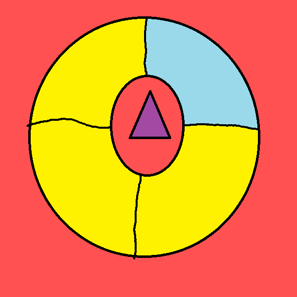
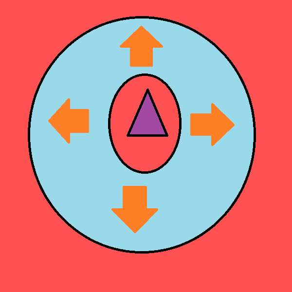
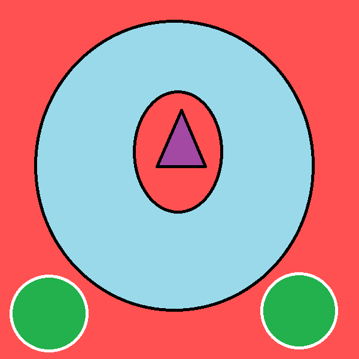
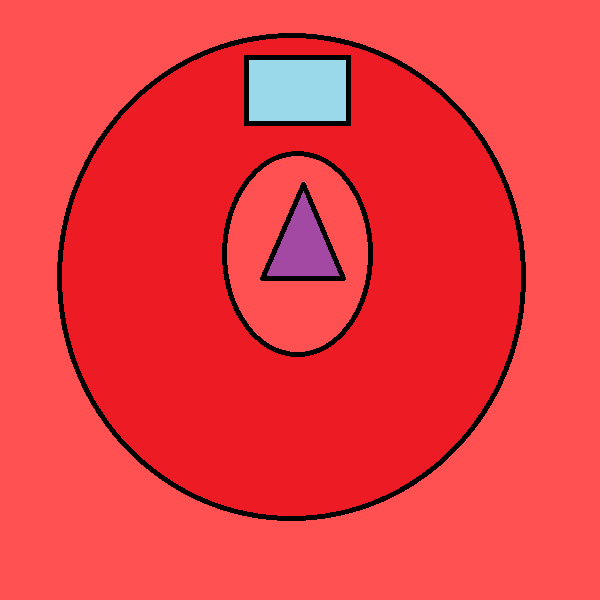

# Bosses

## HP Scaling

A boss' HP is typically scaled according to how many humans are currently in the boss arena or the amount of humans alive during a point in time. In most cases, if too many humans die during a boss fight, the boss' HP will remain scaled to the original amount of humans that scaled it in the first place. This will result in _very_ long boss fights for everybody.&#x20;

Some bosses may have _multiple life bars_, such as 10; which allows for the HP Value to **re-scale** at every new bar for situations where nearly the entire team has died; allowing for the select few people remaining to get through the boss seamlessly.\
\
With scaling in mind, a few situations might call for strategies of only allowing **one person** to fight the boss. As a result, its HP will be scaled low enough such that the boss can be killed much faster than usual or at least in more reasonable amount of time. Such cases can be found in `ze_dark_souls`, `ze_otakuroom` and `ze_ffxii_westersand`.

## Fight Mechanics

Here are some elements of a boss fight you may come across. In the second segment will also be some mockup photos on what the attacks can look like, mostly color coded. ~~I also suck at making anything symmetrical so sorry if it hurts your poor eyes.~~

### Zombie Participation

In most cases, the Zombie team will be separated from the Human team to allow the survivors to focus on fighting the boss. Just so the zombies aren't bored, there will occasionally be spectator booths around the arena to watch all the action unfold. If that's not the case, then they are usually able to continue their pressure by taking designated routes to enter the arena and kill the humans all while they still have to worry about fighting the boss.

### Damage on Touch

If you find yourself in an arena with the boss itself and it's moving around, more likely than not will touching the boss damage you. Sometimes this won't be enough to kill you, but other times it will be certain death!

### Time

The faster you kill a boss, the less the amount of attacks are fired - thus potentially less human deaths. Some bosses even have a time limit before they instantly kill the entire human team. With this in mind, make sure your team composition has good DPS! Recall that the best classes for damage against bosses are Scouts with the Back Scatter, Heavies with Brass Beast (which can be replaced with the Tomislav for greater movement), and Spy's Revolver.

### Nerfed Healing

While in regular TF2 you might be accustomed to the healing benefits of a Medic or an Engineer's dispenser, sometimes, healing rates or amounts may be lessened drastically or entirely disabled during boss fights. This means that you cannot just hug a nearby dispenser or spam your Medic! call and expect to live via rapid healing. You gotta learn to dodge!

### Items

There may be fight gimmicks where items are necessary to either survive or damage the boss. These attacks might outright instakill you or damage you fast enough such that only a heal item would save you. This is why it's crucial to be careful with whenever you use them as using items at the wrong time might result in a team wipe!

### Awareness and Common Sense

The best thing to do to survive a boss fight is to make sure you listen! There will typically be leaders that tell you how to avoid boss attacks and what to do to make sure you don't die. A map might also tell you in chat what attacks a boss does and how to avoid them. If you do die to a boss, take note of the attacks and how the humans dodge them so you don't die yourself the next time you face the boss.

## Common Boss Patterns

## Mockup Color Key

Here's what a typical boss arena _**might**_ be laid out like, often squares or circular areas, sometimes even hexagons - with borders that damage you for touching them or even **instant kill.** Let's assume the latter with this boss fight color key; ~~again sorry for how awful this is in symmetry.~~

* <mark style="color:purple;">**Purple**</mark> **=** **Boss, shoot this!**
* <mark style="color:red;">**Red**</mark> **=** **Instant Kill on Touch!**
* <mark style="color:blue;">**Blue**</mark> **=** **Fight** **Arena**
* <mark style="color:green;">**Green**</mark> **=** **Zombie Spawns**
* <mark style="color:yellow;">**Yellow**</mark>** = Damage**
* <mark style="color:orange;">**Orange**</mark>** = Other - Slow, Push/Pull etc**

.png>)

These are some common elements you might come across map-to-map when fighting bosses. They don't make up the entire scope of attacks - something only limited to the mapper's imagination - but are something you might want to be wary of due to their frequent usage.

### Unavoidable Damage

Sometimes, no matter what you do, you will not be able to avoid damage. Fortunately, there is copious amounts of healing sources in TF2 ZE. Even some sources are nerfed or disabled, you can usually find items meant for the map to allow you to recover the HP lost.

.png>)                      &#x20;

### AoE Attacks

Bosses will typically attack a certain section of the arena, forcing Humans to avoid certain parts of the arena usually either in the outer or inner sections. Some maps will tell you where to avoid and may also have particle effects of where the attack will hit.

                      .png>)

### Targeted Attacks

If a boss is an object that moves around the arena and has contact damage, it'll lock onto a player, following them and trying to ram into them to kill them before losing interest and going after another player. If the boss is after you, you can attempt to **circle strafe** it to avoid it ramming into you until it goes after another player.

### Pushes and Pulls

These attacks will forcefully move you into map hazards that damage you greatly or outright kill you. The direction of a push or pull depends on the boss, so check the arena you're fighting in. If you see gaps or drops, these are usually where you will be pushed or pulled into to be killed. Also, be wary of standing on lines connecting two vertices. In some cases, you will be pushed or pulled with greater force due to being caught into multiple push/pull triggers. The combined strength may even be inescapable.

What's a "vertice?" A vertex? In the context of arenas, think of it as where two edges meet. The corners. The spikey sections. The little bumps.

Hint: Arrows indicate the direction a boss is moving you; _these aren't actually arrows in-game_ and rather indicated with particles or warping effects "inward" or "outward", boiling down to a very reactionary attack that'll need to be responded to with the appropriate movement keys.

####                    

#### Pull Attack _(Go AGAINST effect or S Key!)_            Push Attack _(Go TOWARDS effect or W Key!)_

### Lasers

There's a whole section of this guide dedicated to lasers and now it's leaked here. We can escape zombies but not them. On occasion, bosses will throw lasers at you. The kind they are will vary greatly, so visit the [**Lasers**](bosses.md#lasers) section for a more detailed overview. The damage they inflict will vary greatly among maps, so just be prepared.

### Zombie TPs

Oh, we can't escape the zombies in this section either. Sometimes boss sections will have moments where zombies will be teleported into the arena to cause chaos. These will usually not last very long such that all the humans need to do is survive until they get teleported away. Be careful as some maps do not teleport them away immediately. You will either have to prevent them from entering certain areas that prevent them from getting teleported or resort to killing all that remain.

### Instakills

And if all that isn't enough, you have to worry about getting demolished by attacks that can instakill you. These attacks are usually coordinated by the map telling you to watch out for them potentially even telling you outright how you need to survive them. In most cases, these, much like all other attacks, need to be understood as such beforehand or with experience. If new to the map, make sure to pay attention to the boss fights both as a Human or as a Zombie and listen to any leaders. They'll usually be calling out to dodge these especially!

.png>)               

