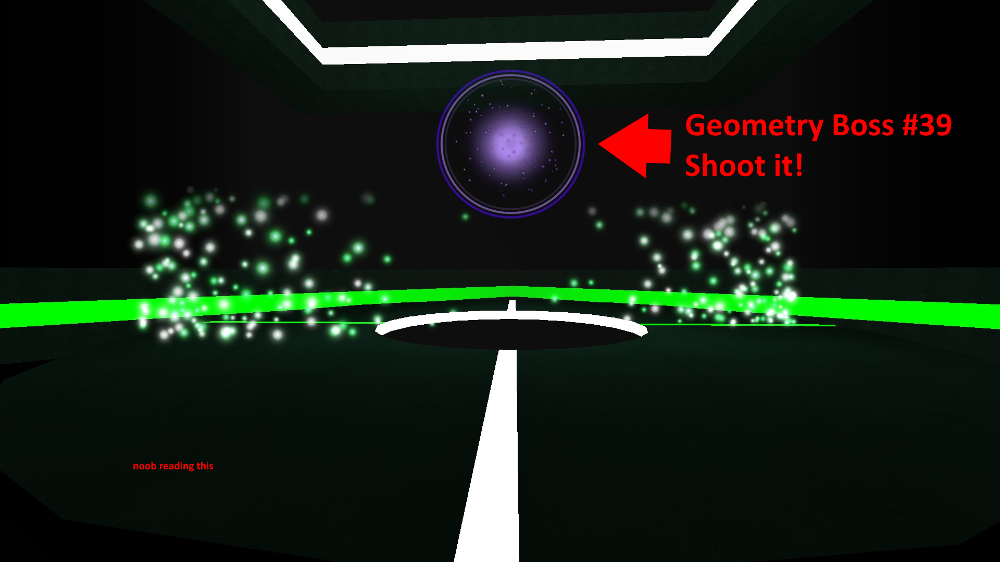
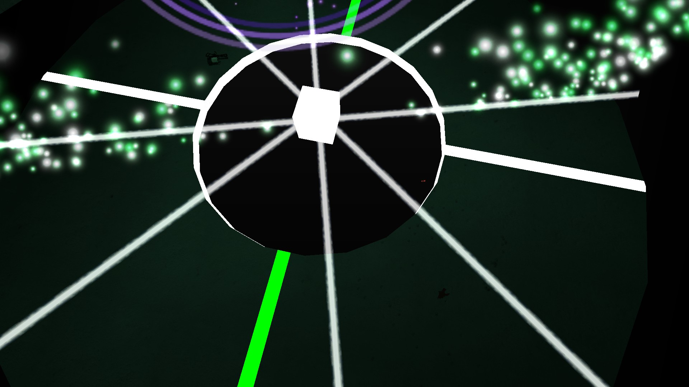
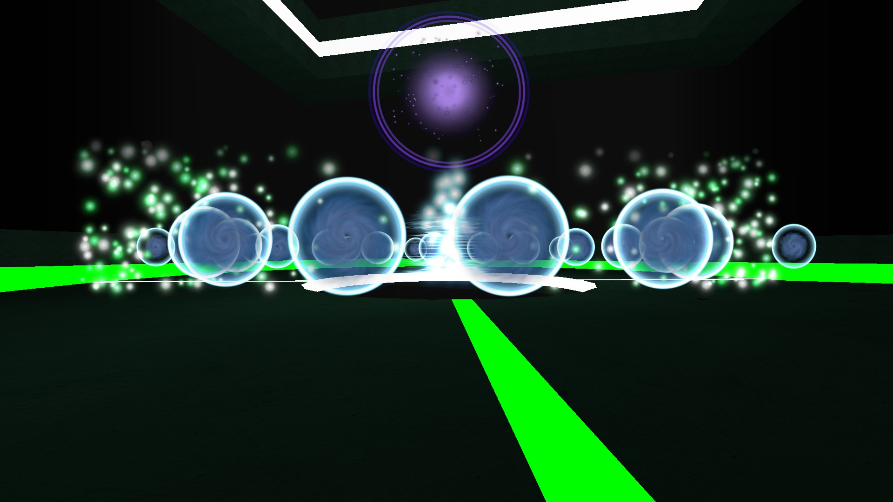
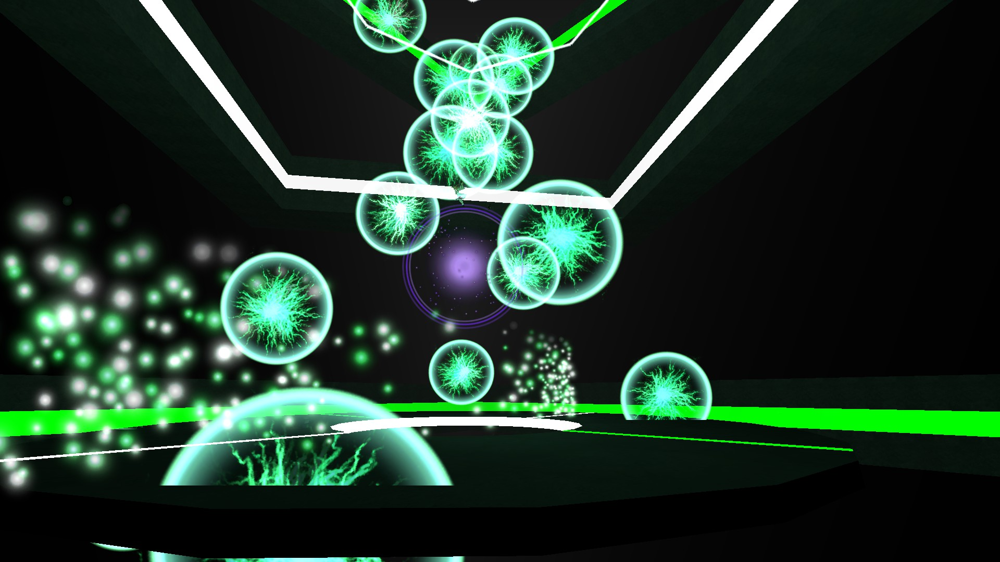
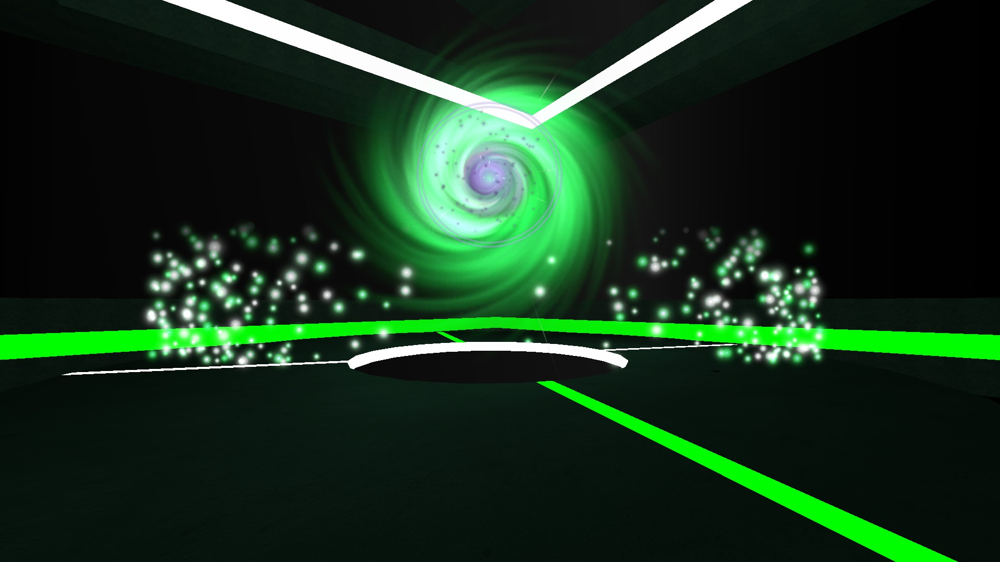
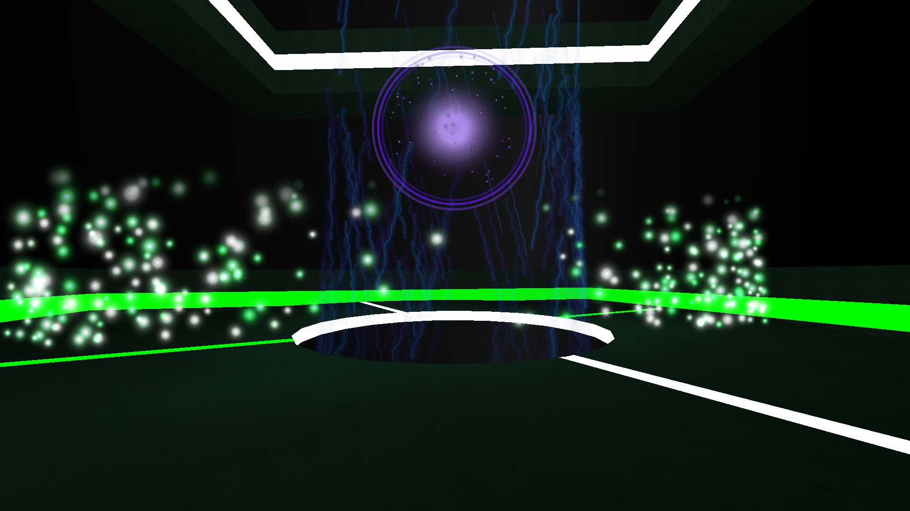
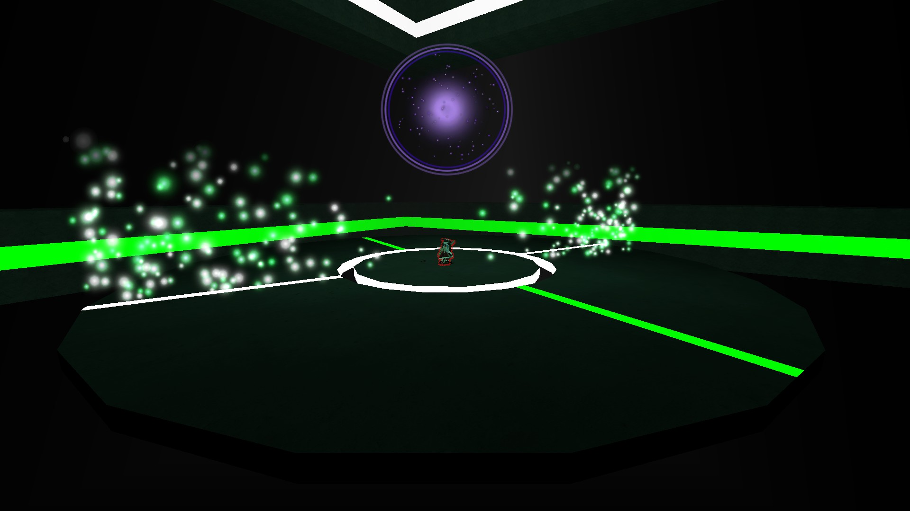
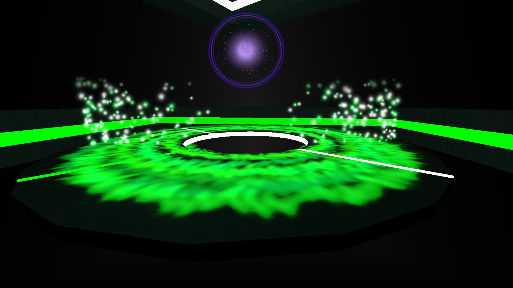
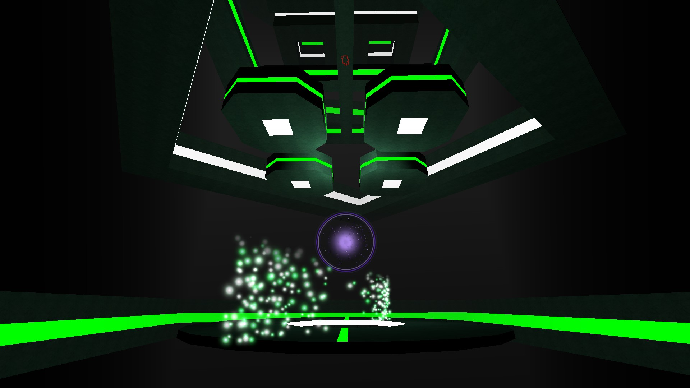

# Bosses

~~_May or may not be pending additional visual screenshots depending on if I remember to get them._~~

## HP Scaling

A boss' HP is typically scaled according to how many humans are currently in the boss arena or the amount of humans alive during a point in time. In most cases, if too many humans die during a boss fight, the boss' HP will remain scaled to the original amount of humans that scaled it in the first place. This will result in _very_ long boss fights for everybody if there is only one boss bar.

Some bosses may have _**multiple life bars**_**, such as 10 for example**; which allows for the HP Value to <mark style="color:yellow;">**re-scale downwards**</mark> at every new bar for situations where nearly the entire team has died; allowing for the select few people remaining to get through the boss seamlessly. You'll see this a lot on maps like `Mist, Offliner, and Visualizer's` bosses.\
\
With scaling in mind, a few situations might call for strategies of only allowing **one person** to fight the boss. As a result, its HP will be scaled low enough such that the boss can be killed much faster than usual or at least in more reasonable amount of time. Such cases can be found in `ze_dark_souls`, `ze_otakuroom` and `ze_ffxii_westersand`.

## Fight Mechanics

### Zombie Participation

In most cases, the Zombie team will be **separated** from the Human team to allow the survivors to focus on fighting the boss. _Just so the zombies aren't bored, there will occasionally be spectator booths around the arena to watch all the action unfold._

If that's not the case, then they are usually able to continue their pressure by taking designated routes to enter the arena and kill the humans all while they still have to worry about fighting the boss.

### Damage on Touch

If you find yourself in an arena with the boss itself and it's moving around, more likely than not will touching the boss damage you. Sometimes this won't be enough to kill you, but other times it will be certain death!

### Time

The faster you kill a boss, the less the amount of attacks are fired - thus potentially less human deaths. Some bosses even have a time limit before they instantly kill the entire human team. With this in mind, make sure your team composition has [**good DPS!** ](../../human-zombie-guides-stats-here/human-meta-discussion-outdated-+loadouts/team-composition.md)

### Nerfed Healing

While in regular TF2 you might be accustomed to the healing benefits of a Medic or an Engineer's dispenser, sometimes, _<mark style="color:red;">**healing rates or amounts may be lessened drastically or entirely disabled during boss fights.**</mark>_ This means that you cannot just hug a nearby dispenser or spam your Medic! call and expect to live via rapid healing. You gotta learn to dodge!

### Items

There may be fight gimmicks where items are necessary to either survive or damage the boss. These attacks might outright instakill you or damage you fast enough such that **only** a heal item would save you. This is why it's crucial to be careful with whenever you use them as using items at the wrong time might result in a team wipe!

### Awareness and Common Sense

The best thing to do to survive a boss fight is to make sure you listen! There will typically be leaders that tell you how to avoid boss attacks and what to do to make sure you don't die. A map might also tell you in chat what attacks a boss does and how to avoid them. If you do die to a boss, take note of the attacks and how the humans dodge them so you don't die yourself the next time you face the boss.

## Common Boss Patterns

## Offliner!


<mark style="color:yellow;">**Note:**</mark> **With Offliner's boss, the attacks are done in a random cycle; there will never be repeat attack types&#x20;**_**UNLESS**_**&#x20;the current cycle is finished and the same attack is randomly selected on the 2nd cycle.**

**You can use this as a process of elimination to determine what attacks might be coming next in the cycle to better prepare for instakills.**


<figure><figcaption>
Note that the giant particle walls will slowly rotate around the arena AND damage you upon touching them.
</figcaption></figure>

Here's what your typical boss arena _**might**_ be laid out like, often squares or circular areas, sometimes even hexagons - with borders that damage you for touching them. In this case, you'll take fall damage upon going out of bounds.

_These are some common elements you might come across map-to-map when fighting bosses. They don't make up the entire scope of attacks - something only limited to the mapper's imagination - but are something you might want to be wary of due to their frequent usage._

### AoE Attacks

Bosses will typically attack a certain section of the arena, forcing Humans to avoid certain parts of the arena usually either in the outer or inner sections. Some maps will tell you where to avoid and may also have particle effects of where the attack will hit.

<figure><figcaption>
Laser Attack from an aerial view since getting it up close is hard to show it. Crouches and jumps.
</figcaption></figure>

<figure><figcaption>
Orb Attack, get in the gaps!
</figcaption></figure>

<figure><figcaption>
Alternate Orb Attack, look up and dodge!
</figcaption></figure>

### Pushes and Pulls

These attacks will forcefully move you into map hazards that damage you greatly or outright kill you. The direction of a push or pull depends on the boss, so check the arena you're fighting in. If you see gaps or drops, these are usually where you will be pushed or pulled into to be killed.&#x20;

Also, be wary of standing on lines connecting two vertices. In some cases, you will be pushed or pulled with greater force due to being caught into multiple push/pull triggers. The combined strength may even be inescapable.

**What's a "vertice?" A vertex? In the context of arenas, think of it as where two edges meet. The corners. The spikey sections. The little bumps.**

Pushes and pulls are typically indicated with particles or warping effects "inward" or "outward", boiling down to a very reactionary attack that'll need to be responded to with the appropriate movement keys.

<figure><figcaption>
Pull Attack, Hold S key! Note that you do move slower backwards and can mitigate that by 180-ing and holding W.
</figcaption></figure>

<figure><figcaption>
Push Attack, Hold W key!
</figcaption></figure>

### Zombie TPs

Oh, we can't escape the zombies in this section either. Sometimes boss sections will have moments where zombies will be teleported into the arena to cause chaos. _These will usually not last very long such that all the humans need to do is survive until they get teleported away._&#x20;

Be careful as some other maps do not teleport them away immediately. You will either have to prevent them from entering certain areas that prevent them from getting teleported or resort to killing all that remain.

<figure><figcaption>
Inner circle will despawn after a set amount of time and teleport all zombies in arena away.
</figcaption></figure>

### Instakills

<figure><figcaption>
If you're not on the <strong>VERY EDGE</strong> of the arena where the green <strong>IS NOT</strong> at - you'll die!
</figcaption></figure>

<figure><figcaption>
THE Dropper. Reponsible for many deaths. You must look up and align yourself between the gaps as these fall onto you.
</figcaption></figure>

If all that isn't enough, you have to worry about getting demolished by attacks that can instakill you. These attacks are usually coordinated by the map telling you to watch out for them potentially even telling you outright how you need to survive them.&#x20;

In most cases, these, much like all other attacks, need to be understood as such beforehand or with experience. If new to the map, make sure to pay attention to the boss fights both as a Human or as a Zombie and listen to any leaders. They'll usually be calling out to dodge these especially!&#x20;

## Misc Map Attacks

_Anything that wasn't an attack pattern in Offliner specifically, that other maps might feature._

### Targeted Attacks

If a boss is an object that moves around the arena and has contact damage, **it'll lock onto a player**, following them and trying to ram into them to kill them before losing interest and going after another player. If the boss is after you, you can attempt to [<mark style="color:yellow;">**circle strafe**</mark>](#user-content-fn-1)[^1] it to avoid it ramming into you until it goes after another player.

### Lasers

There's a whole section of this guide dedicated to lasers and now it's leaked here. We can escape zombies but not them. On occasion, bosses will throw lasers at you. The kind they are will vary greatly, so visit the [**Lasers**](bosses.md#lasers) section for a more detailed overview. The damage they inflict will vary greatly among maps, so just be prepared.

### NPC Attacks

At times a boss may spawn NPCS that will attack you and your teammates on sight - these can be a bigger threat than the boss itself if not taken care of!

### Unavoidable Damage

Sometimes, no matter what you do, you will not be able to avoid damage. Fortunately, there is copious amounts of healing sources in TF2 ZE. Even some sources are nerfed or disabled, you can usually find items meant for the map to allow you to recover the HP lost.

[^1]: Holding ONLY your A or D key and effectively circling around the boss.
