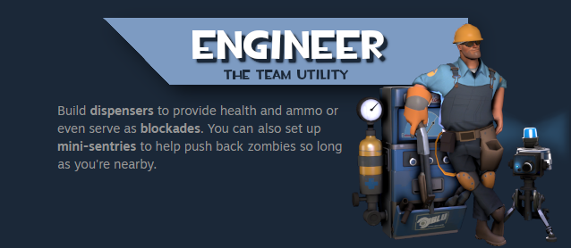
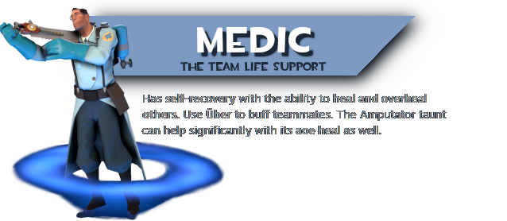

# Human Class Overviews

Team Fortress 2 gives you the ability to play as <mark style="color:yellow;">**\[9]**</mark> classes, each with their own unique way of surviving and fighting. For a more extensive overview, check out their dedicated sections in [**Meet the Humans**](../../human-zombie-guides-stats-here/meet-the-humans-outdated-+weapons/) and in [**Human Strategies**](../../human-zombie-guides-stats-here/human-meta-discussion-outdated-+loadouts/).

<figure><figcaption></figcaption></figure>

<figure><figcaption></figcaption></figure>

<figure><figcaption></figcaption></figure>

<figure><figcaption></figcaption></figure>

<figure><figcaption></figcaption></figure>

<figure><figcaption></figcaption></figure>

<figure><figcaption></figcaption></figure>

<figure><figcaption></figcaption></figure>
