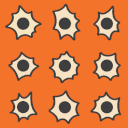
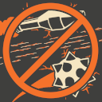
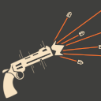
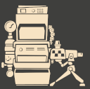
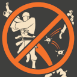
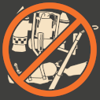
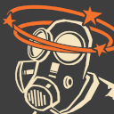
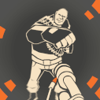
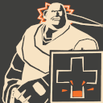
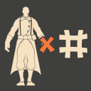

# Human Mechanics

## Slowdown

.png>)

Zombies will be slowed down from all _direct_ damage from humans for approximately <mark style="color:yellow;">**\[1] second.**</mark> Bleed and Afterburn does _not_ trigger this.

## No Random Bullet Spread

Like in competitive TF2, there is no random bullet spread. This can help with consistency in destroying objects, NPCs, or bosses.

## No Random Critical Hits

For even more consistency, random critical hits have been disabled.

## Rapid Fire

The first thing people might notice when playing is that weapons shoot much, much faster. This is for balancing purposes to allow humans to, at the very least, fend for themselves. This is effective against singular zombies, but not so much against a horde of them. Also, it helps normalize DPS against bosses so that everybody can contribute. While weird but useful, in the long run, it's not going to be the one key factor that saves you in the end.

## Psuedo-Infinite Ammo

<mark style="color:blue;">**Humans**</mark> have infinite ammo that gradually recharges. As a result, some weapons can expend ammo at a rate that outpaces the amount gained over time. This will be most noticeable with Heavy's miniguns and Pyro's flame throwers. As a result, it will be handy to look for ammo boxes dropped by killed zombies or to have a dispenser nearby to continue the defense.

## Engineer Buildings

Engineers can only place dispensers and mini-sentries. Dispensers can be upgraded to <mark style="color:orange;">**level 3**</mark> and mini-sentries start out with little ammo and must be hit occasionally to replenish them. **Your mini-sentries will gradually lose their knockback the further away you are from them.** Additionally, you cannot stand on your buildings. To prevent exploitable jumps, they will disappear if you attempt to do this.

## No Explosive or Double Jumping

In order to balance most maps for play in TF2, <mark style="color:red;">**explosive jumping and double jumping have been disabled**</mark> to prevent exploits by getting into unreachable spots or skipping major portions of maps.

## Banned Weapons

A few weapons are banned due to inherent unbalance in the gamemode or if they haven't been adjusted properly for play. Check the [**Meet The Humans**](../../human-zombie-guides-stats-here/meet-the-humans-outdated-+weapons/) section to see if any weapons you're interested in using are prohibited.

## Stun

Zombies can be stunned by Sniper headshots or sticky bombs. This makes them unable to move but makes them immune to knockback from bullets. Stuns last for approximately <mark style="color:yellow;">**\[1 second]**</mark>, but they will become immune to stuns for approximately <mark style="color:yellow;">**\[3] seconds**</mark> afterwards. As a result, more Snipers and more Demos can end up being _detrimental_ to each other.

## Airblast Resistance

While airblasting can be a useful gimmick, each time a zombie is knocked back by it, they gain **resistance** to the push force. Spam it enough and they won't even be pushed back by airblast at all! This resistance will reset after approximately <mark style="color:yellow;">**\[10] seconds**</mark>.

## Surviving One Hit

So long as you are above <mark style="color:green;">**\[208]**</mark> health, you will more than likely survive a hit from a zombie. Extra factors play into this, such as the weapons the zombies are using and any debuffs placed on you, but this is a generalization for most scenarios. You need to be above <mark style="color:green;">**\[300]**</mark> health to survive a backstab from a Spy.

## Infection

When a human does not immediately die and gets infected directly by a zombie hit, they and the infecting zombie become stunned for approximately <mark style="color:yellow;">**\[1] second**</mark>. Additionally, all nearby humans gain a momentary speed boost. If a human happens to get infected while inside of your player model, they will get teleported out but this may not always happen.

## Class Limits

So you don't absolutely steamroll with Heavies and to encourage a wider class variety, some classes have a cap on the amount playable. Scout, Pyro, Demoman, Heavy, Engineer and Medic are all limited to 8 of each playable at a time. Soldier has a cap somewhat larger than this. Sniper and Spy are both uncapped. Class limits do not apply to the Zombie team.

## Last Man Standing

~~_Not to be mistaken with the map of the same name._~~ With all your teammates gone, it'll be you against the world. You'll be given large melee damage resistance. Use that to your advantage to make a final stand or go for the Hail Mary and win solo.&#x20;
