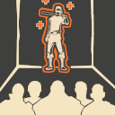

# Human Mechanics

## Slowdown

.png>)

* Zombies will be slowed down from all _direct_ damage from humans for approximately <mark style="color:yellow;">**\[1] second.**</mark>
* Bleed and Afterburn does _not_ trigger this.

## No Random Bullet Spread

* Like in competitive TF2, there is no random bullet spread. This can help with consistency in destroying objects, NPCs, or bosses.

## No Random Critical Hits

* For even more consistency, random critical hits have been disabled.

## Rapid Fire

* The first thing people might notice when playing is that weapons shoot much, _much faster._ This is for balancing purposes to allow humans to, at the very least, fend for themselves.
* This is effective against singular zombie, but not so much against a horde of them. While weird but useful, in the long run, it's not going to be the one key factor that saves you in the end.
* Also, it helps normalize DPS against bosses so that everybody can contribute.

## Psuedo-Infinite Ammo

* <mark style="color:blue;">**Humans**</mark> have infinite ammo that gradually recharges.&#x20;
* As a result, some weapons can expend ammo at a rate that outpaces the amount gained over time. This will be most noticeable with Heavy's miniguns and Pyro's flame-throwers
* Tying into this, it will be handy to keep an eye out for ammo boxes dropped by killed zombies or to have a dispenser nearby to continue a defense for longer than normal.

## Melee Knockback

* While in most cases you shouldn't be meleeing zombies _**(as they have longer reach and will often one shot you,)**_ there is a small buff to Human Melees to make them not otherwise worthless.
* Humans universally have a **small knockback effect** on their melees - this can send zombies flying away in niche cases where classes can't push a zombie off a specific platform or area with conventional methods.

## Engineer Buildings

* Engineers can only place **dispensers and** **mini-sentries.**&#x20;
* Dispensers can be upgraded to <mark style="color:orange;">**level 3**</mark>
* Mini-sentries start out with little ammo and must be hit occasionally to replenish them. <mark style="color:red;">**Your mini-sentries will gradually lose their knockback the further away you are from them.**</mark>&#x20;
* Additionally, you cannot stand on your buildings. To prevent exploitable jumps, they will disappear if you attempt to do this.

## No Explosive or Double Jumping

* In order to balance most maps for play in TF2, <mark style="color:red;">**explosive jumping and double jumping have been disabled**</mark> to prevent exploits by getting into unreachable spots or skipping major portions of maps.

## Banned Weapons

* A few weapons are banned due to inherent unbalance in the gamemode or if they haven't been adjusted properly for play.&#x20;
* Check the [**Meet The Humans**](../../human-zombie-guides-stats-here/meet-the-humans-outdated-+weapons/) section to see if any weapons you're interested in using are prohibited under their specific class pages.

## Stun

&#x20;As a result, more Snipers and more Demos can end up being _detrimental_ to each other.

* Zombies can be stunned by Sniper headshots or sticky bombs. This makes them unable to move but makes them immune to knockback from bullets.
* Stuns last for approximately <mark style="color:yellow;">**\[1 second]**</mark>, but they will become immune to stuns for approximately <mark style="color:yellow;">**\[3] seconds**</mark> afterwards.
* &#x20;...As a result, more Snipers and more Demos can end up being detrimental to each other in a sense; as a demoman trying to stun zombies with immunity might not get the stun they need for cover.

## Airblast Resistance

* While airblasting can be a useful gimmick, each time a zombie is knocked back by it, they gain **resistance** to the push force.
* Spam it enough and they won't even be pushed back by airblast at all! This resistance will reset after approximately <mark style="color:yellow;">**\[10] seconds**</mark> or upon zombie death.

## Surviving One Hit

* So long as you are **above** <mark style="color:green;">**\[208]**</mark> health, you will more than likely survive a hit from a zombie.&#x20;
* Extra factors play into this, such as the weapons the zombies are using and any debuffs placed on you, but this is a generalization for most scenarios. Some examples here:
* You need to be **above** <mark style="color:green;">**\[300]**</mark> health to survive a backstab from a Zombie Spy.
* You need to be **above** <mark style="color:green;">**\[270]**</mark> health to survive a melee from a Zombie Warrior's Spirit Heavy or Zombie Backscratcher Pyro

## Infection

* When a human does not immediately die and gets infected directly by a zombie hit, they and the infecting zombie become stunned for approximately <mark style="color:yellow;">**\[1] second**</mark>.
* Additionally, all nearby humans gain a momentary speed boost to get a chance of escaping any chain infections.
* If a human happens to get infected while inside of your player model _(literally must be standing on you, at other times you can get stuck in their hitbox or vice versa);_ the infected player might be teleported out. Very niche case.

## Class Limits

* So you don't absolutely steamroll with Heavies and to encourage a wider class variety, some classes have a cap on the amount playable.&#x20;
* **Heavy and Engineer are currently now the only two capped classes; with a class limit of \[8] slots available on each.**
* All other classes have no class limit.
* Class limits do not apply to the Zombie Team.

## Last Man Standing

* ~~_Not to be mistaken with the map of the same name._~~ With all your teammates gone, it'll be you against the world.
* You'll be given large melee damage resistance. Use that to your advantage to make a final stand or go for the Hail Mary and win solo.&#x20;
