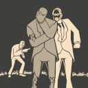
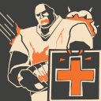
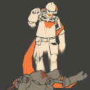
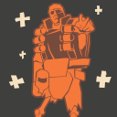
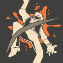
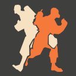
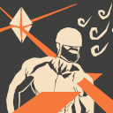
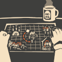

# Zombie Mechanics

## **Starting Zombies**

* At the start of each round, up to a little over [**several individuals**](../mod-mechanics.md#round-start) will be selected to be starter zombies.
* Starter zombies obtain Enzymes quicker until someone get infected and start with a lot more HP _(and even melee resistance)_ to tank at least a backstab or few.

## Large Health Pool

* To make you even stand a chance against a rain of... everything, zombie health has been buffed to a large extent. For exact class HP values, refer to the [**Meet The Zombies**](../../human-zombie-guides-stats-here/meet-the-zombies/) subsections.

## Fast Respawn

* In most cases, you will respawn immediately after the TF2 freezeframe ends. This will allow you to continually apply pressure to the Humans.
* In some circumstances, respawn will be disabled but the humans will have to kill you all!

## Über On Respawn

* When Zombies respawn, they will be given an **ÜberCharge's invulnerability and knockback immunity** for a few seconds.
* As a result, humans shouldn't try to spawncamp too close to the zombies; otherwise, you can use this advantage to simply walk up to them and hit them.

## High Damage

* In most cases, you will be able to instakill the humans in one hit.
* Scouts will need a few hits, and Spy's backstabs will instakill most of the time.
* For exact details on class damage values, refer to the [**Meet The Zombies**](../../human-zombie-guides-stats-here/meet-the-zombies/) subsections.

## Disabled Team Collisions

* This actually applies to the Human team as well, but this essentially prevents you from hitting your teammates.&#x20;
* This is helpful in situations where you and your teammates are stuck in humans. Rather than hitting each other, you can actually hit the humans inside of you to infect them and break free.

## Immunity to Certain Map Elements

* Sometimes, a map will be made such that map hazards, NPCs, bosses, etc. _won't_ be able to damage or affect you.
* &#x20;Other times, they will still affect you but not to the extent that they do to humans.
* Use areas where these are present to push harder and apply even more pressure while the humans are preoccupied.

## Additional Win Conditions

* Sometimes maps will have areas the Human team will have to prevent the zombies from entering or objects they must defend.
* Zombies can use this as an alternative way to beat the humans. You can breach with brute force, play things stealthily, or coordinate your Mutations and put the humans to ruin.

