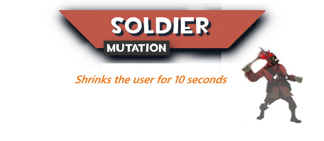

# Zombie Mutations Overview

For a more in-depth discussion about each zombie class' potential, check out their dedicated sections in [**Meet The Zombies**](../../human-zombie-guides-stats-here/meet-the-zombies/)**.**

<figure><figcaption></figcaption></figure>

<figure><figcaption>
holy botched image, had a lot of troubles w/it
</figcaption></figure>

<figure><figcaption>
Pyro will now gain a bomb head that can charge to deal damage (and boost zombies) if the timer has gone down on its own.
</figcaption></figure>

<figure><figcaption></figcaption></figure>

<figure><figcaption></figcaption></figure>

<figure><figcaption></figcaption></figure>

<figure><figcaption></figcaption></figure>

<figure><figcaption></figcaption></figure>

<figure><figcaption></figcaption></figure>
