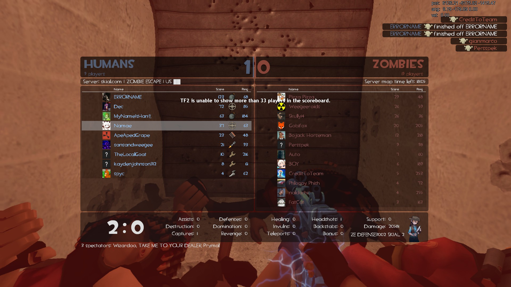
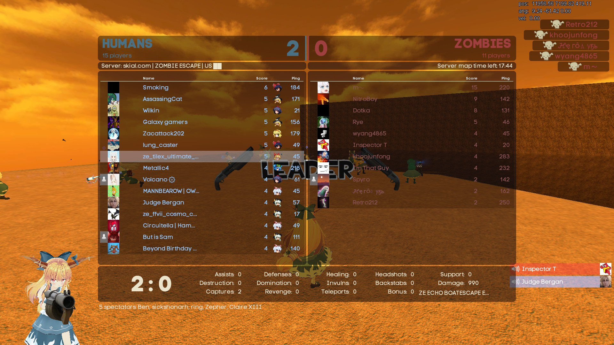

# Map List (+Map Records!)

## Maps available to play: 166 maps [_<mark style="color:blue;">(last updated 2/1/2026)</mark>_](recent-maps-11-13-2023/)

* 88 Non-Leader Nominable Maps
* 77 Leader-Only Nominable Maps - tagged with <mark style="color:purple;">**LEADER**</mark>


#### These are all color coded by all known completions _\[at least once]_ in the community; &#x20;

#### <mark style="color:red;">\~At least have a Relatively Full</mark> <mark style="color:red;"></mark>_<mark style="color:red;">(Usually 30-ish), Non-Friendly S</mark>_<mark style="color:red;">erver. Usually on Normal; might exempt for very casual maps.</mark>

_**Got a new****&#x20;**<mark style="color:$success;">**win**</mark>**&#x20;****screenshot that fulfills this? Send it to****&#x20;**<mark style="color:green;">**@not\_pickles (Myuri)**</mark>**&#x20;****in the Skial Discord!**_

&#x20;[ <mark style="color:yellow;">**`26 Incomplete Maps Remaining...(Added subheader section for these!!!)`**</mark>](map-list-+map-records.md#red-status-uncleared-maps)&#x20;

<mark style="color:red;">**RED**</mark>**&#x20;= `Incomplete/Partially Completed - annotated with run records, (click on names!)`**

<mark style="color:$success;">**GREEN**</mark> = **`Full Completion - annotated with win screenshots!`**_**`(For the most part.)`**_



_<mark style="color:yellow;">**Note:**</mark>_ You can find your custom maps folder through this navigation in the event that you need to clear out any older versions of ZE maps _or_ are experiencing any download error.

<mark style="color:green;">**Right-click TF2 on Steam > Properties > Local Files > tf folder > Download folder > Maps folder.**</mark>.

[**`https://fastdl.skial.com`**](https://fastdl.skial.com)


## RED STATUS/UNCLEARED MAPS


**This subheader area isn't part of the map count, it's here to track what maps aren't&#x20;**<mark style="color:green;">**GREEN**</mark>**&#x20;(cleared) yet.**


1. <mark style="color:red;">**ze\_8bit\_sk2**</mark>**&#x20;\[6 Stages]**
2. <mark style="color:red;">**ze\_backrooms\_sk1**</mark>**&#x20;\[7 Stages]**
3. <mark style="color:red;">**ze\_boatescape888\_v1\_8q**</mark>**&#x20;\[3 Stages - clear marathon mode]**
4. <mark style="color:red;">**ze\_bridge\_v\_z**</mark>**&#x20;**_<mark style="color:yellow;">**(TF2 map)**</mark>_**&#x20;\[1 Stage]**
5. <mark style="color:red;">**ze\_diddle\_skial\_6**</mark>  <mark style="color:purple;">**(LEADER)**</mark>**&#x20;\[PENDING EXTREME CLEAR]**
6. <mark style="color:red;">**ze\_ffvii\_snow\_cosmo\_v5\_5**</mark> <mark style="color:purple;">**(LEADER)**</mark> **\[5 Stages]**
7. <mark style="color:red;">**ze\_ffxii\_mt\_bur\_snow\_s2**</mark> **(v6 Version; Winter Themed) \[5 Stages]&#x20;**<mark style="color:purple;">**(LEADER)**</mark>
8. <mark style="color:red;">**ze\_ffxii\_ridorana\_cataract\_t2**</mark>**&#x20;**<mark style="color:purple;">**(LEADER)**</mark>**&#x20;\[4 Stages]**
9. <mark style="color:red;">**ze\_garten\_of\_banbantaylorythmics\_bald67selene\_update\_v3b**</mark>**&#x20;**_<mark style="color:yellow;">**(TF2 map)**</mark>_**&#x20;\[2 Stages]**
10. <mark style="color:red;">**ze\_industrial\_dejavu\_skial\_2**</mark> **\[4 Stages]**
11. <mark style="color:red;">**ze\_jambled\_v1b**</mark> _<mark style="color:yellow;">**(TF2 map)**</mark>_**&#x20;\[1 Stage]**
12. <mark style="color:red;">**ze\_laserheaven\_v2a**</mark>  _<mark style="color:yellow;">**(TF2 map)**</mark>_**&#x20;**<mark style="color:purple;">**(LEADER)**</mark>**&#x20;\[3 Stages + Bonus]**
13. <mark style="color:red;">**ze\_laserhell\_v1\_1\_1\_1**</mark>  _<mark style="color:yellow;">**(TF2 map)**</mark>_**&#x20;\[PENDING MAKO STAGE CLEAR]**
14. <mark style="color:red;">**ze\_lego\_sk1**</mark>**&#x20;\[1 Stage]**
15. <mark style="color:red;">**ze\_mariah\_carey\_christmas\_massacre\_v1**</mark>**&#x20;**_<mark style="color:yellow;">**(TF2 map)**</mark>_**&#x20;\[1 Stage]**
16. <mark style="color:red;">**ze\_metro\_world\_skial\_3**</mark>**&#x20;**_<mark style="color:yellow;">**(TF2 map)**</mark>_**&#x20;\[1 Stage]**
17. <mark style="color:red;">**ze\_obj\_filth\_skial\_3**</mark>**&#x20;**<mark style="color:purple;">**(LEADER)**</mark>**&#x20;\[1 Stage]**
18. <mark style="color:red;">**ze\_obj\_rescape\_sk2**</mark>**&#x20;**<mark style="color:purple;">**(LEADER)**</mark>**&#x20;\[1 Stage]**
19. <mark style="color:red;">**ze\_obj\_void\_sk1**</mark> <mark style="color:purple;">**(LEADER)**</mark>**&#x20;\[1 Stage]**
20. <mark style="color:red;">**ze\_orangetopia\_v1**</mark>**&#x20;**_<mark style="color:yellow;">**(TF2 map)**</mark>_ **\[1 Stage]**
21. <mark style="color:red;">**ze\_outlast\_skial\_6**</mark>**&#x20;**<mark style="color:purple;">**(LEADER)**</mark>**&#x20;\[2 Stages]**
22. <mark style="color:red;">**ze\_randomizer\_p2**</mark>**&#x20;**<mark style="color:purple;">**(LEADER)**</mark>**&#x20;\[PENDING ENDING 3/100% CLEAR]**
23. <mark style="color:red;">**ze\_ratescape\_sk2**</mark>**&#x20;\[3 Stages]**
24. <mark style="color:red;">**ze\_santassination\_s4**</mark>**&#x20;\[PENDING EXTREME CLEAR]**
25. <mark style="color:red;">**ze\_star\_wars\_skial\_1**</mark>**&#x20;\[5 Stages]**
26. <mark style="color:red;">**ze\_warlab\_v5**</mark>**&#x20;**_<mark style="color:yellow;">**(TF2 map)**</mark>_**&#x20;**<mark style="color:purple;">**(LEADER)**</mark>**&#x20;\[PENDING SECRET ENDING CLEAR]**

## Non-leader Maps


**Any player can nominate these maps, with a cooldown of (5) maps.**


1. <mark style="color:$success;">**ze\_3\_valley\_skial\_8**</mark>**&#x20;&#x20;**_<mark style="color:yellow;">**(TF2 map)**</mark>_**&#x20;\[1 Stage]**
2. <mark style="color:$success;">**ze\_**</mark>[<mark style="color:$success;">**666\_crazy\_escape\_skial\_v2**</mark>](#user-content-fn-1)[^1] **\[2 Stages]**
3. <mark style="color:red;">**ze\_8bit\_sk2**</mark>**&#x20;\[6 Stages]**
4. [<mark style="color:$success;">**ze\_alien\_shooter\_skial\_1**</mark>](#user-content-fn-2)[^2]  **\[1 Stage]**
5. [<mark style="color:$success;">**ze\_arctic\_escape\_skial\_1**</mark> ](#user-content-fn-3)[^3] **\[1 Stage]**
6. <mark style="color:$success;">**ze\_ascension\_v6b**</mark>**&#x20;&#x20;**_<mark style="color:yellow;">**(TF2 map)**</mark>_**&#x20;\[2 Stages]**
7. <mark style="color:$success;">**ze\_atix\_apocalypse\_skial\_13**</mark>**&#x20;\[1 Stage - 5 Endings]**
8. [<mark style="color:$success;">**ze\_atix\_panic\_b3t\_skial\_1**</mark>](#user-content-fn-4)[^4] **\[1 Stage]**
9. <mark style="color:$success;">**ze\_atix\_panic2\_skial\_5**</mark> **\[1 Stage]**
10. [<mark style="color:$success;">**ze\_backrooms\_deathbed\_sk2**</mark>](#user-content-fn-5)[^5] **\[1 Stage]**
11. [<mark style="color:$success;">**ze\_bathroom\_skial\_8**</mark> ](#user-content-fn-6)[^6] **\[2 Stages]**
12. [<mark style="color:$success;">**ze\_best\_korea\_skial\_4**</mark>](#user-content-fn-7)[^7]  **\[3 Stages]**
13. <mark style="color:$success;">**ze\_biohazard2\_rpd\_skial\_4**</mark>**&#x20;\[1 Stage]**
14. [<mark style="color:$success;">**ze\_biohazard2\_sewer\_skial\_1**</mark>](#user-content-fn-8)[^8] **\[1 Stage]**
15. [<mark style="color:$success;">**ze\_blackmesa\_escape\_final\_s1**</mark>](#user-content-fn-9)[^9] **\[1 Stage]**
16. <mark style="color:$success;">**ze\_bowser\_in\_the\_fire\_sea\_skial\_6**</mark>**&#x20;\[6 Stages]**
17. [<mark style="color:$success;">**ze\_breezy\_**</mark>](#user-content-fn-10)[^10]<mark style="color:$success;">**v5**</mark>**&#x20;**_<mark style="color:yellow;">**(TF2 map)**</mark>_**&#x20;\[3 Stages]**
18. <mark style="color:red;">**ze\_bridge\_v\_z**</mark>**&#x20;**_<mark style="color:yellow;">**(TF2 map)**</mark>_**&#x20;\[1 Stage]**
19. [<mark style="color:$success;">**ze\_castle\_escape\_b1**</mark>  ](#user-content-fn-11)[^11]_<mark style="color:yellow;">**(TF2 map)**</mark>_**&#x20;\[1 Stages]**
20. <mark style="color:$success;">**ze\_challenger\_skial4**</mark>**&#x20;**_<mark style="color:yellow;">**(TF2 map)**</mark>_**&#x20;\[1 Stage]**
21. [<mark style="color:$success;">**ze\_dangerous\_waters\_skial\_1**</mark>](#user-content-fn-12)[^12] **\[1 Stage]**
22. [<mark style="color:$success;">**ze\_death\_star\_escape\_skial\_2**</mark>](#user-content-fn-13)[^13] **\[1 Stage]**
23. [<mark style="color:$success;">**ze\_defense3002\_skial\_2**</mark>](#user-content-fn-14)[^14] **\[1 Stage]**
24. [<mark style="color:$success;">**ze\_DOOM\_skial\_3**</mark>](#user-content-fn-15)[^15] **\[3 Stages]**
25. [<mark style="color:$success;">**ze\_echo\_boatescape\_extended\_s1**</mark>](#user-content-fn-16)[^16] **\[1 Stage]**
26. <mark style="color:$success;">**ze\_elevator\_escape\_skial\_2**</mark>**&#x20;\[1 Stage]**
27. [<mark style="color:$success;">**ze\_fall\_guys\_skial\_2**</mark>](#user-content-fn-17)[^17] **\[1 Stage]**
28. <mark style="color:$success;">**ze\_fapescape\_skial\_4**</mark>**&#x20;\[6 Stages]**
29. [<mark style="color:$success;">**ze\_freezy\_v1**</mark>](#user-content-fn-18)[^18]<mark style="color:$success;">**d**</mark>**&#x20; &#x20;**_<mark style="color:yellow;">**(TF2 map)**</mark>_ **\[1 Stage]**
30. <mark style="color:red;">**ze\_garten\_of\_banbantaylorythmics\_bald67selene\_update\_v3b**</mark>  _<mark style="color:yellow;">**(TF2 map)**</mark>_ **\[2 Stages]**
31. <mark style="color:$success;">**ze\_icecap\_escape\_skial\_o2**</mark>**&#x20;\[1 Stage]**
32. <mark style="color:$success;">**ze\_icecap\_escape\_v5\_skial33**</mark>**&#x20;&#x20;**_<mark style="color:yellow;">**(TF2 version)**</mark>_**&#x20;\[1 Stage]**
33. [<mark style="color:$success;">**ze\_inboxed\_skial\_1**</mark>](#user-content-fn-19)[^19]  **\[4 Stages]**
34. <mark style="color:red;">**ze\_industrial\_dejavu\_skial\_2**</mark> **\[4 Stages]**
35. [<mark style="color:$success;">**ze\_italy\_town\_skial\_2**</mark>](#user-content-fn-20)[^20]  **\[4 Stages]**
36. <mark style="color:red;">**ze\_jambled\_v1b**</mark>**&#x20;**_<mark style="color:yellow;">**(TF2 map)**</mark>_**&#x20;\[1 Stage] \[1 Stage - 3 (of) 12 Random Levels] + \[Marathon Mode of all 12]**
37. <mark style="color:$success;">**ze\_jurassic\_park\_story\_skial\_5**</mark>**&#x20;**_<mark style="color:yellow;">**(TF2 version)**</mark>_**&#x20;\[1 Stage]**
38. [<mark style="color:$success;">**ze\_jurassicpark\_skial\_1**</mark>](#user-content-fn-21)[^21] _**(similar name ^ but diff map)**_**&#x20;\[1 Stage]**
39. [<mark style="color:$success;">**ze\_kitchen\_skial\_8**</mark>](#user-content-fn-22)[^22] **\[3 Stages]**
40. [<mark style="color:$success;">**ze\_krusty\_krab\_skial\_4**</mark>](#user-content-fn-23)[^23]  _<mark style="color:yellow;">**(TF2 bonus stages)**</mark>_**&#x20;\[3 Stages + Truth Ending]**
41. <mark style="color:red;">**ze\_laserhell\_v1\_1\_1\_1**</mark>   _<mark style="color:yellow;">**(TF2 map)**</mark>_**&#x20;\[2 Stages + 4 Stage 2 Alts]**
42. <mark style="color:red;">**ze\_lego\_sk1**</mark>**&#x20;\[1 Stage w/checkpoints]**
43. [<mark style="color:$success;">**ze\_licciana\_escape\_skial\_1**</mark> ](#user-content-fn-24)[^24] **\[1 Stage]**
44. [<mark style="color:$success;">**ze\_lila\_panic\_escape\_skial\_2**</mark>](#user-content-fn-25)[^25] **\[9 Stages]**
45. <mark style="color:$success;">**ze\_lotr\_helms\_deep\_skial\_9**</mark>**&#x20;\[1 Stage]**
46. <mark style="color:$success;">**ze\_lotr\_mines\_of\_moria\_skial\_4**</mark>**&#x20;\[1 Stage]**
47. [<mark style="color:$success;">**ze\_luciddreams\_v3\_6\_f2**</mark>](#user-content-fn-26)[^26] **(Old Version)** **\[1 Stage]**
48. <mark style="color:red;">**ze\_mariah\_carey\_christmas\_massacre\_v1**</mark>**&#x20;**_<mark style="color:yellow;">**(TF2 map)**</mark>_**&#x20;\[1 Stage]**
49. [<mark style="color:$success;">**ze\_minecraft\_adventure\_skial\_6**</mark> ](#user-content-fn-27)[^27] **\[4 Stages]**
50. <mark style="color:$success;">**ze\_minecraft\_universe\_skial\_2**</mark>**&#x20;\[1 Stage]**
51. [<mark style="color:$success;">**ze\_nostromo\_redux\_s2**</mark>](#user-content-fn-28)[^28] **\[1 Stage]**
52. [<mark style="color:$success;">**ze\_otakuroom\_skial\_4**</mark> ](#user-content-fn-29)[^29]**\[3 Stages]**
53. [<mark style="color:$success;">**ze\_persona\_v3\_fix**</mark>](#user-content-fn-30)[^30]  _<mark style="color:yellow;">**(TF2 map)**</mark>_**&#x20;\[3 Stages]**
54. [<mark style="color:$success;">**ze\_pirates\_port\_royal\_skial\_12**</mark>](#user-content-fn-31)[^31] **\[5 Stages + Bonus]**
55. [<mark style="color:$success;">**ze\_pokemon\_adventure\_skial\_11**</mark>](#user-content-fn-32)[^32] **\[3 Stages]**
56. [<mark style="color:$success;">**ze\_portal\_story\_skial\_6**</mark>](#user-content-fn-33)[^33] **\[3 Stages]**
57. [<mark style="color:$success;">**ze\_potc\_skial\_1**</mark> ](#user-content-fn-34)[^34]**\[1 Stage]**
58. [<mark style="color:$success;">**ze\_raccoon\_facility\_skial\_1**</mark>](#user-content-fn-35)[^35]  **\[1 Stage]**
59. [<mark style="color:$success;">**ze\_raiin\_v2**</mark>](#user-content-fn-36)[^36] _<mark style="color:yellow;">**(TF2 map)**</mark>_ **\[1 Stage]**
60. <mark style="color:$success;">**ze\_random\_skial\_7**</mark>**&#x20;\[1 Stage - 3 (of) 9 Random Levels]**
61. <mark style="color:red;">**ze\_ratescape\_sk2**</mark>**&#x20;\[3 Stages]**
62. [<mark style="color:$success;">**ze\_rocket\_escape\_skial\_1**</mark>](#user-content-fn-37)[^37] **\[1 Stage]**
63. <mark style="color:$success;">**ze\_rooftop\_runaway1\_skial\_1**</mark> **\[1 Stage]**
64. [<mark style="color:$success;">**ze\_rooftop\_rogue\_skial\_2**</mark> ](#user-content-fn-38)[^38] **\[4 Stages]**
65. [<mark style="color:red;">**ze\_santassination\_s4**</mark>](#user-content-fn-39)[^39] **\[4 Stages - Truth Ending]**
66. <mark style="color:$success;">**ze\_saw\_final\_skial\_9**</mark>**&#x20;\[1 Stage]**
67. [<mark style="color:$success;">**ze\_scp\_skial\_4**</mark>](#user-content-fn-40)[^40] **\[1 Stage]**
68. [<mark style="color:$success;">**ze\_shroomforest\_skial\_7**</mark> ](#user-content-fn-41)[^41] **(Shroom1) \[7 Stages]**
69. [<mark style="color:$success;">**ze\_shroomforest2\_skial\_1**</mark> ](#user-content-fn-42)[^42] **(Shroom2)** **\[7 Stages]**
70. [<mark style="color:$success;">**ze\_shroomforest3\_skial\_1**</mark> ](#user-content-fn-43)[^43] **(Shroom3) \[7 Stages]**
71. [<mark style="color:$success;">**ze\_silent\_hill\_2\_illusion\_skial\_2**</mark>](#user-content-fn-44)[^44] **\[3 Stages]**
72. <mark style="color:$success;">**ze\_sorrento\_escape\_skial\_2**</mark>**&#x20;\[4 Stages]**
73. <mark style="color:$success;">**ze\_squid\_game\_skial\_6**</mark>**&#x20;\[1 Stage]**
74. <mark style="color:red;">**ze\_star\_wars\_skial\_1**</mark>**&#x20;\[5 Stages]**
75. [<mark style="color:$success;">**ze\_star\_wars\_prequel\_skial\_10**</mark>](#user-content-fn-45)[^45] **\[3 Stages]**
76. <mark style="color:$success;">**ze\_subway\_escape\_skial\_9**</mark>**&#x20;&#x20;**_<mark style="color:yellow;">**(TF2 map)**</mark>_**&#x20;\[1 Stages]**
77. <mark style="color:$success;">**ze\_sunlight\_skial\_1**</mark>**&#x20;\[4 Stages + Bonus]**
78. <mark style="color:$success;">**ze\_super\_mario\_64\_skial\_3**</mark>**&#x20;\[4 Stages]**
79. <mark style="color:$success;">**ze\_surf\_facility\_skial\_b1**</mark>**&#x20;\[1 Stage]**
80. [<mark style="color:$success;">**ze\_surf\_froyo\_b**</mark>](#user-content-fn-46)[^46]<mark style="color:$success;">**3**</mark>**&#x20;\[7 Stages]**
81. <mark style="color:$success;">**ze\_surf\_vortex\_skial\_6**</mark>**&#x20;\[1 Stage]**
82. <mark style="color:$success;">**ze\_space\_station\_skial\_2**</mark> **\[1 Stage]**
83. <mark style="color:$success;">**ze\_swamp\_facility\_b2d**</mark>  _<mark style="color:yellow;">**(TF2 map)**</mark>_**&#x20;\[2 Stages]**
84. [<mark style="color:$success;">**ze\_trainescape\_skial\_1**</mark>](#user-content-fn-47)[^47] **\[1 Stage]**
85. <mark style="color:$success;">**ze\_timesplitters\_skial\_2**</mark> **\[1 Stage]**
86. <mark style="color:$success;">**ze\_titanic\_skial\_13**</mark>**&#x20;\[1 Stage]**
87. [<mark style="color:$success;">**ze\_uchiha\_legacy\_skial\_8**</mark>](#user-content-fn-48)[^48] **\[4 Stages]**
88. <mark style="color:$success;">**ze\_venice\_escape\_skial\_1**</mark>**&#x20;\[1 Stage]**
89. <mark style="color:$success;">**ze\_voodoo\_islands\_skial\_5**</mark>**&#x20;&#x20;**_<mark style="color:yellow;">**(Re-made as TF2 Map)**</mark>_**&#x20;\[1 Stage - 2 Endings]**

## **Leader Maps**


**These maps can only be nominated by someone with the in-game&#x20;**<mark style="color:purple;">**LEADER**</mark>**&#x20;status. There is a (1) map cooldown shared between leader-only maps&#x20;**_**(you can't chain them back to back)**_


1. [<mark style="color:$success;">**ze\_2049\_tf2\_f3**</mark> ](#user-content-fn-49)[^49]**\[2 Stages]**
2. [<mark style="color:green;">**ze\_A\_E\_S\_T\_H\_E\_T\_I\_C\_p3**</mark>](#user-content-fn-50)[^50] **\[1 Stage]**
3. [<mark style="color:green;">**ze\_aooka\_skial\_2**</mark>](#user-content-fn-51)[^51] **\[4 Stages]**
4. [<mark style="color:green;">**ze\_aot\_trost\_skial\_2**</mark>](#user-content-fn-52)[^52] **\[4 Stages]**
5. <mark style="color:red;">**ze\_backrooms\_sk1**</mark>**&#x20;\[7 Stages]**
6. [<mark style="color:green;">**ze\_bioluminescent\_v2**</mark>](#user-content-fn-53)[^53] **\[3 Stages]**
7. <mark style="color:red;">**ze\_boatescape888\_v1\_8q**</mark>**&#x20;\[3 Stages]**
8. [<mark style="color:green;">**ze\_cartender\_v1\_6**</mark> ](#user-content-fn-54)[^54]_<mark style="color:yellow;">**(TF2 map)**</mark>_**&#x20;\[1 Stage - 3 Endings]**
9. [<mark style="color:green;">**ze\_chroma\_k1**</mark> ](#user-content-fn-55)[^55] **\[1 Stage]**
10. [<mark style="color:green;">**ze\_crazy\_escape\_skial\_2**</mark>](#user-content-fn-56)[^56] **\[3 Stages]**
11. [<mark style="color:green;">**ze\_dark\_souls\_skial\_2**</mark>](#user-content-fn-57)[^57] **\[1 Stage - 3 Endings]**
12. [<mark style="color:green;">**ze\_deadcore\_skial\_5**</mark>](#user-content-fn-58)[^58] **\[4 Stages + Bonus]**
13. [<mark style="color:red;">**ze\_diddle\_skial\_6**</mark>](#user-content-fn-59)[^59] **\[6 Stages + 2 Endings] OR \[Extreme - 1 Stage]**
14. [<mark style="color:green;">**ze\_djinn\_skial\_2**</mark>](#user-content-fn-60)[^60]  **\[1 Stage]**
15. [<mark style="color:green;">**ze\_dreamin\_b2**</mark>](#user-content-fn-61)[^61] **\[4 Stages]**
16. [<mark style="color:green;">**ze\_evernight\_skial\_1**</mark>](#user-content-fn-62)[^62] **\[3 Stages]**
17. [<mark style="color:green;">**ze\_fapescape\_rote\_skial\_9**</mark>](#user-content-fn-63)[^63] **\[6 Stages]**
18. <mark style="color:green;">**ze\_ffvii\_cosmo\_canyon\_b1**</mark>**&#x20;(v5)** **\[4 Stages]**
19. [<mark style="color:green;">**ze\_ffvii\_mako\_reactor\_skial\_13**</mark>](#user-content-fn-64)[^64] **(v5, Classic Version) \[4 Stages]**
20. [<mark style="color:green;">**ze\_ffvii\_mako\_reactor\_v6\_b5**</mark>](#user-content-fn-65)[^65] **(v6, New Version) \[5 Stages]**
21. [<mark style="color:green;">**ze\_ffvii\_malgo\_reactor\_v5\_s4fix**</mark>](#user-content-fn-66)[^66] **\[6 Stages + 2 Bonus]**
22. <mark style="color:red;">**ze\_ffvii\_snow\_cosmo\_v5\_5**</mark> **\[5 Stages]**
23. [<mark style="color:green;">**ze\_ffxii\_mt\_bur\_omisace\_b1**</mark>](#user-content-fn-67)[^67] **(v5 Version)** **\[4 Stages]**
24. <mark style="color:red;">**ze\_ffxii\_mt\_bur\_snow\_s2**</mark> **(v6 Version; Winter Themed) \[4 Stages]**
25. <mark style="color:red;">**ze\_ffxii\_ridorana\_cataract**</mark>**&#x20;\[4 Stages]**
26. <mark style="color:green;">**ze\_ffxii\_westersand\_skial\_5**</mark>**&#x20;(v7) \[5 Stages]**
27. [<mark style="color:green;">**ze\_ffxiv\_wanderers\_palace\_skial\_4**</mark>](#user-content-fn-68)[^68] **(v5)** **\[4 Stages]**
28. [<mark style="color:green;">**ze\_frostdrake\_tower\_skial\_3**</mark>](#user-content-fn-69)[^69] **\[1 Stage]**
29. [<mark style="color:green;">**ze\_frozen\_abyss\_skial\_1**</mark>](#user-content-fn-70)[^70] **\[2 Stages]**
30. <mark style="color:green;">**ze\_frozentemple\_skial\_b1**</mark> **\[1 Stage]**
31. <mark style="color:green;">**ze\_grau\_fyb**</mark> **\[3 Stages + 2 Bonus]**
32. <mark style="color:green;">**ze\_gris\_skial\_5**</mark> **\[4 Stages + 2 Bonus]**
33. <mark style="color:green;">**ze\_hydroponic\_garden\_s\_2**</mark> **\[4 Stages]**
34. <mark style="color:green;">**ze\_johnny\_nukem\_skial\_6**</mark> **\[3 Stages]**
35. [<mark style="color:green;">**ze\_l0v0l\_v1**</mark>](#user-content-fn-71)[^71] **\[4 Stages]**&#x20;
36. <mark style="color:red;">**ze\_laserheaven\_v2a**</mark>  _<mark style="color:yellow;">**(TF2 map)**</mark>_ **\[3 Stages + Bonus]**
37. [<mark style="color:green;">**ze\_last\_man\_standing\_b1**</mark>](#user-content-fn-72)[^72]  **\[10 Stages]**
38. [<mark style="color:green;">**ze\_lotr\_minas\_tirith\_skial\_1**</mark>](#user-content-fn-73)[^73]<mark style="color:green;">**4**</mark>**&#x20;\[8 Stages]**
39. [<mark style="color:green;">**ze\_luciddreams\_b1**</mark>](#user-content-fn-74)[^74] **(New Version)** **\[1 Stage]**
40. [<mark style="color:green;">**ze\_m0w0m\_b4\_f1**</mark>](#user-content-fn-75)[^75] **\[6 Stages]**
41. [<mark style="color:green;">**ze\_meatropolis\_skial\_2**</mark>](#user-content-fn-76)[^76] **\[3 Stages]**
42. <mark style="color:red;">**ze\_metro\_world\_skial\_3**</mark>**&#x20;**_<mark style="color:yellow;">**(TF2 map)**</mark>_**&#x20;\[1 Stage]**
43. [<mark style="color:green;">**ze\_minimal\_skial\_2**</mark>](#user-content-fn-77)[^77] **\[4 Stages]**
44. [<mark style="color:green;">**ze\_mist\_skial\_3**</mark>](#user-content-fn-78)[^78] **\[1 Stage]**
45. [<mark style="color:green;">**ze\_neochrome\_b1**</mark>](#user-content-fn-79)[^79] **\[1 Stage]**
46. [<mark style="color:green;">**ze\_night\_cinema\_s1**</mark> ](#user-content-fn-80)[^80]**\[6 Stages]**
47. [<mark style="color:green;">**ze\_nomada\_h5**</mark> ](#user-content-fn-81)[^81] **\[3 Stages]**
48. [<mark style="color:red;">**ze\_obj\_filth\_skial\_3**</mark>](#user-content-fn-82)[^82] **\[1 Stage]**
49. [<mark style="color:green;">**ze\_obj\_npst\_tf2\_f1**</mark> ](#user-content-fn-83)[^83] **\[1 Stage]**&#x20;
50. [<mark style="color:green;">**ze\_obj\_rampage\_skial\_2**</mark>](#user-content-fn-84)[^84] **\[1 Stage]**
51. <mark style="color:red;">**ze\_obj\_rescape\_sk2**</mark>**&#x20;\[1 Stage]**
52. <mark style="color:red;">**ze\_obj\_void\_sk1**</mark>**&#x20;\[1 Stage]**
53. [<mark style="color:green;">**ze\_offliner\_skial\_1**</mark>](#user-content-fn-85)[^85]  **\[1 Stage]**
54. <mark style="color:red;">**ze\_orangetopia\_v1**</mark>**&#x20;**_<mark style="color:yellow;">**(TF2 map)**</mark>_ **\[1 Stage]**
55. [<mark style="color:red;">**ze\_outlast\_skial\_**</mark>](#user-content-fn-86)[^86]<mark style="color:red;">**6**</mark>**&#x20;\[2 Stages]**
56. [<mark style="color:green;">**ze\_oot\_shadowtemple\_skial\_2**</mark>](#user-content-fn-87)[^87]  **\[1 Stage]**
57. [<mark style="color:green;">**ze\_palace\_of\_minolila\_skial\_**</mark>](#user-content-fn-88)[^88]<mark style="color:green;">**4**</mark>**&#x20;\[5 Stages + Bonus]**
58. [<mark style="color:green;">**ze\_parkour\_paradise\_v3d**</mark>](#user-content-fn-89)[^89] _<mark style="color:yellow;">**(TF2 map)**</mark>_**&#x20;\[4 Stages + 3 Bonus]**
59. [<mark style="color:green;">**ze\_pkmn\_adventure\_s1**</mark> ](#user-content-fn-90)[^90] **\[5 Stages]**
60. <mark style="color:green;">**ze\_predator\_ultimate\_skial\_3**</mark>**&#x20;** **\[4 Stages]**
61. <mark style="color:green;">**ze\_quicksand\_v1e**</mark>**&#x20; &#x20;**_<mark style="color:yellow;">**(TF2 map)**</mark>_**&#x20;\[4 Stages + Bonus]**&#x20;
62. <mark style="color:red;">**ze\_randomizer\_p2**</mark>**&#x20;** **\[1 Stage - 3 Endings w/20 Random Levels]**
63. [<mark style="color:green;">**ze\_rizomata\_skial\_8**</mark>](#user-content-fn-91)[^91] **\[5 Stages]**
64. [<mark style="color:green;">**ze\_roof\_adventure\_skial\_2**</mark>](#user-content-fn-92)[^92] **\[7 Stages]**
65. [<mark style="color:green;">**ze\_rush\_b\_skial\_6**</mark>](#user-content-fn-93)[^93] **\[1 Stage]**
66. [<mark style="color:green;">**ze\_ryujin\_v3**</mark>](#user-content-fn-94)[^94]   _<mark style="color:yellow;">**(TF2 map)**</mark>_**&#x20;** **\[3 Stages]**
67. [<mark style="color:green;">**ze\_S\_A\_M\_skial\_9**</mark>](#user-content-fn-95)[^95] **\[5 Stages]**
68. [<mark style="color:green;">**ze\_sandstone\_v2**</mark>](#user-content-fn-96)[^96]   _<mark style="color:yellow;">**(TF2 map)**</mark>_ **\[4 Stages + Bonus]**
69. [<mark style="color:green;">**ze\_serpentis\_temple\_skial\_4**</mark>](#user-content-fn-97)[^97] **\[5 Stages]**
70. [<mark style="color:green;">**ze\_simpsons\_escape\_extreme\_a3\_2**</mark>](#user-content-fn-22)[^22] **\[4 Stages +&#x20;**<mark style="color:yellow;">**TF2 Bonus Stage**</mark>**]**
71. [<mark style="color:green;">**ze\_sonic\_3\_skial\_3**</mark>](#user-content-fn-98)[^98] **\[2 Stages]**
72. [<mark style="color:green;">**ze\_street\_fight\_with\_autism\_v5\_s1**</mark>](#user-content-fn-99)[^99] **\[3 Stages]**
73. [<mark style="color:green;">**ze\_tyranny2\_skial\_6**</mark>](#user-content-fn-100)[^100] **\[5 Stages]**
74. [<mark style="color:green;">**ze\_visualizer\_skial\_3**</mark>](#user-content-fn-101)[^101] **\[6 Stages]**
75. [<mark style="color:green;">**ze\_v0u0v\_b2**</mark>](#user-content-fn-102)[^102]**\[6 Stages]**
76. <mark style="color:red;">**ze\_warlab\_v5**</mark>**&#x20;**_<mark style="color:yellow;">**(TF2 map)**</mark>_**&#x20;\[1 Stage - 2 Endings]**
77. [<mark style="color:$success;">**ze\_xenovation\_v3\_5\_d**</mark>](#user-content-fn-22)[^22] **\[1 Stage + Bonus]**

## Admin-Only Maps

Header title; are still playable but can only be set on the server by Skial Admins with **`!map`** perms. Not counted in total maps or win records since these are rarely set on server. _There's a few more floating around the fastdl probably._

* <mark style="color:orange;">**ze\_dodge\_or\_die\_final\_s1fix**</mark> **\[3 Stages]**
* <mark style="color:orange;">**ze\_eerie\_escape\_redux\_s4fix**</mark>**&#x20;\[7 Stages]**
* <mark style="color:orange;">**ze\_onahole\_skial\_4**</mark>**&#x20;\[6 Stages]**
* <mark style="color:orange;">**ze\_realm\_h2**</mark>**&#x20;\[1 Stage]**
* <mark style="color:orange;">**ze\_stalker\_ultimate\_s4fix**</mark> **\[5 Stages]**

[^1]: .jpg>)

[^2]: .png>)

[^3]: 

[^4]: 

[^5]: 

[^6]: 

[^7]: 

[^8]: 

[^9]: 

[^10]: 

[^11]: 

[^12]: 

[^13]: 

[^14]: 

[^15]: 

[^16]: 

[^17]:  (1) (1) (1) (1) (1).png>)

[^18]: 

[^19]: 

[^20]: 

[^21]:  Win.jpg>)

[^22]: 

[^23]: 

[^24]: 

[^25]: 

[^26]: 

[^27]: .jpg>)

[^28]: .jpg>)

[^29]: 

[^30]: .png>)

[^31]: 

[^32]: 

[^33]: 

[^34]: 

[^35]: 

[^36]: .jpg>)

[^37]: 

[^38]: 

[^39]: <mark style="color:yellow;">**Run Record:**</mark>&#x20;

    <mark style="color:orange;">**\[Normal Complete.]**</mark>

    

    <mark style="color:orange;">**\[Extreme;**</mark> <mark style="color:orange;">**Stage 4/4]**</mark>

    **-Socrates Finale!**

[^40]: 

[^41]: 

[^42]: 

[^43]: 

[^44]: 

[^45]: 

[^46]: 

[^47]: .jpg>)

[^48]: 

[^49]: .jpg>)

[^50]: 

[^51]: 

[^52]: 

[^53]: 

[^54]: 

[^55]: .jpg>)

[^56]: 

[^57]: 

[^58]: 

[^59]: <mark style="color:yellow;">**Run Record:**</mark>

    <mark style="color:orange;">**\[Normal Heaven Won]**</mark>

    

    <mark style="color:orange;">**\[Extreme; All One Stage + Voting.]**</mark>

    **\~Pending Record...**

[^60]: .png>)

[^61]: 

[^62]: 

[^63]: 

[^64]: .PNG>)

[^65]:  Win (1).jpg>)

[^66]: .jpg>)

[^67]: .png>)

[^68]: 

[^69]: 

[^70]: 

[^71]: .png>)

[^72]: 

    

[^73]: 

[^74]: .PNG>)

[^75]: 

[^76]: 

[^77]: .jpeg>)

[^78]: 

[^79]: .png>)

[^80]: 

    

[^81]: 

[^82]: <mark style="color:yellow;">**Run Record:**</mark>

    <mark style="color:orange;">**\[Stage 1/1]**</mark>

    **\~1/3rd of map (reached split water-way area)**

[^83]: .png>)

[^84]: 

[^85]: .png>)

[^86]: <mark style="color:yellow;">**Run Record:**</mark>

    <mark style="color:orange;">**\[Stage 2/2 - Underground Lab]**</mark>&#x20;

    **-Finale DPS Check**

[^87]: .PNG>)

[^88]: \
    

[^89]: .jpg>)

[^90]: .jpg>)

[^91]: 

[^92]: 

[^93]: 

[^94]: 

[^95]: 

[^96]: 

[^97]: 

[^98]: 

[^99]: 

[^100]: 

[^101]: .jpg>)

[^102]: &#x20;
