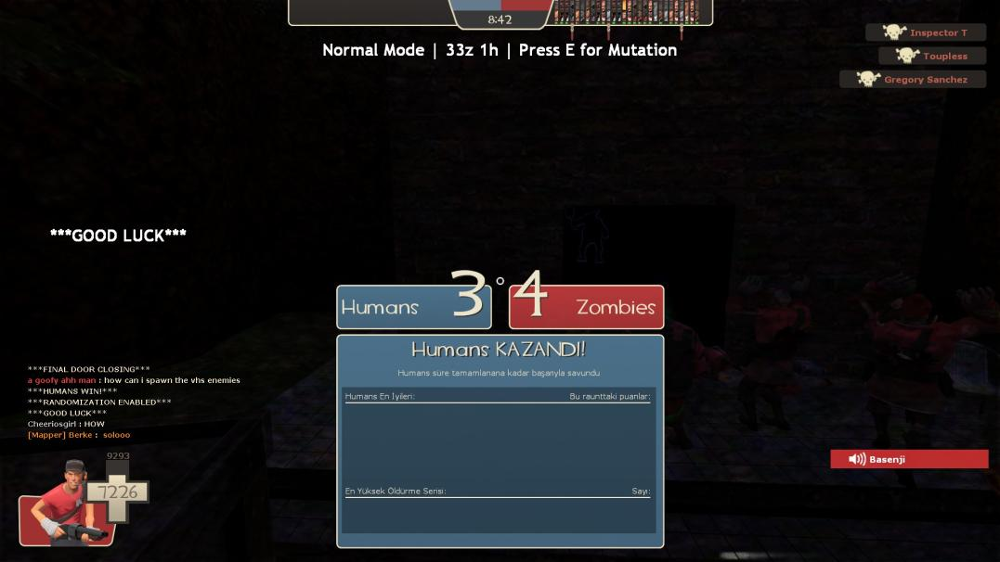

# Map List (+Map Records!)

## Maps available to play: 132 maps [_<mark style="color:blue;">(last updated 3/14/2025)</mark>_](recent-maps-11-13-2023/)


#### These are all color coded by all known completions _\[at least once]_ in the community; &#x20;

#### <mark style="color:red;">\~At least have a Relatively Full</mark> <mark style="color:red;"></mark>_<mark style="color:red;">(Usually 30-ish), Non-Friendly S</mark>_<mark style="color:red;">erver.</mark>&#x20;

#### <mark style="color:red;">\~No longer exempting runs for being Casual.</mark>

_**Got a new****&#x20;**<mark style="color:green;">**win**</mark>**&#x20;****screenshot that fulfills this? Send it to****&#x20;**<mark style="color:green;">**@not\_pickles (Myuri)**</mark>**&#x20;****in the Skial Discord!**_

<mark style="color:yellow;">**`24 Incomplete Maps Remaining...`**</mark>

<mark style="color:red;">**RED**</mark>**&#x20;= `Incomplete/Partially Completed - annotated with run records, (click on names!)`**

<mark style="color:green;">**GREEN**</mark> = **`Full Completion - annotated with win screenshots!`**_**`(Mostly. A lot of these were cleared prior to Valve adding 64 players.)`**_



_<mark style="color:yellow;">**Note:**</mark>_ You can find your custom maps folder through this navigation in the event that you need to clear out any older versions of ZE maps _or_ are experiencing any download error.

<mark style="color:green;">**Right-click TF2 on Steam > Properties > Local Files > tf folder > Download folder > Maps folder.**</mark>

_<mark style="color:yellow;">**Note 2:**</mark>_ If you want want to skip downloading all of these maps individually, you can find maps archived at this link and stick them into the path above.

[**`https://fastdl.skial.com`**](https://fastdl.skial.com)


_**`[The numerical listing doesn't mean anything; it just helps track map total easily, otherwise this is A-Z]`**_

1. [<mark style="color:green;">**ze\_2049\_tf2\_f3**</mark> ](#user-content-fn-1)[^1]<mark style="color:purple;">**(LEADER)**</mark>
2. <mark style="color:green;">**ze\_3\_valley\_skial\_8**</mark>**&#x20;&#x20;**_<mark style="color:yellow;">**(TF2 map)**</mark>_
3. <mark style="color:green;">**ze\_**</mark>[<mark style="color:green;">**666\_crazy\_escape\_skial\_v2**</mark>](#user-content-fn-2)[^2]
4. [<mark style="color:green;">**ze\_A\_E\_S\_T\_H\_E\_T\_I\_C\_p3**</mark>](#user-content-fn-3)[^3] <mark style="color:purple;">**(LEADER)**</mark>
5. [<mark style="color:green;">**ze\_aooka\_skial\_2**</mark>](#user-content-fn-4)[^4] <mark style="color:purple;">**(LEADER)**</mark>
6. <mark style="color:green;">**ze\_ascension\_v6b**</mark>**&#x20;&#x20;**_<mark style="color:yellow;">**(TF2 map)**</mark>_
7. <mark style="color:green;">**ze\_atix\_apocalypse\_skial\_13**</mark>
8. <mark style="color:red;">**ze\_atix\_panic\_b3t\_skial\_1**</mark>**&#x20;(CSS version)**
9. <mark style="color:green;">**ze\_atix\_panic2\_skial\_5**</mark>**&#x20;**<mark style="color:yellow;">**(**</mark>_<mark style="color:yellow;">**TF2 version\[?] )**</mark>_
10. [<mark style="color:green;">**ze\_bathroom\_skial\_8**</mark> ](#user-content-fn-5)[^5]
11. [<mark style="color:green;">**ze\_best\_korea\_skial\_4**</mark>](#user-content-fn-6)[^6]  <mark style="color:purple;">**(LEADER)**</mark>
12. <mark style="color:green;">**ze\_biohazard2\_rpd\_skial\_4**</mark>
13. [<mark style="color:green;">**ze\_bioluminescent\_v2**</mark>](#user-content-fn-7)[^7] <mark style="color:purple;">**(LEADER)**</mark>
14. [<mark style="color:green;">**ze\_blackmesa\_escape\_final\_s1**</mark>](#user-content-fn-8)[^8]
15. <mark style="color:green;">**ze\_bowser\_in\_the\_fire\_sea\_skial\_6**</mark>
16. [<mark style="color:green;">**ze\_breezy\_**</mark>](#user-content-fn-9)[^9]<mark style="color:green;">**v5**</mark>**&#x20;&#x20;**_<mark style="color:yellow;">**(TF2 map)**</mark>_
17. <mark style="color:green;">**ze\_challenger\_skial4**</mark>**&#x20;**_<mark style="color:yellow;">**(TF2 map)**</mark>_
18. [<mark style="color:red;">**ze\_chroma\_k1**</mark>](#user-content-fn-10)[^10]
19. [<mark style="color:green;">**ze\_crazy\_escape\_skial\_2**</mark>](#user-content-fn-11)[^11]
20. [<mark style="color:green;">**ze\_dark\_souls\_skial\_2**</mark>](#user-content-fn-12)[^12] <mark style="color:purple;">**(LEADER)**</mark>
21. [<mark style="color:green;">**ze\_deadcore\_skial\_5**</mark>](#user-content-fn-13)[^13] <mark style="color:purple;">**(LEADER)**</mark>
22. <mark style="color:red;">**ze\_death\_star\_escape\_skial\_2**</mark>
23. [<mark style="color:green;">**ze\_defense3002\_skial\_2**</mark>](#user-content-fn-14)[^14]
24. [<mark style="color:red;">**ze\_diddle\_skial\_6**</mark>](#user-content-fn-15)[^15]  <mark style="color:purple;">**(LEADER)**</mark>
25. [<mark style="color:green;">**ze\_djinn\_skial\_2**</mark>](#user-content-fn-16)[^16]  <mark style="color:purple;">**(LEADER)**</mark>
26. [<mark style="color:green;">**ze\_DOOM\_skial\_3**</mark>](#user-content-fn-17)[^17]&#x20;
27. [<mark style="color:green;">**ze\_dreamin\_b2**</mark> ](#user-content-fn-18)[^18] <mark style="color:purple;">**(LEADER)**</mark>
28. [<mark style="color:green;">**ze\_echo\_boatescape\_extended\_s1**</mark>](#user-content-fn-19)[^19]
29. [<mark style="color:red;">**ze\_eerie\_escape\_redux\_s2**</mark>](#user-content-fn-20)[^20] <mark style="color:purple;">**(LEADER)**</mark>
30. [<mark style="color:green;">**ze\_evernight\_skial\_1**</mark>](#user-content-fn-21)[^21]
31. [<mark style="color:green;">**ze\_fall\_guys\_skial\_2**</mark>](#user-content-fn-22)[^22]  <mark style="color:purple;">**(LEADER)**</mark>
32. [<mark style="color:green;">**ze\_fapescape\_rote\_skial\_9**</mark>](#user-content-fn-23)[^23]
33. <mark style="color:green;">**ze\_fapescape\_skial\_4**</mark>
34. <mark style="color:green;">**ze\_ffvii\_cosmo\_canyon\_b1**</mark>**&#x20;(v5)**
35. [<mark style="color:green;">**ze\_ffvii\_mako\_reactor\_skial\_13**</mark>](#user-content-fn-24)[^24] **(v5, Classic Version)**
36. [<mark style="color:green;">**ze\_ffvii\_mako\_reactor\_v6\_b5**</mark>](#user-content-fn-25)[^25]  **(v6, New Version)**
37. [<mark style="color:green;">**ze\_ffvii\_malgo\_reactor\_v5\_s4fix**</mark>](#user-content-fn-26)[^26] <mark style="color:purple;">**(LEADER)**</mark>
38. [<mark style="color:green;">**ze\_ffxii\_mt\_bur\_omisace\_b1**</mark>](#user-content-fn-27)[^27] **(v5 Version)&#x20;**<mark style="color:purple;">**(LEADER)**</mark>
39. [<mark style="color:red;">**ze\_ffxii\_mt\_bur\_omisace\_v6\_s3fix**</mark>](#user-content-fn-28)[^28] **(v6 - NEW Version)&#x20;**<mark style="color:purple;">**(LEADER)**</mark>
40. <mark style="color:green;">**ze\_ffxii\_westersand\_skial\_3**</mark>**&#x20;**<mark style="color:purple;">**(LEADER)**</mark>
41. [<mark style="color:green;">**ze\_ffxiv\_wanderers\_palace\_skial\_4**</mark>](#user-content-fn-29)[^29] **(v5)&#x20;**<mark style="color:purple;">**(LEADER)**</mark>
42. [<mark style="color:green;">**ze\_freezy\_v1**</mark>](#user-content-fn-30)[^30]<mark style="color:green;">**d**</mark>**&#x20; &#x20;**_<mark style="color:yellow;">**(TF2 map)**</mark>_
43. [<mark style="color:green;">**ze\_frostdrake\_tower\_skial\_3**</mark>](#user-content-fn-31)[^31]
44. [<mark style="color:red;">**ze\_frozen\_abyss\_skial\_1**</mark>](#user-content-fn-32)[^32] <mark style="color:purple;">**(LEADER)**</mark>
45. <mark style="color:green;">**ze\_frozentemple\_skial\_b1**</mark>**&#x20;**<mark style="color:purple;">**(LEADER)**</mark>
46. [<mark style="color:green;">**ze\_garten\_of\_banban\_laserdance\_awesomeworld\_taylors\_version\_v2**</mark>](#user-content-fn-33)[^33]   _<mark style="color:yellow;">**(TF2 map)**</mark>_ <mark style="color:purple;">**(LEADER)**</mark>
47. <mark style="color:green;">**ze\_grau\_fyb**</mark> <mark style="color:purple;">**(LEADER)**</mark>
48. <mark style="color:green;">**ze\_gris\_skial\_5**</mark>&#x20;
49. <mark style="color:green;">**ze\_hydroponic\_garden\_s\_2**</mark>**&#x20;**<mark style="color:purple;">**(LEADER)**</mark>
50. <mark style="color:green;">**ze\_icecap\_escape\_skial\_o2**</mark>
51. <mark style="color:green;">**ze\_icecap\_escape\_v5\_skial33**</mark>**&#x20;&#x20;**_<mark style="color:yellow;">**(TF2 version)**</mark>_
52. [<mark style="color:red;">**ze\_italy\_town\_skial\_2**</mark> ](#user-content-fn-34)[^34]
53. <mark style="color:green;">**ze\_johnny\_nukem\_skial\_6**</mark>**&#x20;**<mark style="color:purple;">**(LEADER)**</mark>
54. <mark style="color:green;">**ze\_jurassic\_park\_story\_skial\_5**</mark>**&#x20;**_<mark style="color:yellow;">**(TF2 version)**</mark>_
55. <mark style="color:red;">**ze\_jurassicpark\_skial\_1**</mark>**&#x20;**_**(CSS Version)**_
56. [<mark style="color:green;">**ze\_kitchen\_skial\_8**</mark>](#user-content-fn-35)[^35]
57. [<mark style="color:green;">**ze\_krusty\_krab\_skial\_4**</mark>](#user-content-fn-36)[^36]   _<mark style="color:yellow;">**(TF2 bonus stages)**</mark>_
58. [<mark style="color:green;">**ze\_l0v0l\_v1**</mark>](#user-content-fn-37)[^37]
59. [<mark style="color:red;">**ze\_laserheaven\_v2a**</mark>](#user-content-fn-38)[^38]   _<mark style="color:yellow;">**(TF2 map)**</mark>_
60. [<mark style="color:red;">**ze\_laserhell\_v1\_1\_1\_1**</mark>](#user-content-fn-39)[^39]   _<mark style="color:yellow;">**(TF2 map)**</mark>_
61. [<mark style="color:green;">**ze\_last\_man\_standing\_b1**</mark>](#user-content-fn-40)[^40]
62. [<mark style="color:green;">**ze\_lila\_panic\_escape\_skial\_2**</mark>](#user-content-fn-41)[^41]
63. <mark style="color:green;">**ze\_lotr\_helms\_deep\_skial\_9**</mark>
64. [<mark style="color:green;">**ze\_lotr\_minas\_tirith\_skial\_1**</mark>](#user-content-fn-42)[^42]<mark style="color:green;">**4**</mark>
65. <mark style="color:green;">**ze\_lotr\_mines\_of\_moria\_skial\_4**</mark>
66. [<mark style="color:green;">**ze\_luciddreams\_v3\_6\_f2**</mark>](#user-content-fn-43)[^43] **(Old Version)** <mark style="color:purple;">**(LEADER)**</mark>
67. [<mark style="color:green;">**ze\_luciddreams\_b1**</mark>](#user-content-fn-44)[^44] **(New Version)&#x20;**<mark style="color:purple;">**(LEADER)**</mark>
68. [<mark style="color:green;">**ze\_meatropolis\_skial\_2**</mark>](#user-content-fn-45)[^45] <mark style="color:purple;">**(LEADER)**</mark>
69. [<mark style="color:green;">**ze\_minecraft\_adventure\_skial\_6**</mark> ](#user-content-fn-46)[^46]
70. <mark style="color:green;">**ze\_minecraft\_universe\_skial\_2**</mark>
71. [<mark style="color:green;">**ze\_minimal\_skial\_2**</mark>](#user-content-fn-47)[^47]
72. [<mark style="color:green;">**ze\_mist\_skial\_3**</mark>](#user-content-fn-48)[^48] <mark style="color:purple;">**(LEADER)**</mark>
73. [<mark style="color:green;">**ze\_neochrome\_b1**</mark>](#user-content-fn-49)[^49] <mark style="color:purple;">**(LEADER)**</mark>
74. [<mark style="color:red;">**ze\_night\_cinema\_s1**</mark>](#user-content-fn-50)[^50] <mark style="color:purple;">**(LEADER)**</mark>
75. [<mark style="color:green;">**ze\_nomada\_h5**</mark> ](#user-content-fn-51)[^51]<mark style="color:purple;">**(LEADER)**</mark>
76. [<mark style="color:green;">**ze\_nostromo\_redux\_s2**</mark>](#user-content-fn-52)[^52]
77. [<mark style="color:red;">**ze\_obj\_filth\_skial\_3**</mark>](#user-content-fn-53)[^53] <mark style="color:purple;">**(LEADER)**</mark>
78. [<mark style="color:red;">**ze\_obj\_npst\_tf2\_f1**</mark>](#user-content-fn-54)[^54] <mark style="color:purple;">**(LEADER)**</mark>
79. [<mark style="color:red;">**ze\_obj\_rampage\_skial\_**</mark>](#user-content-fn-55)[^55]<mark style="color:red;">**2**</mark> <mark style="color:purple;">**(LEADER)**</mark>
80. [<mark style="color:green;">**ze\_offliner\_skial\_1**</mark>](#user-content-fn-56)[^56] <mark style="color:purple;">**(LEADER)**</mark>
81. [<mark style="color:red;">**ze\_outlast\_skial\_**</mark>](#user-content-fn-57)[^57]<mark style="color:red;">**6**</mark>
82. [<mark style="color:green;">**ze\_otakuroom\_skial\_4**</mark> ](#user-content-fn-58)[^58]
83. [<mark style="color:green;">**ze\_oot\_shadowtemple\_skial\_2**</mark>](#user-content-fn-59)[^59]
84. [<mark style="color:red;">**ze\_palace\_of\_minolila\_skial\_**</mark>](#user-content-fn-60)[^60]<mark style="color:red;">**4**</mark>
85. [<mark style="color:green;">**ze\_parkour\_paradise\_v3d**</mark>](#user-content-fn-61)[^61] <mark style="color:purple;">**(LEADER)**</mark>**&#x20;**_<mark style="color:yellow;">**(TF2 map)**</mark>_
86. [<mark style="color:green;">**ze\_persona\_v3\_fix**</mark>](#user-content-fn-62)[^62]  _<mark style="color:yellow;">**(TF2 map)**</mark>_
87. [<mark style="color:green;">**ze\_pirates\_port\_royal\_skial\_12**</mark>](#user-content-fn-63)[^63]
88. [<mark style="color:green;">**ze\_pokemon\_adventure\_skial\_11**</mark>](#user-content-fn-64)[^64]
89. [<mark style="color:red;">**ze\_pkmn\_adventure\_s1**</mark>](#user-content-fn-65)[^65] <mark style="color:purple;">**(LEADER)**</mark>
90. [<mark style="color:green;">**ze\_portal\_story\_skial\_6**</mark>](#user-content-fn-66)[^66]
91. <mark style="color:green;">**ze\_predator\_ultimate\_skial\_3**</mark>
92. <mark style="color:green;">**ze\_quicksand\_v1e**</mark>**&#x20; &#x20;**_<mark style="color:yellow;">**(TF2 map)**</mark>_&#x20;
93. [<mark style="color:green;">**ze\_raiin\_v2**</mark>](#user-content-fn-67)[^67] _<mark style="color:yellow;">**(TF2 map)**</mark>_  <mark style="color:purple;">**(LEADER)**</mark>
94. <mark style="color:green;">**ze\_random\_skial\_7**</mark>&#x20;
95. [<mark style="color:red;">**ze\_randomizer\_p2**</mark>](#user-content-fn-68)[^68] <mark style="color:purple;">**(LEADER)**</mark>
96. [<mark style="color:green;">**ze\_rizomata\_skial\_8**</mark>](#user-content-fn-69)[^69]
97. <mark style="color:red;">**ze\_rocket\_escape\_skial\_1**</mark>
98. <mark style="color:green;">**ze\_rooftop\_runaway2\_v5\_skial\_5**</mark>
99. [<mark style="color:green;">**ze\_rush\_b\_skial\_6**</mark>](#user-content-fn-70)[^70] <mark style="color:purple;">**(LEADER)**</mark>
100. [<mark style="color:green;">**ze\_ryujin\_v3**</mark>](#user-content-fn-71)[^71]   _<mark style="color:yellow;">**(TF2 map)**</mark>_**&#x20;**<mark style="color:purple;">**(LEADER)**</mark>
101. [<mark style="color:green;">**ze\_S\_A\_M\_skial\_9**</mark>](#user-content-fn-72)[^72]
102. [<mark style="color:green;">**ze\_sandstone\_v2**</mark>](#user-content-fn-73)[^73]   _<mark style="color:yellow;">**(TF2 map)**</mark>_**&#x20;**<mark style="color:purple;">**(LEADER)**</mark>
103. [<mark style="color:red;">**ze\_santassination\_s4**</mark>](#user-content-fn-74)[^74]
104. <mark style="color:green;">**ze\_saw\_final\_skial\_9**</mark>
105. [<mark style="color:green;">**ze\_scp\_skial\_4**</mark>](#user-content-fn-75)[^75] <mark style="color:purple;">**(LEADER)**</mark>
106. [<mark style="color:green;">**ze\_serpentis\_temple\_skial\_4**</mark>](#user-content-fn-76)[^76] <mark style="color:purple;">**(LEADER)**</mark>
107. [<mark style="color:green;">**ze\_shroomforest\_skial\_7**</mark> ](#user-content-fn-77)[^77] **(Shroom1)**
108. [<mark style="color:green;">**ze\_shroomforest2\_skial\_1**</mark> ](#user-content-fn-78)[^78] **(Shroom2)** <mark style="color:purple;">**(LEADER)**</mark>
109. [<mark style="color:green;">**ze\_shroomforest3\_skial\_1**</mark> ](#user-content-fn-79)[^79] **(Shroom3)**
110. [<mark style="color:green;">**ze\_sonic\_3\_skial\_3**</mark>](#user-content-fn-80)[^80]
111. <mark style="color:green;">**ze\_sorrento\_escape\_skial\_2**</mark>
112. <mark style="color:green;">**ze\_squid\_game\_skial\_6**</mark>
113. [<mark style="color:red;">**ze\_stalker\_ultimate\_s3**</mark>](#user-content-fn-81)[^81] <mark style="color:purple;">**(LEADER)**</mark>
114. [<mark style="color:green;">**ze\_star\_wars\_prequel\_skial\_10**</mark>](#user-content-fn-82)[^82]
115. [<mark style="color:red;">**ze\_street\_fight\_with\_autism\_v5\_s1**</mark>](#user-content-fn-83)[^83]
116. <mark style="color:green;">**ze\_subway\_escape\_skial\_9**</mark>**&#x20;&#x20;**_<mark style="color:yellow;">**(TF2 map)**</mark>_
117. <mark style="color:green;">**ze\_sunlight\_skial\_1**</mark>
118. <mark style="color:green;">**ze\_super\_mario\_64\_skial\_3**</mark>
119. <mark style="color:green;">**ze\_surf\_facility\_skial\_b1**</mark>
120. [<mark style="color:green;">**ze\_surf\_froyo\_b**</mark>](#user-content-fn-84)[^84]<mark style="color:green;">**3**</mark>
121. <mark style="color:green;">**ze\_surf\_vortex\_skial\_6**</mark>
122. <mark style="color:green;">**ze\_space\_station\_skial\_2**</mark>
123. <mark style="color:green;">**ze\_swamp\_facility\_b2d**</mark>**&#x20;&#x20;**_<mark style="color:yellow;">**(TF2 map)**</mark>_
124. [<mark style="color:green;">**ze\_trainescape\_skial\_1**</mark>](#user-content-fn-85)[^85]
125. [<mark style="color:green;">**ze\_tyranny2\_skial\_6**</mark>](#user-content-fn-86)[^86]
126. <mark style="color:green;">**ze\_timesplitters\_skial\_2**</mark>
127. <mark style="color:green;">**ze\_titanic\_skial\_13**</mark>
128. [<mark style="color:green;">**ze\_uchiha\_legacy\_skial\_8**</mark>](#user-content-fn-87)[^87]
129. [<mark style="color:green;">**ze\_visualizer\_skial\_3**</mark>](#user-content-fn-88)[^88] <mark style="color:purple;">**(LEADER)**</mark>
130. [<mark style="color:green;">**ze\_v0u0v\_b2**</mark>](#user-content-fn-89)[^89]
131. <mark style="color:green;">**ze\_voodoo\_islands\_skial\_5**</mark>**&#x20;&#x20;**_<mark style="color:yellow;">**(Re-made as TF2 Map)**</mark>_
132. [<mark style="color:red;">**ze\_warlab\_v5**</mark>](#user-content-fn-90)[^90] _<mark style="color:yellow;">**(TF2 map)**</mark>_**&#x20;**<mark style="color:purple;">**(LEADER)**</mark>

[^1]: .jpg>)

[^2]: .jpg>)

[^3]: 

[^4]: 

[^5]: 

[^6]: 

[^7]: 

[^8]: 

[^9]: 

[^10]: <mark style="color:yellow;">**Run Record:**</mark>

    <mark style="color:orange;">**\[Stage 1/1]**</mark>

    **\~Pending Record...**

[^11]: 

[^12]: 

[^13]: 

[^14]: 

[^15]: <mark style="color:yellow;">**Run Record:**</mark>

    <mark style="color:orange;">**\[Normal Heaven Won]**</mark>

    

    <mark style="color:orange;">**\[Extreme; All One Stage + Voting.]**</mark>

    **\~Pending Record...**

[^16]: .png>)

[^17]: 

[^18]: 

[^19]: 

[^20]: <mark style="color:yellow;">**Run Record:**</mark>

    <mark style="color:orange;">**\[Stage 3/8]**</mark>

    **\~spinner lasers**

[^21]: 

[^22]:  (1).png>)

[^23]: 

[^24]: .PNG>)

[^25]:  Win (1).jpg>)

[^26]: .jpg>)

[^27]: .png>)

[^28]: <mark style="color:yellow;">**Run Record:**</mark>

    <mark style="color:orange;">**\[Stage 1/4]**</mark>

    **\~Pending Record...**

[^29]: 

[^30]: 

[^31]: 

[^32]: <mark style="color:yellow;">**Run Record:**</mark>

    <mark style="color:orange;">**\[Stage 1/2]**</mark>

    **\~Pending Record...**

[^33]: 

[^34]: <mark style="color:yellow;">**Run Record:**</mark>

    <mark style="color:orange;">**\[Stage 1/4]**</mark>

    **\~Record Pending**

[^35]: 

[^36]: 

[^37]: .png>)

[^38]: <mark style="color:yellow;">**Run Record:**</mark>

    <mark style="color:orange;">**\[Stage 3/3 - RTV Level]**</mark>

    **\~Giant Fan Room**

[^39]: <mark style="color:yellow;">**Run Record:**</mark>

    <mark style="color:orange;">**\[Stage 2 Random Variant Stages]**</mark>

    <mark style="color:green;">**\[Meteor]**</mark>

    <mark style="color:green;">**\[Snow]**</mark>

    <mark style="color:green;">**\[Endless Night]**</mark>

    <mark style="color:red;">**\[Mako]**</mark>

    

[^40]: 

    

[^41]: 

[^42]: 

[^43]: 

[^44]: .PNG>)

[^45]: 

[^46]: .jpg>)

[^47]: .jpeg>)

[^48]: 

[^49]: .png>)

[^50]: <mark style="color:yellow;">**Run Record:**</mark>\
    <mark style="color:orange;">**\[Stage 1/6]**</mark>

    **\~Pending record...**

[^51]: 

[^52]: .jpg>)

[^53]: <mark style="color:yellow;">**Run Record:**</mark>

    <mark style="color:orange;">**\[Stage 1/1]**</mark>

    **\~1/3rd of map (reached split water-way area)**

[^54]: <mark style="color:yellow;">**Run Record:**</mark>

    <mark style="color:orange;">**\[Stage 1/1]**</mark>

    **\~Roughly 15% of map**

[^55]: <mark style="color:yellow;">**Run Record:**</mark>

    <mark style="color:orange;">**\[Stage 1/1]**</mark>

    **\~First surface area defense (outside)**

[^56]: .png>)

[^57]: <mark style="color:yellow;">**Run Record:**</mark>

    <mark style="color:orange;">**\[Stage 2/2 - Underground Lab]**</mark>&#x20;

    **-Finale DPS Check**

[^58]: 

[^59]: .PNG>)

[^60]: <mark style="color:yellow;">**Run Record:**</mark>\
    <mark style="color:orange;">**\[Stage 5/5]**</mark>

    **\~Stage 5 Lasers**

[^61]: .jpg>)

[^62]: .png>)

[^63]: 

[^64]: 

[^65]: <mark style="color:yellow;">**Run Record:**</mark>\
    <mark style="color:orange;">**\[Stage 5/5]**</mark>

    **\~Stage 5 start no extends left**

[^66]: 

[^67]: .jpg>)

[^68]: <mark style="color:yellow;">**Run Record:**</mark>\
    <mark style="color:orange;">\~</mark><mark style="color:orange;">**Endings 1 & 2 Done**</mark>

    **\~70% Complete (100% needed for End 3)**

[^69]: 

[^70]: 

[^71]: 

[^72]: 

[^73]: 

[^74]: <mark style="color:yellow;">**Run Record:**</mark>&#x20;

    <mark style="color:orange;">**\[Normal Complete.]**</mark>

    

    <mark style="color:orange;">**\[Extreme;**</mark> <mark style="color:orange;">**Stage 4/4]**</mark>

    **-Socrates Finale!**

[^75]: 

[^76]: 

[^77]: 

[^78]: 

[^79]: 

[^80]: 

[^81]: <mark style="color:yellow;">**Run Record:**</mark>\
    <mark style="color:orange;">**\[Stage 5/5]**</mark>

    **\~2nd Laser Boss**

[^82]: 

[^83]: <mark style="color:yellow;">**Run Record:**</mark>\
    <mark style="color:orange;">**\[Stage 2/3]**</mark>

    **\~Stage 1 won**

[^84]: 

[^85]: .jpg>)

[^86]: 

[^87]: 

[^88]: .jpg>)

[^89]: &#x20;

[^90]: <mark style="color:yellow;">**Run Record:**</mark>\
    <mark style="color:orange;">**\[Normal End Cleared]**</mark>

    _**\~Secret End pending win**_
