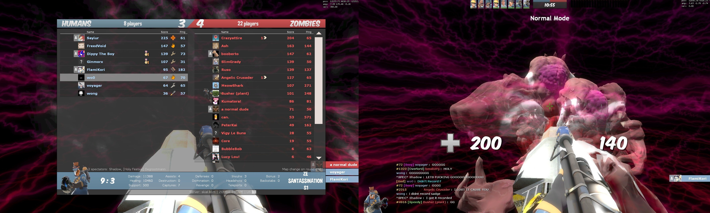

# Map List (+Map Records!)

## Maps available to play: 149 maps [_<mark style="color:blue;">(last updated 7/10/2025)</mark>_](recent-maps-11-13-2023/)

* 83 Non-Leader Nominable Maps
* 66 Leader-Only Nominable Maps - tagged with <mark style="color:purple;">**LEADER**</mark>


#### These are all color coded by all known completions _\[at least once]_ in the community; &#x20;

#### <mark style="color:red;">\~At least have a Relatively Full</mark> <mark style="color:red;"></mark>_<mark style="color:red;">(Usually 30-ish), Non-Friendly S</mark>_<mark style="color:red;">erver. Usually on Normal; might exempt for very casual maps.</mark>

_**Got a new****&#x20;**<mark style="color:green;">**win**</mark>**&#x20;****screenshot that fulfills this? Send it to****&#x20;**<mark style="color:green;">**@not\_pickles (Myuri)**</mark>**&#x20;****in the Skial Discord!**_

&#x20;[ <mark style="color:yellow;">**`18 Incomplete Maps Remaining...(Added subheader section for these!!!)`**</mark>](map-list-+map-records.md#red-status-uncleared-maps)&#x20;

<mark style="color:red;">**RED**</mark>**&#x20;= `Incomplete/Partially Completed - annotated with run records, (click on names!)`**

<mark style="color:green;">**GREEN**</mark> = **`Full Completion - annotated with win screenshots!`**_**`(Mostly. A lot of these were cleared prior to Valve adding 64 players support.)`**_



_<mark style="color:yellow;">**Note:**</mark>_ You can find your custom maps folder through this navigation in the event that you need to clear out any older versions of ZE maps _or_ are experiencing any download error.

<mark style="color:green;">**Right-click TF2 on Steam > Properties > Local Files > tf folder > Download folder > Maps folder.**</mark>.

[**`https://fastdl.skial.com`**](https://fastdl.skial.com)


## RED STATUS/UNCLEARED MAPS


**This subheader area isn't part of the map count, it's here to track what maps aren't&#x20;**<mark style="color:green;">**GREEN**</mark>**&#x20;(cleared) yet.**


* <mark style="color:red;">**ze\_chroma\_k1**</mark>**&#x20;**<mark style="color:purple;">**(LEADER)**</mark>**&#x20;\[1 Stage]**
* <mark style="color:red;">**ze\_diddle\_skial\_6**</mark>  <mark style="color:purple;">**(LEADER)**</mark>**&#x20;\[PENDING EXTREME CLEAR]**
* <mark style="color:red;">**ze\_elevator\_escape\_skial\_2**</mark>**&#x20;\[1 Stage]**
* <mark style="color:red;">**ze\_ffxii\_ridorana\_cataract**</mark>**&#x20;**<mark style="color:purple;">**(LEADER)**</mark>**&#x20;\[4 Stages]**
* <mark style="color:red;">**ze\_inboxed\_skial\_1**</mark>**&#x20; \[4 Stages]**
* <mark style="color:red;">**ze\_industrial\_dejavu\_skial\_2**</mark> **\[4 Stages]**
* <mark style="color:red;">**ze\_laserheaven\_v2a**</mark>  _<mark style="color:yellow;">**(TF2 map)**</mark>_**&#x20;**<mark style="color:purple;">**(LEADER)**</mark>**&#x20;\[3 Stages + Bonus]**
* <mark style="color:red;">**ze\_laserhell\_v1\_1\_1\_1**</mark>  _<mark style="color:yellow;">**(TF2 map)**</mark>_**&#x20;\[PENDING MAKO STAGE CLEAR]**
* <mark style="color:red;">**ze\_night\_cinema\_s1**</mark>**&#x20;**<mark style="color:purple;">**(LEADER)**</mark>**&#x20;\[6 Stages]**
* <mark style="color:red;">**ze\_obj\_filth\_skial\_3**</mark>**&#x20;**<mark style="color:purple;">**(LEADER)**</mark>**&#x20;\[1 Stage]**
* <mark style="color:red;">**ze\_outlast\_skial\_6**</mark>**&#x20;**<mark style="color:purple;">**(LEADER)**</mark>**&#x20;\[2 Stages]**
* <mark style="color:red;">**ze\_randomizer\_p2**</mark>**&#x20;**<mark style="color:purple;">**(LEADER)**</mark>**&#x20;\[PENDING ENDING 3/100% CLEAR]**
* <mark style="color:red;">**ze\_roof\_adventure\_skial\_2**</mark>**&#x20;\[4 Stages]**
* <mark style="color:red;">**ze\_santassination\_s4**</mark>**&#x20;\[PENDING EXTREME CLEAR]**
* <mark style="color:red;">**ze\_simpsons\_escape\_extreme\_a3\_2**</mark>**&#x20;**<mark style="color:purple;">**(LEADER)**</mark> **\[4 Stages +&#x20;**<mark style="color:yellow;">**TF2 Bonus Stage**</mark>**]**
* <mark style="color:red;">**ze\_star\_wars\_skial\_1**</mark>**&#x20;\[5 Stages]**
* <mark style="color:red;">**ze\_venice\_escape\_skial\_1**</mark>**&#x20;\[1 Stage]**
* <mark style="color:red;">**ze\_warlab\_v5**</mark>**&#x20;**_<mark style="color:yellow;">**(TF2 map)**</mark>_**&#x20;**<mark style="color:purple;">**(LEADER)**</mark>**&#x20;\[PENDING SECRET ENDING CLEAR]**

## Non-leader Maps


**Any player can nominate these maps, with a cooldown of (5) maps.**


1. <mark style="color:green;">**ze\_3\_valley\_skial\_8**</mark>**&#x20;&#x20;**_<mark style="color:yellow;">**(TF2 map)**</mark>_**&#x20;\[1 Stage]**
2. <mark style="color:green;">**ze\_**</mark>[<mark style="color:green;">**666\_crazy\_escape\_skial\_v2**</mark>](#user-content-fn-1)[^1] **\[2 Stages]**
3. [<mark style="color:green;">**ze\_alien\_shooter\_skial\_1**</mark>](#user-content-fn-2)[^2] **\[1 Stage]**
4. [<mark style="color:green;">**ze\_arctic\_escape\_skial\_1**</mark> ](#user-content-fn-3)[^3]**\[1 Stage]**
5. <mark style="color:green;">**ze\_ascension\_v6b**</mark>**&#x20;&#x20;**_<mark style="color:yellow;">**(TF2 map)**</mark>_**&#x20;\[2 Stages]**
6. <mark style="color:green;">**ze\_atix\_apocalypse\_skial\_13**</mark>**&#x20;\[1 Stage - 5 Endings]**
7. [<mark style="color:green;">**ze\_atix\_panic\_b3t\_skial\_1**</mark>](#user-content-fn-4)[^4] **\[1 Stage]**
8. <mark style="color:green;">**ze\_atix\_panic2\_skial\_5**</mark>**&#x20;**<mark style="color:yellow;">**(**</mark>_<mark style="color:yellow;">**TF2 version)**</mark>_**&#x20;\[1 Stage]**
9. [<mark style="color:green;">**ze\_bathroom\_skial\_8**</mark> ](#user-content-fn-5)[^5] **\[2 Stages]**
10. [<mark style="color:green;">**ze\_best\_korea\_skial\_4**</mark>](#user-content-fn-6)[^6]  **\[3 Stages]**
11. <mark style="color:green;">**ze\_biohazard2\_rpd\_skial\_4**</mark>**&#x20;\[1 Stage]**
12. [<mark style="color:green;">**ze\_biohazard2\_sewer\_skial\_1**</mark>](#user-content-fn-7)[^7] **\[1 Stage]**
13. [<mark style="color:green;">**ze\_blackmesa\_escape\_final\_s1**</mark>](#user-content-fn-8)[^8] **\[1 Stage]**
14. <mark style="color:green;">**ze\_bowser\_in\_the\_fire\_sea\_skial\_6**</mark>**&#x20;\[6 Stages]**
15. [<mark style="color:green;">**ze\_breezy\_**</mark>](#user-content-fn-9)[^9]<mark style="color:green;">**v5**</mark>**&#x20;&#x20;**_<mark style="color:yellow;">**(TF2 map)**</mark>_**&#x20;\[3 Stages]**
16. <mark style="color:green;">**ze\_challenger\_skial4**</mark>**&#x20;**_<mark style="color:yellow;">**(TF2 map)**</mark>_**&#x20;\[1 Stage]**
17. [<mark style="color:green;">**ze\_dangerous\_waters\_skial\_1**</mark>](#user-content-fn-10)[^10] **\[1 Stage]**
18. [<mark style="color:green;">**ze\_death\_star\_escape\_skial\_2**</mark>](#user-content-fn-11)[^11] **\[1 Stage]**
19. [<mark style="color:green;">**ze\_defense3002\_skial\_2**</mark>](#user-content-fn-12)[^12] **\[1 Stage]**
20. [<mark style="color:green;">**ze\_DOOM\_skial\_3**</mark>](#user-content-fn-13)[^13] **\[3 Stages]**
21. [<mark style="color:green;">**ze\_echo\_boatescape\_extended\_s1**</mark>](#user-content-fn-14)[^14] **\[1 Stage]**
22. <mark style="color:red;">**ze\_elevator\_escape\_skial\_2**</mark>**&#x20;\[1 Stage]**
23. [<mark style="color:green;">**ze\_fall\_guys\_skial\_2**</mark>](#user-content-fn-15)[^15] **\[1 Stage]**
24. <mark style="color:green;">**ze\_fapescape\_skial\_4**</mark>**&#x20;\[6 Stages]**
25. [<mark style="color:green;">**ze\_ffvii\_mako\_reactor\_skial\_13**</mark>](#user-content-fn-16)[^16] **(v5, Classic Version) \[4 Stages]**
26. [<mark style="color:green;">**ze\_freezy\_v1**</mark>](#user-content-fn-17)[^17]<mark style="color:green;">**d**</mark>**&#x20; &#x20;**_<mark style="color:yellow;">**(TF2 map)**</mark>_ **\[1 Stage]**
27. <mark style="color:green;">**ze\_icecap\_escape\_skial\_o2**</mark>**&#x20;\[1 Stage]**
28. <mark style="color:green;">**ze\_icecap\_escape\_v5\_skial33**</mark>**&#x20;&#x20;**_<mark style="color:yellow;">**(TF2 version)**</mark>_**&#x20;\[1 Stage]**
29. <mark style="color:red;">**ze\_inboxed\_skial\_1**</mark>**&#x20; \[4 Stages]**
30. <mark style="color:red;">**ze\_industrial\_dejavu\_skial\_2**</mark> **\[4 Stages]**
31. [<mark style="color:green;">**ze\_italy\_town\_skial\_2**</mark>](#user-content-fn-18)[^18]  **\[4 Stages]**
32. <mark style="color:green;">**ze\_jurassic\_park\_story\_skial\_5**</mark>**&#x20;**_<mark style="color:yellow;">**(TF2 version)**</mark>_**&#x20;\[1 Stage]**
33. [<mark style="color:green;">**ze\_jurassicpark\_skial\_1**</mark>](#user-content-fn-19)[^19] _**(similar name ^ but diff map)**_**&#x20;\[1 Stage]**
34. [<mark style="color:green;">**ze\_kitchen\_skial\_8**</mark>](#user-content-fn-20)[^20] **\[3 Stages]**
35. [<mark style="color:green;">**ze\_krusty\_krab\_skial\_4**</mark>](#user-content-fn-21)[^21]  _<mark style="color:yellow;">**(TF2 bonus stages)**</mark>_**&#x20;\[3 Stages + Truth Ending]**
36. <mark style="color:red;">**ze\_laserhell\_v1\_1\_1\_1**</mark>   _<mark style="color:yellow;">**(TF2 map)**</mark>_**&#x20;\[2 Stages + 4 Stage 2 Alts]**
37. [<mark style="color:green;">**ze\_licciana\_escape\_skial\_1**</mark> ](#user-content-fn-22)[^22] **\[1 Stage]**
38. [<mark style="color:green;">**ze\_lila\_panic\_escape\_skial\_2**</mark>](#user-content-fn-23)[^23] **\[9 Stages]**
39. <mark style="color:green;">**ze\_lotr\_helms\_deep\_skial\_9**</mark>**&#x20;\[1 Stage]**
40. <mark style="color:green;">**ze\_lotr\_mines\_of\_moria\_skial\_4**</mark>**&#x20;\[1 Stage]**
41. [<mark style="color:green;">**ze\_luciddreams\_v3\_6\_f2**</mark>](#user-content-fn-24)[^24] **(Old Version)** **\[1 Stage]**
42. [<mark style="color:green;">**ze\_minecraft\_adventure\_skial\_6**</mark> ](#user-content-fn-25)[^25] **\[4 Stages]**
43. <mark style="color:green;">**ze\_minecraft\_universe\_skial\_2**</mark> **\[1 Stage]**
44. [<mark style="color:green;">**ze\_nostromo\_redux\_s2**</mark>](#user-content-fn-26)[^26] **\[1 Stage]**
45. [<mark style="color:green;">**ze\_otakuroom\_skial\_4**</mark> ](#user-content-fn-27)[^27]**\[3 Stages]**
46. [<mark style="color:green;">**ze\_persona\_v3\_fix**</mark>](#user-content-fn-28)[^28]  _<mark style="color:yellow;">**(TF2 map)**</mark>_**&#x20;\[3 Stages]**
47. [<mark style="color:green;">**ze\_pirates\_port\_royal\_skial\_12**</mark>](#user-content-fn-29)[^29] **\[5 Stages + Bonus]**
48. [<mark style="color:green;">**ze\_pokemon\_adventure\_skial\_11**</mark>](#user-content-fn-30)[^30] **\[3 Stages]**
49. [<mark style="color:green;">**ze\_portal\_story\_skial\_6**</mark>](#user-content-fn-31)[^31] **\[3 Stages]**
50. [<mark style="color:green;">**ze\_potc\_skial\_1**</mark> ](#user-content-fn-32)[^32]**\[1 Stage]**
51. [<mark style="color:green;">**ze\_raccoon\_facility\_skial\_1**</mark>](#user-content-fn-33)[^33] **\[1 Stage]**
52. [<mark style="color:green;">**ze\_raiin\_v2**</mark>](#user-content-fn-34)[^34] _<mark style="color:yellow;">**(TF2 map)**</mark>_ **\[1 Stage]**
53. <mark style="color:green;">**ze\_random\_skial\_7**</mark>**&#x20;\[1 Stage - 3 (of) 9 Random Levels]**
54. [<mark style="color:green;">**ze\_rocket\_escape\_skial\_1**</mark>](#user-content-fn-35)[^35] **\[1 Stage]**
55. <mark style="color:red;">**ze\_roof\_adventure\_skial\_2**</mark>**&#x20;\[4 Stages]**
56. <mark style="color:green;">**ze\_rooftop\_runaway1\_skial\_1**</mark>**&#x20;\[1 Stage]**
57. [<mark style="color:green;">**ze\_rooftop\_rogue\_skial\_2**</mark> ](#user-content-fn-36)[^36] **\[4 Stages]**
58. [<mark style="color:red;">**ze\_santassination\_s4**</mark>](#user-content-fn-37)[^37] **\[4 Stages - Truth Ending]**
59. <mark style="color:green;">**ze\_saw\_final\_skial\_9**</mark>**&#x20;\[1 Stage]**
60. [<mark style="color:green;">**ze\_scp\_skial\_4**</mark>](#user-content-fn-38)[^38] **\[1 Stage]**
61. [<mark style="color:green;">**ze\_shroomforest\_skial\_7**</mark> ](#user-content-fn-39)[^39] **(Shroom1) \[7 Stages]**
62. [<mark style="color:green;">**ze\_shroomforest2\_skial\_1**</mark> ](#user-content-fn-40)[^40] **(Shroom2)** **\[7 Stages]**
63. [<mark style="color:green;">**ze\_shroomforest3\_skial\_1**</mark> ](#user-content-fn-41)[^41] **(Shroom3) \[7 Stages]**
64. [<mark style="color:green;">**ze\_silent\_hill\_2\_illusion\_skial\_2**</mark>](#user-content-fn-42)[^42] **\[3 Stages]**
65. <mark style="color:green;">**ze\_sorrento\_escape\_skial\_2**</mark>**&#x20;\[4 Stages]**
66. <mark style="color:green;">**ze\_squid\_game\_skial\_6**</mark>**&#x20;\[1 Stage]**
67. <mark style="color:red;">**ze\_star\_wars\_skial\_1**</mark>**&#x20;\[5 Stages]**
68. [<mark style="color:green;">**ze\_star\_wars\_prequel\_skial\_10**</mark>](#user-content-fn-43)[^43] **\[3 Stages]**
69. [<mark style="color:green;">**ze\_street\_fight\_with\_autism\_v5\_s1**</mark>](#user-content-fn-44)[^44] **\[3 Stages]**
70. <mark style="color:green;">**ze\_subway\_escape\_skial\_9**</mark>**&#x20;&#x20;**_<mark style="color:yellow;">**(TF2 map)**</mark>_**&#x20;\[1 Stages]**
71. <mark style="color:green;">**ze\_sunlight\_skial\_1**</mark>**&#x20;\[4 Stages + Bonus]**
72. <mark style="color:green;">**ze\_super\_mario\_64\_skial\_3**</mark>**&#x20;\[4 Stages]**
73. <mark style="color:green;">**ze\_surf\_facility\_skial\_b1**</mark>**&#x20;\[1 Stage]**
74. [<mark style="color:green;">**ze\_surf\_froyo\_b**</mark>](#user-content-fn-45)[^45]<mark style="color:green;">**3**</mark>**&#x20;\[7 Stages]**
75. <mark style="color:green;">**ze\_surf\_vortex\_skial\_6**</mark>**&#x20;\[1 Stage]**
76. <mark style="color:green;">**ze\_space\_station\_skial\_2**</mark>**&#x20;\[1 Stage]**
77. <mark style="color:green;">**ze\_swamp\_facility\_b2d**</mark>**&#x20;&#x20;**_<mark style="color:yellow;">**(TF2 map)**</mark>_**&#x20;\[2 Stages]**
78. [<mark style="color:green;">**ze\_trainescape\_skial\_1**</mark>](#user-content-fn-46)[^46] **\[1 Stage]**
79. <mark style="color:green;">**ze\_timesplitters\_skial\_2**</mark>**&#x20;\[1 Stage]**
80. <mark style="color:green;">**ze\_titanic\_skial\_13**</mark>**&#x20;\[1 Stage]**
81. [<mark style="color:green;">**ze\_uchiha\_legacy\_skial\_8**</mark>](#user-content-fn-47)[^47] **\[4 Stages]**
82. <mark style="color:red;">**ze\_venice\_escape\_skial\_1**</mark>**&#x20;\[1 Stage]**
83. <mark style="color:green;">**ze\_voodoo\_islands\_skial\_5**</mark>**&#x20;&#x20;**_<mark style="color:yellow;">**(Re-made as TF2 Map)**</mark>_**&#x20;\[1 Stage - 2 Endings]**

## **Leader Maps**


**These maps can only be nominated by someone with the in-game&#x20;**<mark style="color:purple;">**LEADER**</mark>**&#x20;status. There is a (1) map cooldown shared between leader-only maps&#x20;**_**(you can't chain them back to back)**_


1. [<mark style="color:green;">**ze\_2049\_tf2\_f3**</mark> ](#user-content-fn-48)[^48]**\[2 Stages]**
2. [<mark style="color:green;">**ze\_A\_E\_S\_T\_H\_E\_T\_I\_C\_p3**</mark>](#user-content-fn-49)[^49] **\[1 Stage]**
3. [<mark style="color:green;">**ze\_aooka\_skial\_2**</mark>](#user-content-fn-50)[^50] **\[4 Stages]**
4. [<mark style="color:green;">**ze\_bioluminescent\_v2**</mark>](#user-content-fn-51)[^51] **\[3 Stages]**
5. [<mark style="color:green;">**ze\_cartender\_v1\_6**</mark> ](#user-content-fn-52)[^52]_<mark style="color:yellow;">**(TF2 map)**</mark>_**&#x20;\[1 Stage - 3 Endings]**
6. <mark style="color:red;">**ze\_chroma\_k1**</mark>**&#x20;** **\[1 Stage]**
7. [<mark style="color:green;">**ze\_crazy\_escape\_skial\_2**</mark>](#user-content-fn-53)[^53] **\[3 Stages]**
8. [<mark style="color:green;">**ze\_dark\_souls\_skial\_2**</mark>](#user-content-fn-54)[^54] **\[1 Stage - 3 Endings]**
9. [<mark style="color:green;">**ze\_deadcore\_skial\_5**</mark>](#user-content-fn-55)[^55] **\[4 Stages + Bonus]**
10. [<mark style="color:red;">**ze\_diddle\_skial\_6**</mark>](#user-content-fn-56)[^56] **\[6 Stages + 2 Endings] OR \[Extreme - 1 Stage]**
11. [<mark style="color:green;">**ze\_djinn\_skial\_2**</mark>](#user-content-fn-57)[^57]  **\[1 Stage]**
12. [<mark style="color:green;">**ze\_dreamin\_b2**</mark>](#user-content-fn-58)[^58] **\[4 Stages]**
13. [<mark style="color:green;">**ze\_eerie\_escape\_redux\_s2**</mark>](#user-content-fn-59)[^59] **\[7 Stages +&#x20;**<mark style="color:yellow;">**TF2 Bonus Stage**</mark>**]**
14. [<mark style="color:green;">**ze\_evernight\_skial\_1**</mark>](#user-content-fn-60)[^60] **\[3 Stages]**
15. [<mark style="color:green;">**ze\_fapescape\_rote\_skial\_9**</mark>](#user-content-fn-61)[^61] **\[6 Stages]**
16. <mark style="color:green;">**ze\_ffvii\_cosmo\_canyon\_b1**</mark>**&#x20;(v5)** **\[4 Stages]**
17. [<mark style="color:green;">**ze\_ffvii\_mako\_reactor\_v6\_b5**</mark>](#user-content-fn-62)[^62] **(v6, New Version) \[5 Stages]**
18. [<mark style="color:green;">**ze\_ffvii\_malgo\_reactor\_v5\_s4fix**</mark>](#user-content-fn-63)[^63] **\[6 Stages + 2 Bonus]**
19. [<mark style="color:green;">**ze\_ffxii\_mt\_bur\_omisace\_b1**</mark>](#user-content-fn-64)[^64] **(v5 Version)** **\[4 Stages]**
20. <mark style="color:red;">**ze\_ffxii\_ridorana\_cataract**</mark>**&#x20;\[4 Stages]**
21. <mark style="color:green;">**ze\_ffxii\_westersand\_skial\_3**</mark> **\[5 Stages]**
22. [<mark style="color:green;">**ze\_ffxiv\_wanderers\_palace\_skial\_4**</mark>](#user-content-fn-65)[^65] **(v5)** **\[4 Stages]**
23. [<mark style="color:green;">**ze\_frostdrake\_tower\_skial\_3**</mark>](#user-content-fn-66)[^66] **\[1 Stage]**
24. [<mark style="color:green;">**ze\_frozen\_abyss\_skial\_1**</mark>](#user-content-fn-67)[^67] **\[2 Stages]**
25. <mark style="color:green;">**ze\_frozentemple\_skial\_b1**</mark> **\[1 Stage]**
26. [<mark style="color:green;">**ze\_garten\_of\_banban\_laserdance\_awesomeworld\_taylors\_version\_v2**</mark>](#user-content-fn-68)[^68]  _<mark style="color:yellow;">**(TF2 map)**</mark>_ **\[1 Stage]**
27. <mark style="color:green;">**ze\_grau\_fyb**</mark> **\[3 Stages + 2 Bonus]**
28. <mark style="color:green;">**ze\_gris\_skial\_5**</mark> **\[4 Stages + 2 Bonus]**
29. <mark style="color:green;">**ze\_hydroponic\_garden\_s\_2**</mark> **\[4 Stages]**
30. <mark style="color:green;">**ze\_johnny\_nukem\_skial\_6**</mark> **\[3 Stages]**
31. [<mark style="color:green;">**ze\_l0v0l\_v1**</mark>](#user-content-fn-69)[^69] **\[4 Stages]**&#x20;
32. <mark style="color:red;">**ze\_laserheaven\_v2a**</mark>  _<mark style="color:yellow;">**(TF2 map)**</mark>_ **\[3 Stages + Bonus]**
33. [<mark style="color:green;">**ze\_last\_man\_standing\_b1**</mark>](#user-content-fn-70)[^70]  **\[10 Stages]**
34. [<mark style="color:green;">**ze\_lotr\_minas\_tirith\_skial\_1**</mark>](#user-content-fn-71)[^71]<mark style="color:green;">**4**</mark>**&#x20;\[8 Stages]**
35. [<mark style="color:green;">**ze\_luciddreams\_b1**</mark>](#user-content-fn-72)[^72] **(New Version)** **\[1 Stage]**
36. [<mark style="color:green;">**ze\_m0w0m\_b4\_f1**</mark>](#user-content-fn-73)[^73] **\[6 Stages]**
37. [<mark style="color:green;">**ze\_meatropolis\_skial\_2**</mark>](#user-content-fn-74)[^74] **\[3 Stages]**
38. [<mark style="color:green;">**ze\_minimal\_skial\_2**</mark>](#user-content-fn-75)[^75] **\[4 Stages]**
39. [<mark style="color:green;">**ze\_mist\_skial\_3**</mark>](#user-content-fn-76)[^76] **\[1 Stage]**
40. [<mark style="color:green;">**ze\_neochrome\_b1**</mark>](#user-content-fn-77)[^77] **\[1 Stage]**
41. [<mark style="color:red;">**ze\_night\_cinema\_s1**</mark>](#user-content-fn-78)[^78] **\[6 Stages]**
42. [<mark style="color:green;">**ze\_nomada\_h5**</mark> ](#user-content-fn-79)[^79] **\[3 Stages]**
43. [<mark style="color:red;">**ze\_obj\_filth\_skial\_3**</mark>](#user-content-fn-80)[^80] **\[1 Stage]**
44. [<mark style="color:green;">**ze\_obj\_npst\_tf2\_f1**</mark> ](#user-content-fn-81)[^81] **\[1 Stage]**&#x20;
45. [<mark style="color:green;">**ze\_obj\_rampage\_skial\_2**</mark>](#user-content-fn-82)[^82] **\[1 Stage]**
46. [<mark style="color:green;">**ze\_offliner\_skial\_1**</mark>](#user-content-fn-83)[^83]  **\[1 Stage]**
47. [<mark style="color:red;">**ze\_outlast\_skial\_**</mark>](#user-content-fn-84)[^84]<mark style="color:red;">**6**</mark>**&#x20;\[2 Stages]**
48. [<mark style="color:green;">**ze\_oot\_shadowtemple\_skial\_2**</mark>](#user-content-fn-85)[^85]  **\[1 Stage]**
49. [<mark style="color:green;">**ze\_palace\_of\_minolila\_skial\_**</mark>](#user-content-fn-86)[^86]<mark style="color:green;">**4**</mark>**&#x20;\[5 Stages + Bonus]**
50. [<mark style="color:green;">**ze\_parkour\_paradise\_v3d**</mark>](#user-content-fn-87)[^87] _<mark style="color:yellow;">**(TF2 map)**</mark>_**&#x20;\[4 Stages + 3 Bonus]**
51. [<mark style="color:green;">**ze\_pkmn\_adventure\_s1**</mark> ](#user-content-fn-88)[^88] **\[5 Stages]**
52. <mark style="color:green;">**ze\_predator\_ultimate\_skial\_3**</mark>**&#x20;** **\[4 Stages]**
53. <mark style="color:green;">**ze\_quicksand\_v1e**</mark>**&#x20; &#x20;**_<mark style="color:yellow;">**(TF2 map)**</mark>_**&#x20;\[4 Stages + Bonus]**&#x20;
54. <mark style="color:red;">**ze\_randomizer\_p2**</mark>**&#x20;** **\[1 Stage - 3 Endings w/20 Random Levels]**
55. [<mark style="color:green;">**ze\_rizomata\_skial\_8**</mark>](#user-content-fn-89)[^89] **\[5 Stages]**
56. [<mark style="color:green;">**ze\_rush\_b\_skial\_6**</mark>](#user-content-fn-90)[^90] **\[1 Stage]**
57. [<mark style="color:green;">**ze\_ryujin\_v3**</mark>](#user-content-fn-91)[^91]   _<mark style="color:yellow;">**(TF2 map)**</mark>_**&#x20;** **\[3 Stages]**
58. [<mark style="color:green;">**ze\_S\_A\_M\_skial\_9**</mark>](#user-content-fn-92)[^92] **\[5 Stages]**
59. [<mark style="color:green;">**ze\_sandstone\_v2**</mark>](#user-content-fn-93)[^93]   _<mark style="color:yellow;">**(TF2 map)**</mark>_ **\[4 Stages + Bonus]**
60. [<mark style="color:green;">**ze\_serpentis\_temple\_skial\_4**</mark>](#user-content-fn-94)[^94] **\[5 Stages]**
61. <mark style="color:red;">**ze\_simpsons\_escape\_extreme\_a3\_2**</mark>**&#x20;\[4 Stages +&#x20;**<mark style="color:yellow;">**TF2 Bonus Stage**</mark>**]**
62. [<mark style="color:green;">**ze\_sonic\_3\_skial\_3**</mark>](#user-content-fn-95)[^95] **\[2 Stages]**
63. [<mark style="color:green;">**ze\_tyranny2\_skial\_6**</mark>](#user-content-fn-96)[^96] **\[5 Stages]**
64. [<mark style="color:green;">**ze\_visualizer\_skial\_3**</mark>](#user-content-fn-97)[^97] **\[6 Stages]**
65. [<mark style="color:green;">**ze\_v0u0v\_b2**</mark>](#user-content-fn-98)[^98]**\[6 Stages]**
66. <mark style="color:red;">**ze\_warlab\_v5**</mark>**&#x20;**_<mark style="color:yellow;">**(TF2 map)**</mark>_**&#x20;\[1 Stage - 2 Endings]**

[^1]: .jpg>)

[^2]: .png>)

[^3]: 

[^4]: 

[^5]: 

[^6]: 

[^7]: 

[^8]: 

[^9]: 

[^10]: 

[^11]: 

[^12]: 

[^13]: 

[^14]: 

[^15]:  (1) (1) (1) (1).png>)

[^16]: .PNG>)

[^17]: 

[^18]: 

[^19]:  Win.jpg>)

[^20]: 

[^21]: 

[^22]: 

[^23]: 

[^24]: 

[^25]: .jpg>)

[^26]: .jpg>)

[^27]: 

[^28]: .png>)

[^29]: 

[^30]: 

[^31]: 

[^32]: 

[^33]: 

[^34]: .jpg>)

[^35]: 

[^36]: 

[^37]: <mark style="color:yellow;">**Run Record:**</mark>&#x20;

    <mark style="color:orange;">**\[Normal Complete.]**</mark>

    

    <mark style="color:orange;">**\[Extreme;**</mark> <mark style="color:orange;">**Stage 4/4]**</mark>

    **-Socrates Finale!**

[^38]: 

[^39]: 

[^40]: 

[^41]: 

[^42]: 

[^43]: 

[^44]: 

[^45]: 

[^46]: .jpg>)

[^47]: 

[^48]: .jpg>)

[^49]: 

[^50]: 

[^51]: 

[^52]: 

[^53]: 

[^54]: 

[^55]: 

[^56]: <mark style="color:yellow;">**Run Record:**</mark>

    <mark style="color:orange;">**\[Normal Heaven Won]**</mark>

    

    <mark style="color:orange;">**\[Extreme; All One Stage + Voting.]**</mark>

    **\~Pending Record...**

[^57]: .png>)

[^58]: 

[^59]: \

[^60]: 

[^61]: 

[^62]:  Win (1).jpg>)

[^63]: .jpg>)

[^64]: .png>)

[^65]: 

[^66]: 

[^67]: 

[^68]: 

[^69]: .png>)

[^70]: 

    

[^71]: 

[^72]: .PNG>)

[^73]: 

[^74]: 

[^75]: .jpeg>)

[^76]: 

[^77]: .png>)

[^78]: <mark style="color:yellow;">**Run Record:**</mark>\
    <mark style="color:orange;">**\[Stage 1/6]**</mark>

    **\~Pending record...**

[^79]: 

[^80]: <mark style="color:yellow;">**Run Record:**</mark>

    <mark style="color:orange;">**\[Stage 1/1]**</mark>

    **\~1/3rd of map (reached split water-way area)**

[^81]: .png>)

[^82]: 

[^83]: .png>)

[^84]: <mark style="color:yellow;">**Run Record:**</mark>

    <mark style="color:orange;">**\[Stage 2/2 - Underground Lab]**</mark>&#x20;

    **-Finale DPS Check**

[^85]: .PNG>)

[^86]: \
    

[^87]: .jpg>)

[^88]: .jpg>)

[^89]: 

[^90]: 

[^91]: 

[^92]: 

[^93]: 

[^94]: 

[^95]: 

[^96]: 

[^97]: .jpg>)

[^98]: &#x20;
