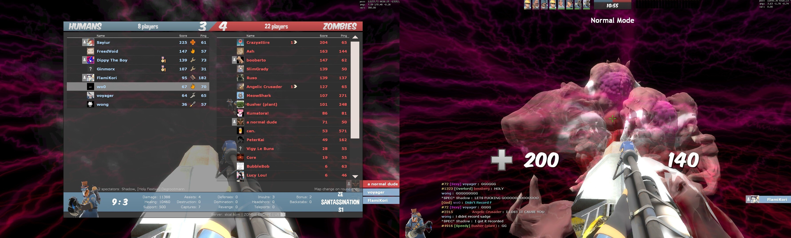

# Map List (+Map Records!)

## Maps available to play: 108 maps [_<mark style="color:blue;">(last updated 11/12/2024)</mark>_](recent-maps-11-13-2023.md)


#### These are all color coded by all known completions _\[at least once]_ in the community; <mark style="color:red;">(In NORMAL MODE +</mark> <mark style="color:red;"></mark>_<mark style="color:red;">Relatively Full (30+), Non-Friendly S</mark>_<mark style="color:red;">erver.)</mark>

_**Got a new**** **<mark style="color:green;">**win**</mark>** ****screenshot that fulfills this? Send it to**** **<mark style="color:green;">**@not\_pickles (Myuri)**</mark>** ****in the Skial Discord!**_

<mark style="color:yellow;">**`15 Incomplete Maps Remaining...`**</mark>

<mark style="color:red;">**RED**</mark>** = `Incomplete/Partially Completed - annotated with run records, (click on names!)`**

<mark style="color:green;">**GREEN**</mark> = **`Full Completion - annotated with win screenshots!`**~~_**`(Mostly.)`**_~~



_<mark style="color:yellow;">**Note:**</mark>_ You can find your custom maps folder through this navigation in the event that you need to clear out any older versions of ZE maps _or_ are experiencing any download error.

<mark style="color:green;">**Right-click TF2 on Steam > Properties > Local Files > tf folder > Download folder > Maps folder.**</mark>

_<mark style="color:yellow;">**Note 2:**</mark>_ If you want want to skip downloading all of these maps individually, you can find maps archived at this link and stick them into the path above.

[**`https://fastdl.skial.com`**](https://fastdl.skial.com)


_**`[The numerical listing doesn't mean anything; it just helps track map total easily, otherwise this is A-Z]`**_

1. [<mark style="color:green;">**ze\_2049\_tf2\_f1**</mark>](#user-content-fn-1)[^1]
2. <mark style="color:green;">**ze\_3\_valley\_skial\_8**</mark>**  **_<mark style="color:yellow;">**(TF2 map)**</mark>_
3. <mark style="color:green;">**ze\_**</mark>[<mark style="color:green;">**666\_crazy\_escape\_skial\_v2**</mark>](#user-content-fn-2)[^2]
4. [<mark style="color:green;">**ze\_A\_E\_S\_T\_H\_E\_T\_I\_C\_p3**</mark>](#user-content-fn-3)[^3] <mark style="color:purple;">**(LEADER)**</mark>
5. [<mark style="color:green;">ze\_aooka\_skial\_2</mark>](#user-content-fn-4)[^4] <mark style="color:purple;">**(LEADER)**</mark>
6. <mark style="color:green;">**ze\_ascension\_v6b**</mark>**   **_<mark style="color:yellow;">**(TF2 map)**</mark>_
7. <mark style="color:green;">**ze\_atix\_panic\_skial\_5**</mark>
8. [<mark style="color:green;">**ze\_bathroom\_skial\_8**</mark> ](#user-content-fn-5)[^5]
9. [<mark style="color:green;">**ze\_best\_korea\_skial\_4**</mark>](#user-content-fn-6)[^6]  <mark style="color:purple;">**(LEADER)**</mark>
10. [<mark style="color:green;">**ze\_bioluminescent\_v2**</mark>](#user-content-fn-7)[^7]
11. <mark style="color:green;">**ze\_bowser\_in\_the\_fire\_sea\_skial\_6**</mark>
12. [<mark style="color:green;">**ze\_breezy\_**</mark>](#user-content-fn-8)[^8]<mark style="color:green;">**v5**</mark>**   **_<mark style="color:yellow;">**(TF2 map)**</mark>_
13. <mark style="color:green;">**ze\_challenger\_skial4**</mark>
14. [<mark style="color:green;">**ze\_crazy\_escape\_skial\_2**</mark>](#user-content-fn-9)[^9]
15. [<mark style="color:green;">**ze\_dark\_souls\_skial\_2**</mark>](#user-content-fn-10)[^10] <mark style="color:purple;">**(LEADER)**</mark>
16. [<mark style="color:green;">**ze\_deadcore\_skial\_5**</mark>](#user-content-fn-11)[^11]
17. [<mark style="color:green;">**ze\_defense3002\_skial\_2**</mark>](#user-content-fn-12)[^12]
18. [<mark style="color:red;">**ze\_diddle\_skial\_6**</mark>](#user-content-fn-13)[^13]  <mark style="color:purple;">**(LEADER)**</mark>
19. [<mark style="color:green;">**ze\_djinn\_skial\_2**</mark>](#user-content-fn-14)[^14]  <mark style="color:purple;">**(LEADER)**</mark>
20. [<mark style="color:green;">**ze\_DOOM\_skial\_3**</mark>](#user-content-fn-15)[^15]  <mark style="color:purple;">**(LEADER)**</mark>
21. [<mark style="color:green;">**ze\_dreamin\_b2**</mark> ](#user-content-fn-16)[^16]
22. [<mark style="color:green;">**ze\_evernight\_skial\_1**</mark>](#user-content-fn-17)[^17]
23. [<mark style="color:green;">**ze\_fall\_guys\_skial\_2**</mark>](#user-content-fn-18)[^18]  <mark style="color:purple;">**(LEADER)**</mark>
24. [<mark style="color:green;">**ze\_fapescape\_rote\_skial\_9**</mark>](#user-content-fn-19)[^19]
25. <mark style="color:green;">**ze\_fapescape\_skial\_4**</mark>
26. <mark style="color:green;">**ze\_ffvii\_cosmo\_canyon\_b1**</mark>** (v5)**
27. [<mark style="color:green;">**ze\_ffvii\_mako\_reactor\_skial\_13**</mark>](#user-content-fn-20)[^20] **(v5, Classic Version)**
28. [<mark style="color:green;">**ze\_ffvii\_mako\_reactor\_v6\_b5**</mark>](#user-content-fn-21)[^21]  **(v6, New Version)**
29. [<mark style="color:green;">**ze\_ffvii\_malgo\_reactor\_4\_2\_s**</mark>](#user-content-fn-22)[^22]<mark style="color:green;">**7**</mark>
30. [<mark style="color:green;">**ze\_ffxii\_mt\_bur\_omisace\_b1**</mark>](#user-content-fn-23)[^23] **(v5 Version)**
31. [<mark style="color:red;">**ze\_ffxii\_mt\_bur\_omisace\_v6\_s3fix**</mark>](#user-content-fn-24)[^24] **(v6 - NEW Version)**
32. [<mark style="color:green;">**ze\_ffxiv\_wanderers\_palace\_skial\_4**</mark>](#user-content-fn-25)[^25] **(v5) **<mark style="color:purple;">**(LEADER)**</mark>
33. [<mark style="color:green;">**ze\_freezy\_v1**</mark>](#user-content-fn-26)[^26]<mark style="color:green;">**d**</mark>**   **_<mark style="color:yellow;">**(TF2 map)**</mark>_
34. [<mark style="color:green;">**ze\_frostdrake\_tower\_skial\_3**</mark>](#user-content-fn-27)[^27]
35. [<mark style="color:red;">**ze\_frozen\_abyss\_skial\_1**</mark>](#user-content-fn-28)[^28]
36. <mark style="color:green;">**ze\_frozentemple\_skial\_b1**</mark>** **<mark style="color:purple;">**(LEADER)**</mark>
37. [<mark style="color:green;">**ze\_garten\_of\_banban\_laserdance\_awesomeworld\_taylors\_version\_v2**</mark>](#user-content-fn-29)[^29]   _<mark style="color:yellow;">**(TF2 map)**</mark>_ <mark style="color:purple;">**(LEADER)**</mark>
38. [<mark style="color:red;">**ze\_grau\_fyb**</mark>](#user-content-fn-30)[^30] <mark style="color:purple;">**(LEADER)**</mark>
39. <mark style="color:green;">**ze\_gris\_skial\_5**</mark>&#x20;
40. <mark style="color:green;">**ze\_hydroponic\_garden\_s\_2**</mark>** **<mark style="color:purple;">**(LEADER)**</mark>
41. <mark style="color:green;">**ze\_icecap\_escape\_skial\_o2**</mark>
42. <mark style="color:green;">**ze\_icecap\_escape\_v5\_skial33**</mark>
43. <mark style="color:green;">**ze\_johnny\_nukem\_skial\_6**</mark>** **<mark style="color:purple;">**(LEADER)**</mark>
44. [<mark style="color:green;">**ze\_kitchen\_skial\_8**</mark>](#user-content-fn-31)[^31]
45. [<mark style="color:green;">**ze\_krusty\_krab\_skial\_4**</mark>](#user-content-fn-32)[^32]   _<mark style="color:yellow;">**(TF2 bonus stages)**</mark>_
46. [<mark style="color:green;">**ze\_l0v0l\_v1**</mark>](#user-content-fn-33)[^33]
47. [<mark style="color:red;">**ze\_laserheaven\_v2a**</mark>](#user-content-fn-34)[^34]   _<mark style="color:yellow;">**(TF2 map)**</mark>_
48. [<mark style="color:red;">**ze\_laserhell\_v1\_1\_1\_1**</mark>](#user-content-fn-35)[^35]   _<mark style="color:yellow;">**(TF2 map)**</mark>_
49. [<mark style="color:green;">**ze\_last\_man\_standing\_b1**</mark>](#user-content-fn-36)[^36]
50. <mark style="color:green;">**ze\_lotr\_helms\_deep\_skial\_9**</mark>
51. [<mark style="color:green;">**ze\_lotr\_minas\_tirith\_skial\_1**</mark>](#user-content-fn-37)[^37]<mark style="color:green;">**4**</mark>
52. <mark style="color:green;">**ze\_lotr\_mines\_of\_moria\_skial\_4**</mark>
53. [<mark style="color:green;">**ze\_luciddreams\_v3\_6\_f2**</mark>](#user-content-fn-38)[^38] **(Old Version)** <mark style="color:purple;">**(LEADER)**</mark>
54. [<mark style="color:green;">**ze\_luciddreams\_b1**</mark>](#user-content-fn-39)[^39] **(New Version) **<mark style="color:purple;">**(LEADER)**</mark>
55. [<mark style="color:green;">**ze\_meatropolis\_skial\_2**</mark>](#user-content-fn-40)[^40] <mark style="color:purple;">**(LEADER)**</mark>
56. [<mark style="color:green;">**ze\_minecraft\_adventure\_skial\_6**</mark> ](#user-content-fn-41)[^41]
57. <mark style="color:green;">**ze\_minecraft\_universe\_skial\_2**</mark>
58. [<mark style="color:green;">**ze\_minimal\_skial\_2**</mark>](#user-content-fn-42)[^42]
59. [<mark style="color:green;">**ze\_mist\_skial\_3**</mark>](#user-content-fn-43)[^43] <mark style="color:purple;">**(LEADER)**</mark>
60. [<mark style="color:green;">**ze\_neochrome\_b1**</mark>](#user-content-fn-44)[^44] <mark style="color:purple;">**(LEADER)'**</mark>
61. [<mark style="color:green;">**ze\_nomada\_h5**</mark> ](#user-content-fn-45)[^45]<mark style="color:purple;">**(LEADER)**</mark>
62. [<mark style="color:red;">**ze\_obj\_filth\_skial\_3**</mark>](#user-content-fn-46)[^46] <mark style="color:purple;">**(LEADER)**</mark>
63. [<mark style="color:red;">**ze\_obj\_npst\_tf2\_f1**</mark>](#user-content-fn-47)[^47] <mark style="color:purple;">**(LEADER)**</mark>
64. [<mark style="color:red;">**ze\_obj\_rampage\_skial\_**</mark>](#user-content-fn-48)[^48]<mark style="color:red;">**2**</mark> <mark style="color:purple;">**(LEADER)**</mark>
65. [<mark style="color:green;">**ze\_offliner\_skial\_1**</mark>](#user-content-fn-49)[^49]
66. [<mark style="color:red;">**ze\_outlast\_skial\_**</mark>](#user-content-fn-50)[^50]<mark style="color:red;">**6**</mark>
67. [<mark style="color:green;">**ze\_otakuroom\_skial\_4**</mark> ](#user-content-fn-51)[^51]
68. [<mark style="color:red;">**ze\_palace\_of\_minolila\_skial\_**</mark>](#user-content-fn-52)[^52]<mark style="color:red;">**4**</mark>
69. [<mark style="color:green;">**ze\_persona\_v3\_fix**</mark>](#user-content-fn-53)[^53]  _<mark style="color:yellow;">**(TF2 map)**</mark>_
70. [<mark style="color:green;">**ze\_pirates\_port\_royal\_skial\_12**</mark>](#user-content-fn-54)[^54]
71. [<mark style="color:green;">**ze\_pokemon\_adventure\_skial\_11**</mark>](#user-content-fn-55)[^55]
72. [<mark style="color:green;">**ze\_portal\_story\_skial\_6**</mark>](#user-content-fn-56)[^56]
73. <mark style="color:green;">**ze\_quicksand\_v1e**</mark>**   **_<mark style="color:yellow;">**(TF2 map)**</mark>_&#x20;
74. [<mark style="color:green;">**ze\_raiin\_v2**</mark>](#user-content-fn-57)[^57] _<mark style="color:yellow;">**(TF2 map)**</mark>_&#x20;
75. <mark style="color:green;">**ze\_random\_skial\_7**</mark>&#x20;
76. [<mark style="color:red;">**ze\_randomizer\_p2**</mark>](#user-content-fn-58)[^58]
77. [<mark style="color:green;">**ze\_rizomata\_skial\_8**</mark>](#user-content-fn-59)[^59]
78. [<mark style="color:green;">**ze\_rush\_b\_skial\_6**</mark>](#user-content-fn-60)[^60] <mark style="color:purple;">**(LEADER)**</mark>
79. [<mark style="color:green;">**ze\_ryujin\_v3**</mark>](#user-content-fn-61)[^61]   _<mark style="color:yellow;">**(TF2 map)**</mark>_
80. [<mark style="color:green;">**ze\_S\_A\_M\_skial\_9**</mark>](#user-content-fn-62)[^62]
81. [<mark style="color:green;">**ze\_sandstone\_v2**</mark>](#user-content-fn-63)[^63]   _<mark style="color:yellow;">**(TF2 map)**</mark>_
82. [<mark style="color:red;">**ze\_santassination\_s4**</mark>](#user-content-fn-64)[^64]
83. <mark style="color:green;">**ze\_saw\_final\_skial\_8**</mark>
84. [<mark style="color:green;">**ze\_scp\_skial\_4**</mark>](#user-content-fn-65)[^65]
85. [<mark style="color:green;">**ze\_serpentis\_temple\_skial\_4**</mark>](#user-content-fn-66)[^66]
86. [<mark style="color:green;">**ze\_shroomforest\_skial\_7**</mark> ](#user-content-fn-67)[^67]
87. [<mark style="color:green;">**ze\_shroomforest2\_skial\_1**</mark> ](#user-content-fn-68)[^68] <mark style="color:purple;">**(LEADER)**</mark>
88. [<mark style="color:green;">**ze\_shroomforest3\_skial\_1**</mark> ](#user-content-fn-69)[^69]
89. [<mark style="color:green;">**ze\_sonic\_3\_skial\_3**</mark>](#user-content-fn-70)[^70]
90. <mark style="color:green;">**ze\_sorrento\_escape\_skial\_2**</mark>
91. <mark style="color:green;">**ze\_squid\_game\_skial\_6**</mark>
92. [<mark style="color:red;">**ze\_stalker\_ultimate\_s3**</mark>](#user-content-fn-71)[^71] <mark style="color:purple;">**(LEADER)**</mark>
93. [<mark style="color:green;">**ze\_star\_wars\_prequel\_skial\_10**</mark>](#user-content-fn-72)[^72]
94. <mark style="color:green;">**ze\_subway\_escape\_skial\_9**</mark>**  **_<mark style="color:yellow;">**(TF2 map)**</mark>_
95. <mark style="color:green;">**ze\_sunlight\_skial\_1**</mark>
96. <mark style="color:green;">**ze\_surf\_facility\_skial\_b1**</mark>
97. [<mark style="color:green;">**ze\_surf\_froyo\_b**</mark>](#user-content-fn-73)[^73]<mark style="color:green;">**3**</mark>
98. <mark style="color:green;">**ze\_surf\_sahok\_skial\_4**</mark>
99. <mark style="color:green;">**ze\_surf\_vortex\_skial\_6**</mark>
100. <mark style="color:green;">**ze\_swamp\_facility\_b2d**</mark>**  **_<mark style="color:yellow;">**(TF2 map)**</mark>_
101. [<mark style="color:green;">**ze\_tyranny2\_skial\_6**</mark>](#user-content-fn-74)[^74]
102. <mark style="color:green;">**ze\_timesplitters\_skial\_2**</mark>
103. <mark style="color:green;">**ze\_titanic\_skial\_13**</mark>
104. [<mark style="color:green;">**ze\_uchiha\_legacy\_skial\_8**</mark>](#user-content-fn-75)[^75]
105. [<mark style="color:green;">**ze\_visualizer\_skial\_3**</mark>](#user-content-fn-76)[^76] <mark style="color:purple;">**(LEADER)**</mark>
106. [<mark style="color:green;">**ze\_v0u0v\_b2**</mark>](#user-content-fn-77)[^77]
107. <mark style="color:green;">**ze\_voodoo\_islands\_skial\_5**</mark>**    **_<mark style="color:yellow;">**(Re-made as TF2 Map)**</mark>_
108. [<mark style="color:red;">**ze\_warlab\_v5**</mark>](#user-content-fn-78)[^78] _<mark style="color:yellow;">**(TF2 map)**</mark>_

[^1]: 

[^2]: .jpg>)

[^3]: 

[^4]: 

[^5]: 

[^6]: 

[^7]: 

[^8]: 

[^9]: 

[^10]: 

[^11]: 

[^12]: 

[^13]: <mark style="color:yellow;">**Run Record:**</mark>

    <mark style="color:orange;">**\[Normal Heaven Won]**</mark>

    

    <mark style="color:orange;">**\[Extreme; All One Stage + Voting.]**</mark>

    **\~Pending Record...**

[^14]: .png>)

[^15]: 

[^16]: 

[^17]: 

[^18]: .png>)

[^19]: 

[^20]: .PNG>)

[^21]:  Win (1).jpg>)

[^22]: 

    

[^23]: .png>)

[^24]: <mark style="color:yellow;">**Run Record:**</mark>

    <mark style="color:orange;">**\[Stage 1/4]**</mark>

    **\~Pending Record...**

[^25]: 

[^26]: 

[^27]: 

[^28]: <mark style="color:yellow;">**Run Record:**</mark>

    <mark style="color:orange;">**\[Stage 1/2]**</mark>

    **\~Pending Record...**

[^29]: 

[^30]: <mark style="color:yellow;">**Run Record:**</mark>

    <mark style="color:orange;">**\[RTV2]**</mark>

    _**\~Pending RTV2 win for full completion**_

[^31]: 

[^32]: 

[^33]: .png>)

[^34]: <mark style="color:yellow;">**Run Record:**</mark>

    <mark style="color:orange;">**\[Stage 3/3 - RTV Level]**</mark>

    **\~Giant Fan Room**

[^35]: <mark style="color:yellow;">**Run Record:**</mark>

    <mark style="color:orange;">**\[Stage 2 Random Variant Stages]**</mark>

    <mark style="color:green;">**\[Meteor]**</mark>

    <mark style="color:green;">**\[Snow]**</mark>

    <mark style="color:green;">**\[Endless Night]**</mark>

    <mark style="color:red;">**\[Mako]**</mark>

    

[^36]: 

    

[^37]: 

[^38]: 

[^39]: .PNG>)

[^40]: 

[^41]: .jpg>)

[^42]: .jpeg>)

[^43]: 

[^44]: .png>)

[^45]: 

[^46]: <mark style="color:yellow;">**Run Record:**</mark>

    <mark style="color:orange;">**\[Stage 1/1]**</mark>

    **\~Pending Record...**

[^47]: <mark style="color:yellow;">**Run Record:**</mark>

    <mark style="color:orange;">**\[Stage 1/1]**</mark>

    **\~Pending Record...**

[^48]: <mark style="color:yellow;">**Run Record:**</mark>

    <mark style="color:orange;">**\[Stage 1/1]**</mark>

    **\~Pending Record...**

[^49]: .png>)

[^50]: <mark style="color:yellow;">**Run Record:**</mark>

    <mark style="color:orange;">**\[Stage 2/2 - Underground Lab]**</mark>&#x20;

    **-Finale DPS Check**

[^51]: 

[^52]: <mark style="color:yellow;">**Run Record:**</mark>\
    <mark style="color:orange;">**\[Stage 4/5]**</mark>

    **\~Laser Boss**

[^53]: .png>)

[^54]: 

[^55]: 

[^56]: 

[^57]: .jpg>)

[^58]: <mark style="color:yellow;">**Run Record:**</mark>\
    <mark style="color:orange;">\~</mark><mark style="color:orange;">**Endings 1 & 2 Done**</mark>

    **\~70% Complete (100% needed for End 3)**

[^59]: 

[^60]: 

[^61]: 

[^62]: 

[^63]: 

[^64]: <mark style="color:yellow;">**Run Record:**</mark>&#x20;

    _(Entirely re-ported version with differing mechanics; so past records aren't into account anymore!)_&#x20;

    <mark style="color:orange;">**\[Normal Complete.]**</mark>

    

    <mark style="color:orange;">**\[Extreme;**</mark> <mark style="color:orange;">**Stage 4/4]**</mark>

    **-Socrates Finale!**

[^65]: 

[^66]: 

[^67]: 

[^68]: 

[^69]: 

[^70]: 

[^71]: <mark style="color:yellow;">**Run Record:**</mark>\
    <mark style="color:orange;">**\[Stage 1/5]**</mark>

    **\~Pending record...**

[^72]: 

[^73]: 

[^74]: 

[^75]: 

[^76]: .jpg>)

[^77]: &#x20;

[^78]: <mark style="color:yellow;">**Run Record:**</mark>\
    <mark style="color:orange;">**\[Normal End Cleared]**</mark>

    _**\~Secret End pending win**_
