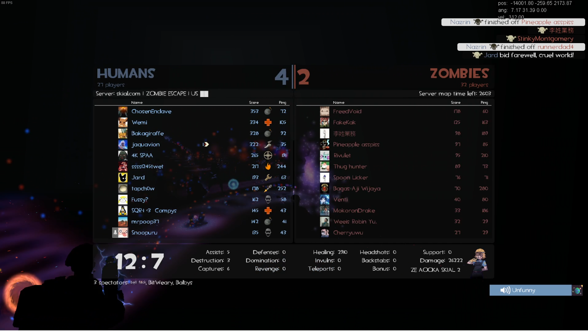

# (NEW) !zload


<mark style="color:yellow;">**!zload**</mark> is a new command in which allows you to swap or 'buy' another weapon in place to allow you change gameplay styles instantly; among being able to alleviate being on any suboptimal weapon for specific parts of maps.

<mark style="color:yellow;">**Note:**</mark> Items that don't get loaded by zload - spy sappers and shields, can be done by using **!items** then zloading any item.

<mark style="color:yellow;">**Note 2:**</mark> Weapons upon being z-loaded will retain their 'original' TF2 clip value; eg Frontier Justice will have 3 shots - so it might not be worth "rebuying" in most cases for your DPS.\
\
Currently, you are restricted to <mark style="color:green;">**3 charges (uses)**</mark> of <mark style="color:yellow;">**!zload**</mark> swaps.


_**Almost any**_ Zombie Escape modified weapon can be zloaded - _albeit if its a disabled weapon_ in the gamemode _<mark style="color:red;">(currently Boots, Mantreads, Base Jumper, Thermal Thruster, Disciplinary Action...)</mark>_ - then it will just force you onto something else like a Flare Gun or Shotgun regardless of the text implying you're given it.

<figure><figcaption></figcaption></figure>

* Example: <mark style="color:yellow;">**!zload Liberty**</mark> _(play defensive Soldier via Rocket Specialist attribute)_ **->** <mark style="color:yellow;">**!zload Mangler**</mark> _(play as banner/boss support Soldier via increased banner length attribute)_
* Example 2: <mark style="color:yellow;">**!zload Baby**</mark> _(play trigger Scout_ _or grab an item via extra speed) **-**_**>** <mark style="color:yellow;">**!zload Scattergun**</mark> _(switch to general use defense/boss support via overall damage + kb increase)_
* _Example 3: <mark style="color:yellow;">**!zload Jarate**</mark> (re-buy your slowdown grenade for an incoming teleport) **->****&#x20;**<mark style="color:yellow;">**!zload smg**</mark> (switch to cover/boss option)_

<figure><figcaption>
Zombies are too dumb to use !zload mechanics, sorry!
</figcaption></figure>

_No, you can't !zload a minigun as a Spy._
