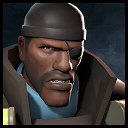

# 💣 Demoman

**`Class Cap: N/A`**

<mark style="color:green;">**Health: 200 (Stickies); 175 (Shields)**</mark>\
<mark style="color:yellow;">**Speed:**</mark> _**252.00 HU/s (84.0% base TF2 speed)**_\
\
<mark style="color:blue;">**Pros**</mark>

* Detonated stickies can cause an AoE stun
* Extremely effective at group stalling
* Can tank one Zombie hit with a [rechargeable shield](secondaries.md#splendid-screen)

<mark style="color:red;">**Cons**</mark>

* **Slowest** base class speed _(without the_ [_Pain Train_](melees.md#pain-train)_)_
* Cannot sticky/pill jump _(only **ze\_freezy** and **ze\_breezy** have this enabled.)_
* Up close, zombies can overwhelm easily due to lack of reliable knockback
* Stickies will slide off any moving geometry; making it **VERY** hard to properly stun zombies on them
* Stun immunity makes stacking more Demos exponentially less effective

\
Demoman's main job in Zombie Escape is to slow and stun hordes of zombies during fallbacks while also stunning certain dangerous zombies during defenses. The sticky bomb's area of effect can slow multiple zombies down or **stun** them outright if they deal enough damage. **Zombies will gain stun immunity for&#x20;**<mark style="color:yellow;">**3 seconds**</mark>**&#x20;after they've been stunned once, so multiple Demomen and Snipers can become less effective as you won't be getting any 'more' stuns.**\
\
Also be mindful that, while a zombie is stunned, they cannot be knocked back unless airblasted. This means stunning them up close allows them to bodyblock your team's bullets, so zombies behind them can push forward. If you do want to knock back zombies or launch them into map hazards, your grenade launchers can achieve this at the risk of boosting somewhat.

\
Alternatively, if you wish to fight up close, there's always the Demoknight subclass that lets you tank a hit with your shield. **When fully charged,** [**Shields**](secondaries.md#splendid-screen) **will give you ÜberCharge upon receiving any sort of damage from a zombie.** While useful for blocking Heavies trying to force their way through with Mutations, _it also procs off of Medic and pyro Mutations_ making it extremely ineffective against multiple Mutation spam. Aside from helping deal with Heavies and a few other niche scenarios, Demoknight is ineffective on defense - but not outright useless in good hands.
