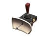

# Engineer Secondaries

## Short Circuit   .png>)

| Attributes                                                                                                    |
| ------------------------------------------------------------------------------------------------------------- |
| <mark style="color:yellow;">**Uses metal for ammo**</mark>                                                    |
| <mark style="color:blue;">**+320% Damage Bonus**</mark>                                                       |
| <mark style="color:blue;">**+30% Faster Firing Speed**</mark>                                                 |
| <mark style="color:orange;">**Per Shot: -5 ammo**</mark>                                                      |
| <mark style="color:orange;">**Alt-Fire: Launches a projectile-consuming energy ball. Costs 65 metal.**</mark> |
| <mark style="color:orange;">**No reload necessary**</mark>                                                    |

<table data-view="cards"><thead><tr><th></th><th></th><th></th><th></th></tr></thead><tbody><tr><td><mark style="color:purple;"><strong>[Timings]</strong></mark></td><td>Attack Interval: 0.105</td><td>TEC: 7.14 seconds</td><td>Full Reload Time: 5 seconds</td></tr><tr><td><mark style="color:purple;"><strong>Damage [Func_Physbox]</strong></mark></td><td>Base Damage: 24.9 per shot</td><td><strong>Real DPS:</strong> 164.678 DPS</td><td>Clip DPS <em>(Nonstop)</em>: 280 DPS</td></tr><tr><td><mark style="color:purple;"><strong>Damage [Func_Breakable]</strong></mark></td><td>Base Damage: 14 per shot</td><td><strong>Real DPS:</strong> 78.418 DPS</td><td>Clip DPS <em>(Nonstop)</em>: 133.333 DPS</td></tr></tbody></table>

Seemingly useless at first glance, you might think the Short Circuit is in the same tier as the Bison or Pomson. However, this is a **fantastic** Engineer weapon that lets you slow many zombies in an AoE turning you into a psuedo Pyro. Amazing for fallbacks and considering you mainly use your primary to defend anyway, the Short Circuit provides great utility to the Engineer. The only cases where this weapon can fall off usage-wise is if map geometry doesn't allow for the alt-fire projectile to travel anywhere and dissipates nearly immediately - this tends to happen on moving platforms, tight doorways, or elevators.

With the function of it's M1 attack, it only lasts about \~7 seconds of fire-time but can provide a burst-knockback option for any imminent dangers - otherwise that use of the weapon isn't too useful due to the short range. _With plentiful dispensers_ supplying it ammo, its potential for burst DPS has the potential to be extremely strong, going from a \~165 sustained DPS to a \~280 nonstop.

## Pistol    .png>)

| Attributes                                                    |
| ------------------------------------------------------------- |
| **Clip Size - 48 shots**                                      |
| **Weapon Spread: 100:1**                                      |
| <mark style="color:blue;">**+53% Damage Bonus**</mark>        |
| <mark style="color:blue;">**+33% Faster Firing Speed**</mark> |
| <mark style="color:blue;">**+50% More Accurate**</mark>       |
| <mark style="color:red;">**-50% Slower Reload Time**</mark>   |

<table data-view="cards"><thead><tr><th></th><th></th><th></th><th></th></tr></thead><tbody><tr><td><mark style="color:purple;"><strong>[Timings]</strong></mark></td><td>Attack Interval: 0.105</td><td>TEC: 5.04 seconds</td><td>Full Reload Time: 1.515 seconds</td></tr><tr><td><mark style="color:purple;"><strong>Damage [Func_Physbox]</strong></mark></td><td>Base Damage: 19.125 per shot</td><td><strong>Real DPS:</strong> 140.0.45 DPS</td><td>Clip DPS <em>(Nonstop)</em>: 182.142 DPS</td></tr><tr><td><mark style="color:purple;"><strong>Damage [Func_Breakable]</strong></mark></td><td>Base Damage: 9 per shot</td><td><strong>Real DPS:</strong> 65.903 DPS</td><td>Clip DPS <em>(Nonstop)</em>: 85.714 DPS</td></tr></tbody></table>

The Pistol serves as Scout and Engineer’s trusty follow-up weapon the majority of the time. In base TF2, if enemies are far away or low on health, they can quickly swap to this weapon in the hopes of more accurately putting a few shots in. It’s not meant to be stronger than a Shotgun, hence the damage nerf of \~140 DPS.

What this weapon does now excel at is accuracy, which is emphasized by its decreased bullet spread to 100:1. This makes the Pistol one of the better picks for single-target stalling and for shooting at fast-moving or far-away bosses, assuming one can track well. As an engineer, the pistol is a great choice of pick to have a consistent no-brainer output of damage if you plan on running any of the gimmicky, non-damaging primaries.

## Wrangler   

| Attributes                                                                                                                                           |
| ---------------------------------------------------------------------------------------------------------------------------------------------------- |
| <mark style="color:blue;">**+20% Sentry Firing Speed**</mark>                                                                                        |
| <mark style="color:blue;">**+200% Sentry Build Speed**</mark>                                                                                        |
| <mark style="color:blue;">**+200% Dispenser Range**</mark>                                                                                           |
| <mark style="color:orange;">**Take manual control of your Sentry Gun Wrangled sentries gain a shield that reduces damage and repairs by 66%**</mark> |
| <mark style="color:yellow;">**Sentries are disabled for 3 seconds after becoming unwrangled**</mark>                                                 |

A potential lifesaver, the Wrangler allows your Dispenser to have a much further range while making your sentry far more tankier, **and building it quicker.** The main benefit of this weapon is the extended dispenser range, causing you to save potentially more of your teammates during boss fights that let you heal normally with its extended range. Another purpose of actually using the weapon other than to use its passives; is to create a shielded blockade for zombies to be unable to pass through, making it especially useful on doors and narrow holes. However, the sentry is short enough that a zombie could easily jump over it, and the sentry repairs are significantly nerfed making it mediocre as a blockade compared to the much taller Dispenser.
