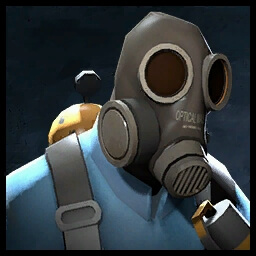

# 🔥 Pyro

**`Class Cap: N/A`**

<mark style="color:green;">**Health:**</mark> _**200**_\
<mark style="color:yellow;">**Speed:**</mark> _**270.00 HU/s (90.0% base TF2 speed)**_\
\
<mark style="color:blue;">**Pros**</mark>

* Extremely effective for spacing, pushing back zombies
* Fire from his flamethrowers can easily stall larger groups of zombies from reaching a specific objective or door

<mark style="color:red;">**Cons**</mark>

* Low DPS for bosses and NPCs\
  &#xNAN;_(flames essentially do 0 to no damage to them!)_
* Not many sources of teammates on fire to extinguish for self-healing
* Has to be up close to zombies to be effective
* Can Boost Zombies VERY high _via_ specific flares
* Airblast resistance means that more Pyros make\
  them less effective until resistance wears out
* Flamethrower particles might be _(unintentionally)_ entirely blocked by specific map areas
* Flamethrowers can outpace ammo regeneration

\
Utilizing their flamethrowers, Pyro's main job in Zombie Escape is defense support and stalling the zombies on fall backs. Set zombies on fire to slow them down or airblast them if they get too close. Make sure you have shotguns though as you can't deal damage to NPCs or bosses using your fire!\
\
Important to note is that zombies gain airblast resistance each time they are hit by one. This will reduce their knockback from it and gradually come to a point where airblasts are completely negated. This effect will stack until it _**resets**_ after approximately <mark style="color:yellow;">**10 seconds.**</mark> In addition to that, Pyro's flamethrowers tend to run out of ammo quickly the more you airblast, so watch your ammo count.\
\
Since you have to get so close to the zombies, be careful of any Mutations that might stun you or that ignore knockback. To space yourself and keep a safe distance, use shotguns. [Flare guns](secondaries.md#flare-gun) can be interesting with their ridulous knockback or side gimmicks, but this usually results in zombies being boosted unfavorably. Topping it all off, if even more mobility is your thing, try out the [Powerjack](melees.md#powerjack) but be careful as you'll universally take more damage with it out.
