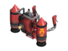

# Pyro Secondaries


## <mark style="color:red;">The Thermal Thruster is banned and unable to be used.</mark>   


## Shotgun   .png>)

| Attributes                                                    |
| ------------------------------------------------------------- |
| **Clip Size - 18 Shots**                                      |
| **Weapon Spread: 30:1**                                       |
| <mark style="color:blue;">**+60% Faster Firing Speed**</mark> |
| <mark style="color:blue;">**+60% Faster Reload Time**</mark>  |
| <mark style="color:blue;">**+20% Damage Bonus**</mark>        |

<table data-view="cards"><thead><tr><th></th><th></th><th></th><th></th><th></th><th></th></tr></thead><tbody><tr><td><mark style="color:purple;"><strong>[Timings]</strong></mark></td><td>Attack Interval: 0.255</td><td>TEC: 4.59 seconds</td><td>Reload Time (First): 0.405 seconds</td><td>Reload Time (Consec.): 0.21 seconds</td><td>Full Reload Time: 3.975 seconds</td></tr><tr><td><mark style="color:purple;"><strong>Damage [Func_Physbox]</strong></mark></td><td>Base Damage: 72 per shot</td><td><strong>Real DPS:</strong> 151.312 DPS</td><td>Clip DPS <em>(Nonstop)</em>: 282.352 DPS</td><td></td><td></td></tr><tr><td><mark style="color:purple;"><strong>Damage [Func_Breakable]</strong></mark></td><td>Base Damage: 36 per shot</td><td><strong>Real DPS:</strong> 76.656 DPS</td><td>Clip DPS <em>(Nonstop)</em>: 141.716 DPS</td><td></td><td></td></tr></tbody></table>

The stock shotgun is pretty much the de facto weapon used by new players or those overwhelmed by all the weapon changes. It also sets the precedent for pretty much all shotgun-esque weapons. This weapon's base DPS is around \~150, which is a damage range all weapons will hover around with a lowered fire rate to compensate.

Reliable as a mid ranged option, the stock Shotgun is the premier choice for pyros in ZE. Since flamethrowers are short ranged weapons, the Shotgun is a good way of keeping zombies a safer distance away - especially in cases where your airblast isn't going to work on knocking zombies back. The Shotgun also lets pyros damage NPCs and bosses as flamethrower fire does nearly zero damage against them _(or if they can't land their flares.)_ This is just a solid, reliable option.

## Reserve Shooter   .png>)

| Attributes                                                                                                               |
| ------------------------------------------------------------------------------------------------------------------------ |
| **Clip Size - 12 Shots**                                                                                                 |
| **Weapon Spread: 50:1**                                                                                                  |
| <mark style="color:blue;">**+60% Faster Firing Speed**</mark>                                                            |
| <mark style="color:blue;">**+60% Faster Reload Time**</mark>                                                             |
| <mark style="color:blue;">**+20% Faster Weapon Deploy**</mark>                                                           |
| <mark style="color:blue;">**+40% More Accurate**</mark>                                                                  |
| <mark style="color:blue;">**+20% Damage Bonus**</mark>                                                                   |
| <mark style="color:orange;">**Mini-crits targets launched airborne by explosions, grapple hooks or rocket packs**</mark> |

<table data-view="cards"><thead><tr><th></th><th></th><th></th><th></th><th></th><th></th></tr></thead><tbody><tr><td><mark style="color:purple;"><strong>[Timings]</strong></mark></td><td>Attack Interval: 0.255</td><td>TEC: 3.06 seconds</td><td>Reload Time (First): 0.405 seconds</td><td>Reload Time (Consec.): 0.21 seconds</td><td>Full Reload Time: 2.715 seconds</td></tr><tr><td><mark style="color:purple;"><strong>Damage [Func_Physbox]</strong></mark></td><td>Base Damage: 72 per shot</td><td><strong>Real DPS:</strong> 149.609 DPS</td><td>Clip DPS <em>(Nonstop)</em>: 282.352 DPS</td><td></td><td></td></tr><tr><td><mark style="color:purple;"><strong>Damage [Func_Breakable]</strong></mark></td><td>Base Damage: 36 per shot</td><td><strong>Real DPS:</strong> 74.804 DPS</td><td>Clip DPS <em>(Nonstop)</em>: 141.176 DPS</td><td></td><td></td></tr></tbody></table>

The Reserve Shooter in base TF2 is a shotgun primarily utilized as a follow-up weapon for enemy players launched in the air. With its faster deploy time and ability to mini-crit airborne targets, it can more easily take them down. Since a majority of the time, the goal is to simply shoot at zombies with ludicrous amounts of HP, this mechanic doesn’t really play much of a role.&#x20;

What can instead be taken advantage of is its faster deployment time, allowing players to respond to immediate threats much more easily. From there, this weapon has been remade to accentuate accuracy among the shotguns much like how a player would need to accurately shoot enemy players launched in the air. **The difference in DPS compared to the stock Shotgun is practically negligible.**

The goal of these attributes is to provide a higher-accuracy hitscan weapon for the Pyro and Soldier. They reduce the weapon's horde-stoppability while making it great for fighting bosses or NPCs that are **far away or fast-moving**. To an extent, this can make it less effective for fallbacks with larger hordes but greater for single-target stalling. The smaller clip size and higher accuracy may be a bit more perilous for Pyros defending up close and for Soldiers boosting zombies in front of them. In a pinch, the faster deployment time can help, but, in the heat of the moment, the smaller clip size and lesser spread may prove fatal.

## Panic Attack   .png>)

| Attributes                                                                   |
| ---------------------------------------------------------------------------- |
| **Clip Size - 18 Shots**                                                     |
| **Weapon Spread: 20:1**                                                      |
| <mark style="color:blue;">**+80% Faster Firing Speed**</mark>                |
| <mark style="color:blue;">**+45% Faster Reload Time**</mark>                 |
| <mark style="color:blue;">**+50% Bullets Per Shot**</mark>                   |
| <mark style="color:blue;">**+50% Quicker Weapon Deploy**</mark>              |
| <mark style="color:blue;">**+25% Damage vs Players**</mark>                  |
| <mark style="color:red;">**-37% Damage Penalty**</mark>                      |
| <mark style="color:red;">**-50% Less Accurate**</mark>                       |
| <mark style="color:orange;">**Fires a wide, fixed shot pattern**</mark>      |
| <mark style="color:orange;">**Successive shots become less accurate**</mark> |

<table data-view="cards"><thead><tr><th></th><th></th><th></th><th></th><th></th><th></th></tr></thead><tbody><tr><td><mark style="color:purple;"><strong>[Timings]</strong></mark></td><td>Attack Interval: 0.135</td><td>TEC: 2.43 seconds</td><td>Reload Time (First): 0.555 seconds</td><td>Reload Time (Consec.): 0.285 seconds</td><td>Full Reload Time: 5.4 seconds</td></tr><tr><td><mark style="color:purple;"><strong>Damage [Func_Physbox]</strong></mark></td><td>Base Damage: 56.7 per shot</td><td><strong>Real DPS:</strong> 130.344 DPS</td><td>Clip DPS <em>(Nonstop)</em>: 420 DPS</td><td></td><td></td></tr><tr><td><mark style="color:purple;"><strong>Damage [Func_Breakable]</strong></mark></td><td>Base Damage: 28 per shot</td><td><strong>Real DPS:</strong> 64.367 DPS</td><td>Clip DPS <em>(Nonstop)</em>: 207.407 DPS</td><td></td><td></td></tr></tbody></table>

The Panic Attack in base TF2 has gone through many revisions. It was originally a charged burst weapon that fired much faster the lower one’s health was. Now, it’s a rapid-fire burst weapon that loses accuracy the longer one keeps firing. These modifications follow the trend of the latter, as this weapon has been reworked into an immediate response option for players caught out by groups of zombies.

Currently the weapon stands as the **fastest-firing yet slowest-reloading** shotgun. With a TEC time of 2.43 seconds and a FRT of 5.4 seconds, this produces an extremely low uptime-downtime ratio of 0.45. This means that this weapon is **highly unsustainable for long-term defenses** and should only be used if necessary. This weapon has a 37% damage penalty, leading to the lowest sustained DPS among all shotguns at \~130. But, because this weapon boasts an extremely high fire rate, its nonstop DPS is actually **one of the highest among all weapons at 420&#x20;**_**(provided that you have an**_ [_**ammo item.**_](../../../elements-of-zombie-escape/items/common-items.md#human-items)_**)**_

Even if this weapon has low sustained DPS, it evens out by being given a damage bonus to players in an attempt to make it more effective for close-range knockback in hitting multiple zombies due to the spread 'penalty' applying to extra pellets. With all this in effect, hopefully this becomes a weapon Pyros, Heavies, and Soldiers can consider as an option should they tend to over-defend or get caught out often. The low damage and high spread also make this weapon less appealing for fast-moving boss fights, so try to _avoid_ using it on maps that require optimal DPS or accurate shots to win unless you're comfortable with getting up close.

## Detonator   .png>)

| Attributes                                                               |
| ------------------------------------------------------------------------ |
| **Blast Radius: 110**                                                    |
| **Projectile Speed: 2000**                                               |
| <mark style="color:blue;">**+600% Damage Bonus**</mark>                  |
| <mark style="color:red;">**-57% Damage vs Players**</mark>               |
| <mark style="color:blue;">**+25% Faster Firing Speed**</mark>            |
| <mark style="color:red;">**+50% Damage to Self**</mark>                  |
| <mark style="color:orange;">**100% minicrits vs burning players**</mark> |
| <mark style="color:orange;">**Can not be crit boosted.**</mark>          |
| <mark style="color:orange;">**Alt-Fire: Detonate flare.**</mark>         |
| <mark style="color:orange;">**Sets weapon mode #1.0 (Hidden)**</mark>    |

<table data-view="cards"><thead><tr><th></th><th></th><th></th><th></th></tr></thead><tbody><tr><td><mark style="color:purple;"><strong>[Timings]</strong></mark></td><td>Attack Interval: 1.5</td><td></td><td></td></tr><tr><td><mark style="color:purple;"><strong>Damage [Func_Physbox]</strong></mark></td><td>Base Damage: 210 per shot</td><td><strong>Real DPS:</strong> 140 DPS</td><td>Clip DPS <em>(Nonstop)</em>: 140 DPS</td></tr><tr><td><mark style="color:purple;"><strong>Damage [Func_Breakable]</strong></mark></td><td>Base Damage: 105 per shot</td><td><strong>Real DPS:</strong> 70 DPS</td><td>Clip DPS <em>(Nonstop)</em>: 70 DPS</td></tr></tbody></table>

The Detonator in base TF2 is a weapon enjoyed for its explosive flares. It was the original flare gun for Pyro's explosive jumps and is something they can use for area denial from a distance.&#x20;

In Zombie Escape, it functions similarly aside from the explosive jump mechanic. It shares the same fire rate as the Flare Gun but with lesser overall damage leading to \~140 DPS.

Since it doesn't pack a -z velocity attribute like the other flares for balance reasons _(AoE afterburn all causing z-velocity jump denial);_ The Detonator particularly specializes in a focus on slowing down zombies through its right-click AoE damage, akin to the Short Circuit.&#x20;

While it can _theoretically_ perma-slow zombies, it requires much more skill than either the Flamethrower or the Short Circuit, and a well-timed and placed detonation to send zombies off pitfalls - or at the worst boost them in the air some; the detonator also has some lower-end damage against NPCs/bosses in pyro secondaries; but it's ranked higher due to the skill ceiling in being able to launch away groups of zombies from specific angles.

## Manmelter   .png>)

| Attributes                                                                                             |
| ------------------------------------------------------------------------------------------------------ |
| **Projectile Speed: 3000**                                                                             |
| <mark style="color:blue;">**+50% Projectile Speed**</mark>                                             |
| <mark style="color:blue;">**+70% Faster Firing Speed**</mark>                                          |
| <mark style="color:blue;">**+160% Damage Bonus**</mark>                                                |
| <mark style="color:red;">**+49% Damage vs Players**</mark>                                             |
| <mark style="color:orange;">**Does not require ammo**</mark>                                           |
| <mark style="color:orange;">**Applies -125 z velocity on hit (Hidden)**</mark>                         |
| <mark style="color:orange;">**Minicrits whenever it would normally crit.**</mark>                      |
| <mark style="color:orange;">**Alt-Fire: Extinguish teammates to gain guaranteed critical hits**</mark> |
| <mark style="color:orange;">**Extinguishing teammates restores 20 health**</mark>                      |
| <mark style="color:orange;">**Sets weapon mode #2.0 (Hidden)**</mark>                                  |

<table data-view="cards"><thead><tr><th></th><th></th><th></th><th></th></tr></thead><tbody><tr><td><mark style="color:purple;"><strong>[Timings]</strong></mark></td><td>Attack Interval: 0.6</td><td></td><td></td></tr><tr><td><mark style="color:purple;"><strong>Damage [Func_Physbox]</strong></mark></td><td>Base Damage: 78 per shot</td><td><strong>Real DPS:</strong> 130 DPS</td><td>Clip DPS <em>(Nonstop)</em>: 130 DPS</td></tr><tr><td><mark style="color:purple;"><strong>Damage [Func_Breakable]</strong></mark></td><td>Base Damage: 39 per shot</td><td><strong>Real DPS:</strong> 65 DPS</td><td>Clip DPS <em>(Nonstop)</em>: 65 DPS</td></tr></tbody></table>

The Manmelter in base TF2 is probably among the least-used Pyro secondaries. It does have unlimited ammo and a unique mechanic of being able to extinguish teammates while providing crits, but these are relatively pointless and non-unique in Zombie Escape.&#x20;

What this weapon now works as is something like a rapid-fire unlimited ammo, igniting pistol with <mark style="color:orange;">**-125 z velocity**</mark> applied on hit; continuously pulling down multiple zombies attempting to jump in the air as they take damage from afterburn.

## Flare gun   .png>)

| Attributes                                                                     |
| ------------------------------------------------------------------------------ |
| **Projectile Speed: 2000**                                                     |
| <mark style="color:blue;">**+25% Faster Firing Speed**</mark>                  |
| <mark style="color:blue;">**+700% Damage Bonus**</mark>                        |
| <mark style="color:red;">**-58.5% Damage vs Players**</mark>                   |
| <mark style="color:orange;">**Applies -125 z velocity on hit (Hidden)**</mark> |

<table data-view="cards"><thead><tr><th></th><th></th><th></th><th></th></tr></thead><tbody><tr><td><mark style="color:purple;"><strong>[Timings]</strong></mark></td><td>Attack Interval: 1.5</td><td></td><td></td></tr><tr><td><mark style="color:purple;"><strong>Damage [Func_Physbox]</strong></mark></td><td>Base Damage: 240 per shot</td><td><strong>Real DPS:</strong> 160 DPS</td><td>Clip DPS <em>(Nonstop)</em>: 160 DPS</td></tr><tr><td><mark style="color:purple;"><strong>Damage [Func_Breakable]</strong></mark></td><td>Base Damage: 120 per shot</td><td><strong>Real DPS:</strong> 80 DPS</td><td>Clip DPS <em>(Nonstop)</em>: 80 DPS</td></tr></tbody></table>

The stock Flare Gun is a weapon that can be satisfying to use if one can land their flares on burning players for crit damage. This effect does make it one of, if not the best, flare guns for single-target damage. With increasing the damage on hit - it can result in _extreme_ boosting of zombies; so it has also been given an applied <mark style="color:orange;">**-125 z velocity**</mark> on hit. **This applied z velocity also reapply as zombies take damage from afterburn**, so it does have the unintentional capability of sustained hinderance and can pre-emptively shut down a zombie from jumping over defendable gaps as they will instead get pushed downwards.

Essentially, each class has a weapon that deals damage significantly greater than the average damage output of their secondaries or primaries. The Flare Gun acts as this option for Pyros, in which they can specialize in damage at the cost of their defensive potency, self-protection, and the potential liability of unfavorable boosts. Hitscan will still be easier to land, so shotguns will remain a decent option, but this opens the door slightly for squeezing out a bit of extra damage should it be necessary.

## **Scorch Shot** .png>)

| Attributes                                                                                   |
| -------------------------------------------------------------------------------------------- |
| <mark style="color:yellow;">**Fires an incendiary rocket instead of a special flare**</mark> |
| **Blast Radius: 73**                                                                         |
| **Projectile Speed: 1999.8**                                                                 |
| <mark style="color:blue;">**+700% Afterburn Aamage Bonus**</mark>                            |
| <mark style="color:blue;">**+100% Damage Bonus vs Burning Players**</mark>                   |
| <mark style="color:blue;">**+81.8% Projectile Speed**</mark>                                 |
| <mark style="color:blue;">**+10% Faster Reload Time**</mark>                                 |
| <mark style="color:blue;">**+740% Damage Bonus**</mark>                                      |
| <mark style="color:red;">**-50% Damage vs Players**</mark>                                   |
| <mark style="color:red;">**-50% Explosion Radius**</mark>                                    |
| <mark style="color:red;">**-67% Afterburn Duration**</mark>                                  |
| <mark style="color:red;">**-100% Self Damage Force (No Flare/Rocket Jumping)**</mark>        |
| <mark style="color:orange;">**100% minicrits vs burning players**</mark>                     |
| <mark style="color:orange;">**On Hit: target is engulfed in flames**</mark>                  |

<table data-view="cards"><thead><tr><th></th><th></th><th></th><th></th></tr></thead><tbody><tr><td><mark style="color:purple;"><strong>[Timings]</strong></mark></td><td>Attack Interval: 1.8</td><td></td><td></td></tr><tr><td><mark style="color:purple;"><strong>Damage [Func_Physbox]</strong></mark></td><td>Base Damage: 252 per shot</td><td><strong>Real DPS:</strong> 140 DPS</td><td>Clip DPS <em>(Nonstop)</em>: 140 DPS</td></tr><tr><td><mark style="color:purple;"><strong>Damage [Func_Breakable]</strong></mark></td><td>Base Damage: 126 per shot</td><td><strong>Real DPS:</strong> 70 DPS</td><td>Clip DPS <em>(Nonstop)</em>: 70 DPS</td></tr></tbody></table>

The Scorch Shot in base TF2 is a very controversial weapon. It's fairly easy to use, much like the other flare guns, yet it provides an extremely strong utility for area denial due to the properties of its flares. They can halt the momentum of players and even explode on contact with the ground to ignite nearby players. They can even allow Pyros to flare jump due to the explosion.

The knockback mechanic of the flares being so powerful may have been why this weapon was _previously_ banned in Zombie Escap. **It has been added back under a rework where this weapon now fires a mini-rocket that ignites zombies.** The only thing that really hasn't changed—the primary concern - is its erratic boosting potential, as it can still launch zombies fairly easily.

For those worried, currently the server plugin makes it such that players launched will either be flung back and to the sides at ridiculous angles or find themselves flung directly upwards with little to no momentum to air-strafe around and take advantage of it. As a precaution, this weapon has also been given 0% self-damage force **to prevent "rocket-jumping" with it.**

## Gas Passer   

| Attributes                                                                                                                       |
| -------------------------------------------------------------------------------------------------------------------------------- |
| <mark style="color:blue;">**+50% Deploy Speed**</mark>                                                                           |
| <mark style="color:blue;">**+50% Holster Speed**</mark>                                                                          |
| <mark style="color:orange;">**Now throws an incendiary grenade instead.**</mark>                                                 |
| <mark style="color:orange;">**Deals 100 splash damage to players on direct hit, inflicting afterburn on any hit players**</mark> |
| <mark style="color:orange;">**Deals 1000 damage to bosses on direct hit**</mark>                                                 |
| <mark style="color:yellow;">**8 second delay before each throw**</mark>                                                          |
| <mark style="color:yellow;">**Has 200 ammo to make it last the entire round**</mark>                                             |

~~`Instantly kills all the zombies coated by this, revives your entire team, destroys every single NPC and Boss, does your taxes, solves world hunger, and can even win the Nobel Prize. The Gas Passer will make your team question whether you're trolling or genuinely clueless.`~~ ~~_Old version's decription was funny enough to keep; it's not this bad now._~~

A complete rework to the Gas Passer since the former versions were extremely buggy. Essentially this option throws an **incendiary grenade** that damages both zombies and bosses, making it useful for flinging zombies and taking down bosses. However, it deprives the Pyro of a reliable knockback option, making it less useful for defending _(not delaying)_ alongside the team in places where you may need to hold.

##

