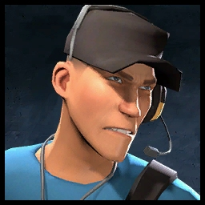

# Scout

**`Class Cap: N/A`**

<mark style="color:green;">**Health:**</mark> _**200**_\
<mark style="color:yellow;">**Speed:**</mark> _**292.50 HU/s (97.5% base TF2 speed)**_\
\
<mark style="color:blue;">**Pros**</mark>

* Fastest survivor
* High DPS against NPCs and bosses
* Team support with speed boosts and heal-on-hit

<mark style="color:red;">**Cons**</mark>

* Subpar defender
* Unable to double jump on most maps

The fastest class on his team, Scout's main job in Zombie Escape is to get triggers as fast as possible while being able to support his team with speed boosts from Bonk! Atomic Punch or healing-on-hit with Mad Milk. He also boasts the second highest DPS allowing him to kill NPCs and bosses the quickest while maintaining his fast speed.\
\
Scout is a supportive class that provides utility through his secondaries and his ability to doorhug with his speed. While his niche in being able to trigger the quickest can't be matched, it's best not to get more than a few scouts doorhugging for triggers as they typically don't require more than 1 or 2 people. He doesn't have the defensive capabilities as some of the stronger classes to justify having so many scouts either.\
\
With high speed and relatively high survivability, Scout can be an easy class to play for new players. Just make sure to avoid being one of the many scouts that doorhug and ignore all the triggers!
