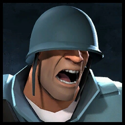

# 🚀 Soldier

**`Class Cap: N/A`**

<mark style="color:green;">**Health:**</mark> **200**\
<mark style="color:yellow;">**Speed:**</mark> _**256.50 HU/s (85.5% base TF2 speed)**_\
\
<mark style="color:blue;">**Pros**</mark>

* Effective at countering Heavy Mutations
* Can launch zombies off of platforms or into map hazards
* Buffs the team with [various effects](secondaries.md) _(Conch for mobility, Battalions for Boss Survivability, Banner for defense.)_&#x20;
* Cannot die to self-sustained explosive damage _(unless using_ [_Rocket Jumper_](primaries.md#rocket-jumper)_)_

<mark style="color:red;">**Cons**</mark>

* One of the slower classes _(without the_ [_Pain Train_](melees.md#pain-train) _held out or active_ [_Concherer_](secondaries.md#concheror)_)_
* Lowest DPS out of all the classes
* Can easily boost zombies into unfavorable height advantages
* Rockets are slow making his defending inconsistent and very poor in wide open areas
* Cannot rocket jump _(only **ze\_freezy** and **ze\_breezy** have this enabled.)_

\
**A Soldier's main job in Zombie Escape is to support the team with various banner effects while slowing the zombies down with AoE explosives.** His rocket launchers may be easy to use, but they can prove to be very dangerous. Plus, you won't be able to rocket jump to escape, so you'll have to make the most of the class through team utility.\
\
This will come in the form of team-wide buffs that are situational but very strong if timed correctly.&#x20;

* His [**Buff Banner**](secondaries.md#buff-banner) can provide **mini-crits** to deal more damage _(against zombies)_ and, consequently, more knockback.
* His [**Battallion's Backup**](secondaries.md#battalions-backup) can provide **damage resistance** to protect against some sources of damage _(This includes damage taken from bosses. You'll commonly see Soldiers firing rockets towards any available zombie cage to build new banner charge for this.)_
* His [**Concheror**](secondaries.md#concheror), one of the best utilities in the game, can provide **speed boosts** and **health regen upon damaging zombies.** All this allows him to juggle between being a supportive defender, staller, or retreater depending on what best fits the situation.&#x20;


One **VERY** important thing to note about Soldier banners is that all of his P**rimaries have damage fall-off&#x20;**_**(against Zombies only)**_**&#x20;based on range!**&#x20;

This means you'll be building <mark style="color:red;">**less banner**</mark> <mark style="color:red;">**per hit the further Zombies away from you are.**</mark> (_The **Cow Mangler's** secondary fire can work around this via burn damage from afar.)_


If you want to utilize his rockets, you will have to be careful with how you fire them to avoid accidentally "boosting" zombies into positions that will kill your team. It's crucial that you try to hit a zombie directly rather than go for splash damage to mitigate these issues. The [Liberty Launcher](primaries.md#liberty-launcher) and [Direct Hit](primaries.md#direct-hit) can help with this. Although, in some scenarios, it may be helpful to launch zombies if it's off of edges or thin platforms. There really should not be more than 2 or 3 soldiers in a team to avoid boosting altogether, _which is ironic given that Soldier is the class automatically chosen on joining the server._
