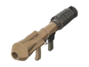

# Soldier Primaries

## Liberty Launcher   .png>)

| Attributes                                                                                                                                                                                   |
| -------------------------------------------------------------------------------------------------------------------------------------------------------------------------------------------- |
| **Clip Size - 5 Shots**                                                                                                                                                                      |
| **Blast Radius: 146**                                                                                                                                                                        |
| **Projectile Speed: 1771**                                                                                                                                                                   |
| <mark style="color:blue;">**+40% Projectile Speed**</mark>                                                                                                                                   |
| <mark style="color:blue;">**-25% Blast Damage from \[self-inflicted explosive damage]**</mark>                                                                                               |
| <mark style="color:blue;">**+204% Damage Bonus**</mark>                                                                                                                                      |
| <mark style="color:red;">**-50% Damage vs Players**</mark>                                                                                                                                   |
| <mark style="color:red;">**-15% Slower Firing Speed**</mark>                                                                                                                                 |
| <mark style="color:red;">**-25% Slower Reload Time**</mark>                                                                                                                                  |
| _<mark style="color:orange;">**1 Point of Rocket Specialist:**</mark>_**&#x20;**<mark style="color:blue;">**+15% Rocket Speed**</mark>                                                       |
| <mark style="color:orange;">**On direct hit: rocket does maximum damage, \[stops target momentum], and increases**</mark>**&#x20;**<mark style="color:blue;">**blast radius by +15%**</mark> |

<table data-view="cards"><thead><tr><th></th><th></th><th></th><th></th><th></th><th></th></tr></thead><tbody><tr><td><mark style="color:purple;"><strong>[Timings]</strong></mark></td><td>Attack Interval: 0.93</td><td>TEC: 4.65 seconds</td><td>Reload Time (First): 1.155 seconds</td><td>Reload Time (Consec.): 1.005 seconds</td><td>Full Reload Time: 5.175 seconds</td></tr><tr><td><mark style="color:purple;"><strong>Damage [Func_Physbox]</strong></mark></td><td>Base Damage: 273.6 per shot</td><td><strong>Real DPS:</strong> 139.236 DPS</td><td>Clip DPS <em>(Nonstop)</em>: 294.193 DPS</td><td></td><td></td></tr><tr><td><mark style="color:purple;"><strong>Damage [Func_Breakable]</strong></mark></td><td>Base Damage: 342 per shot</td><td><strong>Real DPS:</strong> 174.045 DPS</td><td>Clip DPS <em>(Nonstop)</em>: 367.741 DPS</td><td></td><td></td></tr></tbody></table>

The Liberty Launcher in base TF2 sacrifices damage at the cost of increased clip size and increased projectile speed. It’s one of the lesser-used rocket launchers, primarily because of the decreased damage output.

The most notable attribute here is the addition of Rocket Specialist, which **allows players to halt all movement on zombies upon direct hit with this weapon even while they are ÜberCharged or using a Heavy Enzyme.** _(This covers a downside to Sniper and Demoman stuns, as they cannot stop zombies through Über.)_ These particular zombies could easily kill a defender especially on certain tight chokepoints; so its a nice option against particularly sweaty zombies to completely shut them down. Aside from that niche, it has suboptimal damage sitting at (\~140 Sustained DPS), a slower firing speed, and a slower reload time making it feel sluggish to use - these are both in place to hinder rockets from being spammed for constant movement denial.

## Cow Mangler 5000   .png>)

| Attributes                                                                                                                                  |
| ------------------------------------------------------------------------------------------------------------------------------------------- |
| **Clip Size - 4 Shots**                                                                                                                     |
| **Blast Radius: 146**                                                                                                                       |
| **Projectile Speed: 1100**                                                                                                                  |
| <mark style="color:blue;">**+67% Banner Buff Duration**</mark>**&#x20;**<mark style="color:yellow;">**(\~25 Seconds Total)**</mark>         |
| <mark style="color:blue;">**+155% Damage Bonus**</mark>                                                                                     |
| <mark style="color:red;">**-50% Damage vs Players**</mark>                                                                                  |
| <mark style="color:red;">**-15% Slower Firing Speed**</mark>                                                                                |
| <mark style="color:orange;">**Gains a damage bonus as rage increases, up to +40%**</mark>                                                   |
| <mark style="color:orange;">**Does not require ammo**</mark>                                                                                |
| <mark style="color:orange;">**Minicrits whenever it would normally crit**</mark>                                                            |
| <mark style="color:orange;">**Alt-Fire: A charged shot that mini-crits players, sets them on fire and disables buildings for 4 sec**</mark> |

<table data-view="cards"><thead><tr><th></th><th></th><th></th><th></th><th></th><th></th></tr></thead><tbody><tr><td><mark style="color:purple;"><strong>[Timings]</strong></mark></td><td>Attack Interval: 0.93</td><td>TEC: 3.72 seconds</td><td>Reload Time (First): 0.93 seconds</td><td>Reload Time (Consec.): 0.81 seconds</td><td>Full Reload Time: 3.36 seconds</td></tr><tr><td><mark style="color:purple;"><strong>Damage [Func_Physbox]</strong></mark></td><td>Base Damage: 229.5 per shot</td><td><strong>Real DPS:</strong> 129.66 DPS</td><td><strong>Real DPS (Full Rage):</strong> 181.524 DPS</td><td>Clip DPS <em>(Nonstop)</em>: 246.774 DPS</td><td>Clip DPS <em>(Full Rage, Nonstop)</em>: 345.484 DPS</td></tr><tr><td><mark style="color:purple;"><strong>Damage [Func_Breakable]</strong></mark></td><td>Base Damage: 286 per shot</td><td><strong>Real DPS:</strong> 161.581 DPS</td><td><strong>Real DPS (Full Rage):</strong> 226.213 DPS</td><td>Clip DPS <em>(Nonstop)</em>: 307.526 DPS</td><td>Clip DPS <em>(Full Rage, Nonstop)</em>: 430.356 DPS</td></tr></tbody></table>

The Cow Mangler 5000 in base TF2 is a unique variant of the rocket launchers that offers unlimited ammo at the cost of never being able to utilize full crits. and a decreased damage output to buildings. It also sacrifices these benefits for its ability to fire a charged shot that has **guaranteed minicrits, ignites enemies,** and disables buildings. Only those first two attributes of the charged shot are really relevant in Zombie Escape, as they allow players to more reliably build up banner rage at a distance.

This sort of established the original niche of the weapon in Zombie Escape as a utility for building banner rage, _(since damage falloff would pretty much make rockets without minicrits deal insignificant damage when far enough away, thus rewarding less banner.)_ These changes supplement this role in a manner similar to the currently proposed Black Box. It starts off weak at \~130 sustained DPS but can reach \~182 sustained DPS with full banner rage. With this steeper DPS penalty and due to the fact there's no heal-on-hit like the Black Box, this gives room for a much longer buff duration; from <mark style="color:yellow;">**\~15 seconds**</mark> (due to plugin things) to <mark style="color:yellow;">**\~25 seconds.**</mark> That's a whole _**ten more seconds**_ of either providing boss tanking with Battalions or Conch for a prolonged stall!

## Black Box   .png>)

| Attributes                                                                                                                          |
| ----------------------------------------------------------------------------------------------------------------------------------- |
| **Clip Size - 3 Shots**                                                                                                             |
| **Blast Radius: 146**                                                                                                               |
| **Projectile Speed: 1100**                                                                                                          |
| <mark style="color:blue;">**+25% Faster Reload Time**</mark>                                                                        |
| <mark style="color:blue;">**+34% Banner Buff Duration**</mark>**&#x20;**<mark style="color:yellow;">**(\~20 Seconds Total)**</mark> |
| <mark style="color:blue;">**+144% Damage Bonus**</mark>                                                                             |
| <mark style="color:red;">**-50% Damage vs Players**</mark>                                                                          |
| <mark style="color:red;">**-15% Slower Firing Speed**</mark>                                                                        |
| <mark style="color:orange;">**Gains a damage bonus as rage increases, up to +20%**</mark>                                           |
| <mark style="color:orange;">**On Hit: Gain up to +20 health per attack**</mark>                                                     |

<table data-view="cards"><thead><tr><th></th><th></th><th></th><th></th><th></th><th></th></tr></thead><tbody><tr><td><mark style="color:purple;"><strong>[Timings]</strong></mark></td><td>Attack Interval: 0.93</td><td>TEC: 2.79 seconds</td><td>Reload Time (First): 0.69 seconds</td><td>Reload Time (Consec.): 0.6 seconds</td><td>Full Reload Time: 1.89 seconds</td></tr><tr><td><mark style="color:purple;"><strong>Damage [Func_Physbox]</strong></mark></td><td>Base Damage: 219.6 per shot</td><td><strong>Real DPS:</strong> 140.769 DPS</td><td><strong>Real DPS (Full Rage):</strong> 168.923 DPS</td><td>Clip DPS <em>(Nonstop)</em>: 236.129 DPS</td><td>Clip DPS <em>(Full Rage, Nonstop)</em>: 283.355 DPS</td></tr><tr><td><mark style="color:purple;"><strong>Damage [Func_Breakable]</strong></mark></td><td>Base Damage: 274 per shot</td><td><strong>Real DPS:</strong> 175.64 DPS</td><td><strong>Real DPS (Full Rage):</strong> 210.768 DPS</td><td>Clip DPS <em>(Nonstop)</em>: 294.623 DPS</td><td>Clip DPS <em>(Full Rage, Nonstop)</em>: 353.548 DPS</td></tr></tbody></table>

The Black Box in base TF2 is a rocket launcher commonly used by soldiers for its self-sustainability through health-on-hit. At a cost, its clip size is reduced, thus losing out on important burst damage for initial combats.&#x20;

In Zombie Escape, it keeps these attributes. While the smaller clip size may have less impact due to constantly spamming rockets, the heal-on-hit can be fairly beneficial. As a new quirk, this weapon now acts as a supportive weapon that plays around banner building.

Firstly, one may notice that this weapon's sustained DPS is \~141, which is at the lower end of rocket launchers. With a full banner charge, this weapon's damage output is increased by 1.2, bringing the sustained DPS to \~169, or on par with the stock Rocket Launcher. Secondly, this weapon also provides an increased buff duration from <mark style="color:yellow;">**\~15 seconds**</mark> (due to plugin things) to <mark style="color:yellow;">**\~20 seconds**</mark> much akin to being a Cow Mangler sidegrade. This creates a new dynamic where Black Box users can provide greater team support via longer banners at the cost of damage output, or simply keep their full charge and enjoy their buffed DPS.

## Direct Hit   .png>)

| Attributes                                                                                                               |
| ------------------------------------------------------------------------------------------------------------------------ |
| **Clip Size - 4 Shots**                                                                                                  |
| **Blast Radius: 43.8**                                                                                                   |
| **Projectile Speed: 2200**                                                                                               |
| <mark style="color:blue;">**+100% Projectile Speed**</mark>                                                              |
| <mark style="color:blue;">**+25% Faster Reload time**</mark>                                                             |
| <mark style="color:blue;">**+204% Damage Bonus**</mark>                                                                  |
| <mark style="color:red;">**-25% Damage vs Players**</mark>                                                               |
| <mark style="color:red;">**-70% Explosion Radius**</mark>                                                                |
| <mark style="color:red;">**+100% Damage to Self**</mark>                                                                 |
| <mark style="color:red;">**-25 Max Health on Wearer**</mark>                                                             |
| <mark style="color:orange;">**Mini-crits targets launched airborne by explosions, grapple hooks or rocket packs**</mark> |
| <mark style="color:orange;">**Applies -500 z velocity on damage (Hidden)**</mark>                                        |

<table data-view="cards"><thead><tr><th></th><th></th><th></th><th></th><th></th><th></th></tr></thead><tbody><tr><td><mark style="color:purple;"><strong>[Timings]</strong></mark></td><td>Attack Interval: 0.81</td><td>TEC: 3.24 seconds</td><td>Reload Time (First): 0.69 seconds</td><td>Reload Time (Consec.): 0.6 seconds</td><td>Full Reload Time: 2.49 seconds</td></tr><tr><td><mark style="color:purple;"><strong>Damage [Func_Physbox]</strong></mark></td><td>Base Damage: 273.6 per shot</td><td><strong>Real DPS:</strong> 190.994 DPS</td><td>Clip DPS <em>(Nonstop)</em>: 337.777 DPS</td><td></td><td></td></tr><tr><td><mark style="color:purple;"><strong>Damage [Func_Breakable]</strong></mark></td><td>Base Damage: 342 per shot</td><td><strong>Real DPS:</strong> 238.743 DPS</td><td>Clip DPS <em>(Nonstop)</em>: 422.222 DPS</td><td></td><td></td></tr></tbody></table>

The Direct Hit in base TF2 is a rocket launcher that rewards accurate aim. This is done via its smaller blast radius but increased damage output and minicrit on airshot. While you may find zombies occasionally launched in the air for these types of shots, it’s generally something to be advised against purposefully doing. Plus, the bonus damage for this is negligible due to the extremely high zombie health and external sources of mini-crits provided. What can be accentuated is the overall damage bonus, which makes this **a skilled Soldier’s weapon of choice for fighting bosses** or dishing out high single-target damage on zombies.

Supplementing its high-end damage output is a <mark style="color:orange;">**-500 z velocity**</mark> applied on hit to spike zombies downwards - (a zombie mid-air over something like a gap will be immediately sent down on hit.) This lessened blast radius will also help prevent inadvertently spiking nearby zombies.

The decreased blast radius also makes it slightly harder to fight faster-moving bosses, so the speed increase on rockets should allow players to land direct shots more consistently. As a final touch, the Direct Hit has been given a -**25 max health penalty** and a **+100% blast damage** **to self** penalty to compensate for all the extremified attributes and to make the weapon riskier to run.

## Air Strike  .png>)

| Attributes                                                                                                                                                                                   |
| -------------------------------------------------------------------------------------------------------------------------------------------------------------------------------------------- |
| **Clip Size - 4 Shots (Max 8)**                                                                                                                                                              |
| **Blast Radius: 131.4**                                                                                                                                                                      |
| **Projectile Speed: 1771**                                                                                                                                                                   |
| <mark style="color:yellow;">**Hold Fire to load up to four rockets - Release Fire to unleash the barrage.**</mark>                                                                           |
| <mark style="color:blue;">**+60% Faster Firing Speed**</mark>                                                                                                                                |
| <mark style="color:blue;">**+40% Projectile Speed**</mark>                                                                                                                                   |
| <mark style="color:blue;">**-15% Blast Damage from \[self-inflicted explosive damage]**</mark>                                                                                               |
| <mark style="color:blue;">**+134% Damage Bonus**</mark>                                                                                                                                      |
| <mark style="color:red;">**-50% Damage vs Players**</mark>                                                                                                                                   |
| <mark style="color:red;">**-50% Slower Reload Time**</mark>                                                                                                                                  |
| <mark style="color:red;">**-10% Explosion Radius**</mark>                                                                                                                                    |
| <mark style="color:red;">**+1.0 degrees random projectile deviation**</mark>                                                                                                                 |
| <mark style="color:red;">**When Held: No Ammo from Dispensers**</mark>                                                                                                                       |
| _<mark style="color:orange;">**1 Point of Rocket Specialist:**</mark>_**&#x20;**<mark style="color:blue;">**+15% Rocket Speed**</mark>                                                       |
| <mark style="color:orange;">**On direct hit: rocket does maximum damage, \[stops target momentum], and increases**</mark>**&#x20;**<mark style="color:blue;">**blast radius by +15%**</mark> |
| <mark style="color:orange;">**Clip Size Increased on Kill**</mark>                                                                                                                           |

<table data-view="cards"><thead><tr><th></th><th></th><th></th><th></th><th></th><th></th><th></th><th></th></tr></thead><tbody><tr><td><mark style="color:purple;"><strong>[Timings]</strong></mark></td><td>Attack Interval: 0.33</td><td>TEC: 1.32 seconds</td><td><strong>(Max Clip)</strong> TEC: 2.64 seconds</td><td>Reload Time (First): 1.29 seconds</td><td>Reload Time (Consec.): 1.29 seconds</td><td>Full Reload Time: 5.16 seconds</td><td><strong>(Max Clip)</strong> Full Reload Time: 10.32 seconds</td></tr><tr><td><mark style="color:purple;"><strong>Damage [Func_Physbox]</strong></mark></td><td>Base Damage: 210.6 per shot</td><td><strong>Real DPS:</strong> 130 DPS</td><td>Clip DPS <em>(Nonstop)</em>: 130 DPS</td><td></td><td></td><td></td><td></td></tr><tr><td><mark style="color:purple;"><strong>Damage [Func_Breakable]</strong></mark></td><td>Base Damage: 263 per shot</td><td><strong>Real DPS:</strong> 162.345 DPS</td><td>Clip DPS <em>(Nonstop)</em>: 162.345 DPS</td><td></td><td></td><td></td><td></td></tr></tbody></table>

The Air Strike in base TF2 is a fun weapon that works in tandem with its clip size increase on kill to let you barrage enemies. Unfortunately, you can’t rocket jump as a human in Zombie Escape currently, so you won’t be able to take advantage of the increased firing speed while doing so.&#x20;

Instead, this weapon facilitates a different niche of holding back zombies as a _hybrid_ between the modified Liberty Launcher and Beggar’s Bazooka. Recall that the Liberty Launcher has **Rocket Specialist, which can "stun" zombies on direct hits even through Über.** To mimic the feeling of barraging enemies, this weapon also implements the Beggar's Bazooka's burst functionality, achieved through its fast fire rate and pre-loading mechanic. This dual utility does come at the cost of being the rocket launcher with the lowest sustained and nonstop DPS of 130.

This weapon will initially start off with a clip size of \~4. The faster fire rate and loading capability will allow players to store this number of rockets and then fire them in quick succession to hold down an area of zombies. Timed right, this can easily shut down a dangerous push; however, having a longer reload time will make it less consistent to use throughout the duration of a defense compared to the Liberty Launcher. If you do happen to kill a zombie, the clip size will increase by \~1 until the maximum capacity of \~8 rockets is reached. This increased clip size won't dramatically increase this weapon's DPS, but it will increase the duration at which one can continually barrage zombies to effectively stunlock them. This will become very helpful for fallbacks in close quarters or for defenses dangerously close to zombie teleports. It will be up to players to find the most opportune moments to utilize the strength of this weapon's burst stun capabilities and the moments where they can kill zombies to strengthen it.

## Beggar's Bazooka  .png>)

| Attributes                                                                                                         |
| ------------------------------------------------------------------------------------------------------------------ |
| **Clip Size - 1/2/3 Shots**                                                                                        |
| **Blast Radius: 116.8**                                                                                            |
| **Projectile Speed: 1100**                                                                                         |
| <mark style="color:yellow;">**Hold Fire to load up to three rockets - Release Fire to unleash the barrage**</mark> |
| <mark style="color:blue;">**+70% faster firing speed (Hidden)**</mark>                                             |
| <mark style="color:blue;">**+100% Damage Bonus**</mark>                                                            |
| <mark style="color:red;">**-50% Damage vs Players**</mark>                                                         |
| <mark style="color:red;">**-15% Slower Firing Speed**</mark>                                                       |
| <mark style="color:red;">**-30% Slower Reload Time (Hidden)**</mark>                                               |
| <mark style="color:red;">**-20% Explosion Radius**</mark>                                                          |
| <mark style="color:red;">**+1.5 Degrees Random Projectile Deviation**</mark>                                       |
| <mark style="color:red;">**Overloading the chamber will cause a misfire**</mark>                                   |
| <mark style="color:red;">**When Held: No Ammo from Dispensers**</mark>                                             |

<table data-view="cards"><thead><tr><th></th><th></th><th></th><th></th><th></th><th></th></tr></thead><tbody><tr><td><mark style="color:purple;"><strong>[Timings]</strong></mark></td><td>Attack Interval: 0.285</td><td>TEC: 0.855 seconds</td><td>Reload Time (First): 0.705 seconds</td><td>Reload Time (Consec.): 0.705 seconds</td><td>Full Reload Time: 2.115 seconds</td></tr><tr><td><mark style="color:purple;"><strong>Damage [Func_Physbox]</strong></mark></td><td>Base Damage: 180 per shot</td><td><strong>Real DPS:</strong> 181.818 DPS</td><td>Clip DPS <em>(Nonstop)</em>: 181.818 DPS</td><td></td><td></td></tr><tr><td><mark style="color:purple;"><strong>Damage [Func_Breakable]</strong></mark></td><td>Base Damage: 225 per shot</td><td><strong>Real DPS:</strong> 227.272 DPS</td><td>Clip DPS <em>(Nonstop)</em>: 227.272 DPS</td><td></td><td></td></tr></tbody></table>

The Beggar's Bazooka is a unique rocket launcher in base TF2 that allows Soldiers to load rockets and fire them in bursts. It does come at the risk of overloading, causing self-explosive damage, and having less accuracy due to an applied random projectile deviation.&#x20;

The modified version of this weapon in Zombie Escape doesn't stray too far from this functionality. It's only changed features include a +100% damage bonus, a -50% damage penalty vs players, a 15% slower fire rate, and a +1.5 degree random projectile deviation. This makes it slightly more accurate and makes it the third most damaging rocket launcher with a sustained DPS of \~182.0

## Rocket Launcher   .png>)

| Attributes                                                   |
| ------------------------------------------------------------ |
| **Clip Size - 4 Shots**                                      |
| **Blast Radius: 146**                                        |
| **Projectile Speed: 1100**                                   |
| <mark style="color:blue;">**+25% Faster Reload Time**</mark> |
| <mark style="color:blue;">**+171% Damage Bonus**</mark>      |
| <mark style="color:red;">**-50% Damage vs Players**</mark>   |

<table data-view="cards"><thead><tr><th></th><th></th><th></th><th></th><th></th><th></th></tr></thead><tbody><tr><td><mark style="color:purple;"><strong>[Timings]</strong></mark></td><td>Attack Interval: 0.81</td><td>TEC: 3.24 seconds</td><td>Reload Time (First): 0.69 seconds</td><td>Reload Time (Consec.): 0.6 seconds</td><td>Full Reload Time: 2.49 seconds</td></tr><tr><td><mark style="color:purple;"><strong>Damage [Func_Physbox]</strong></mark></td><td>Base Damage: 243.9 per shot</td><td><strong>Real DPS:</strong> 170.261 DPS</td><td>Clip DPS <em>(Nonstop)</em>: 301.111 DPS</td><td></td><td></td></tr><tr><td><mark style="color:purple;"><strong>Damage [Func_Breakable]</strong></mark></td><td>Base Damage: 304 per shot</td><td><strong>Real DPS:</strong> 212.216 DPS</td><td>Clip DPS <em>(Nonstop)</em>: 375.308 DPS</td><td></td><td></td></tr></tbody></table>

The Rocket Launcher is practically the go-to primary for most Soldiers in base TF2. It's consistent, does good enough damage, and gets the job done overall.

For the purposes of Zombie Escape, not many attributes of the weapon have been tweaked other than what would be expected - leaving it to be one of the least gimmicky options in the mode to a point where it _may as well be suboptimal_ running this other than it being a generic spammy rocket. You can get a lot more mileage for your team using anything else here.

## Rocket Jumper  .png>)

| Attributes                                                                                    |
| --------------------------------------------------------------------------------------------- |
| **Clip Size - 1 Shots**                                                                       |
| **Blast Radius: 182.5**                                                                       |
| **Projectile Speed: 550**                                                                     |
| <mark style="color:blue;">**+25% Explosion Radius**</mark>                                    |
| <mark style="color:blue;">**+1011% Damage Bonus**</mark>**&#x20;**~~_**(no, not a typo.)**_~~ |
| <mark style="color:red;">**-50% Damage vs Players**</mark>                                    |
| <mark style="color:red;">**-337% Slower Firing Speed**</mark>                                 |
| <mark style="color:red;">**When Held: 20% Slower Move Speed on Wearer.**</mark>               |
| <mark style="color:red;">**-63% Slower Reload Time**</mark>                                   |
| <mark style="color:red;">**-50% Projectile Speed**</mark>                                     |
| <mark style="color:red;">**-150% Deploy/Holster Speed**</mark>                                |
| <mark style="color:red;">**+200% Damage To Self**</mark>                                      |
| <mark style="color:orange;">**On Hit: Slow target movement by 40% for 3.0s**</mark>           |
| <mark style="color:orange;">**No Rocket Jumping.**</mark>                                     |

<table data-view="cards"><thead><tr><th></th><th></th><th></th><th></th><th></th><th></th></tr></thead><tbody><tr><td><mark style="color:purple;"><strong>[Timings]</strong></mark></td><td>Attack Interval: 3.51</td><td>TEC: 3.51 seconds</td><td>Reload Time (First): 1.5 seconds</td><td>Reload Time (Consec.): 1.305 seconds</td><td>Full Reload Time: 1.5 seconds</td></tr><tr><td><mark style="color:purple;"><strong>Damage [Func_Physbox]</strong></mark></td><td>Base Damage: 999.9 per shot</td><td><strong>Real DPS:</strong> 199.58 DPS</td><td>Clip DPS <em>(Nonstop)</em>: 284.871 DPS</td><td></td><td></td></tr><tr><td><mark style="color:purple;"><strong>Damage [Func_Breakable]</strong></mark></td><td>Base Damage: 1249 per shot</td><td><strong>Real DPS:</strong> 249.301 DPS</td><td>Clip DPS <em>(Nonstop)</em>: 355.84 DPS</td><td></td><td></td></tr></tbody></table>

The Rocket Jumper in base TF2 is a weapon that allows players to rocket jump without self-inflicted blast damage, at the cost of being able to damage enemy players. It’s a fun weapon used for new players to learn the mechanics of rocket jumping or for those already familiar to more easily cruise through maps. **Since you cannot currently rocket jump in Zombie Escape&#x20;**~~_**(nor hopefully will you ever be able to)**_~~**, this weapon’s entire gimmick is gone.**&#x20;

A weapon that hurts both zombies and you - you won’t be able to outrun your choices for using this weapon. This Rocket Jumper comes with a 150% slower deploy and holster time penalty, making it a weapon to **commit to** if you whip it out. _If_ you land a shot with this, you can reduce a hit zombies’ movement speed to a minimum of 240 HU/s for <mark style="color:yellow;">**\~3 seconds**</mark>. But if you somehow hit yourself with this, the +200% damage to yourself might leave you at death's door or dead outright. With it active, your movement speed will also be reduced by -20%.

Sure - it _does_ do the most high-end soldier damage, but that requires a boss that isn't mobile in most cases; otherwise you'll probably miss with that horrendous rocket speed - maybe stick to the Direct Hit if you're going for boss damage as Soldier. Rather than take this weapon in the direction of a Rocket Launcher alternative, it has been extremified as a semi-joke weapon. This weapon will be slow to respond, slow to fire, slow to run with, and will slow zombies all at once. It will slowly deplete everyone's sanity as they watch teammates inadvertently blow themselves up or attempt to blow the zombies up with their super slow rockets.
