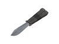
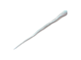
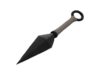

# Spy Melees

## Knife   

| Attributes                                                                                         |
| -------------------------------------------------------------------------------------------------- |
| <mark style="color:orange;">**You become ÜberCharged and gain a speedboost on a backstab.**</mark> |

The stock Knife is your standard weapon of choice. You gain ÜberCharge and a speed boost on backstab without any of the potential downsides of other knives. Reliable and consistent though do note that very rarely, the knife will glitch out and not give you the ÜberCharge or speedboost on back stab although this applies to all knives. But then again, when aren't backstabs glitchy?

## Big Earner .png>)

| Attributes                                                                                                                                                                                                                                                                         |
| ---------------------------------------------------------------------------------------------------------------------------------------------------------------------------------------------------------------------------------------------------------------------------------- |
| <mark style="color:blue;">**+30% Cloak on Kill**</mark>                                                                                                                                                                                                                            |
| <mark style="color:blue;">**+10% Cloak on Hit**</mark>                                                                                                                                                                                                                             |
| <mark style="color:red;">**-25 Max Health on Wearer**</mark>                                                                                                                                                                                                                       |
| <mark style="color:orange;">**When Held:**</mark> <mark style="color:orange;">**Marked for death and for a brief period after switching weapons**</mark>                                                                                                                           |
| <mark style="color:orange;">**On Hit:**</mark> <mark style="color:orange;">**+5 seconds of speed boost**</mark><mark style="color:orange;">**&#x20;**</mark>_<mark style="color:orange;">**(overrides 3s speed boost on backstab, doesn't stack, works with face stabs!)**</mark>_ |
| <mark style="color:orange;">**You become ÜberCharged on a backstab (halved time!)**</mark>                                                                                                                                                                                         |

Although the Big Earner lets you get cloak upon getting a kill, you typically want to be at full cloak when going for backstabs as the Dead Ringer is usually the preferred choice among spies - in a pinch though, you can quickly build back any cloak or dead ringer to get away. <mark style="color:red;">**You also only get**</mark><mark style="color:red;">**&#x20;**</mark>_<mark style="color:red;">**half the Übercharge time**</mark>_ _<mark style="color:red;">**on stab and**</mark>_<mark style="color:red;">**&#x20;**</mark><mark style="color:red;">**the**</mark><mark style="color:red;">**&#x20;**</mark>_<mark style="color:red;">**s**</mark>_<mark style="color:red;">**peed-boost only applies upon actually killing a zombie with a backstab;**</mark> making this less optimal than stock at chaining unless you hit all of your stabs. Though the -25 max hp and only getting a speedboost upon backstab kill isn't as crippling of downsides as the other knives, and getting a face-stab if a zombie turns around can provide a smooth getaway speed-boost. Risky!

## Spy-Cicle   

| Attributes                                                                                                          |
| ------------------------------------------------------------------------------------------------------------------- |
| <mark style="color:blue;">**+50% Increased Melee Range (same as Eyelander, 72 HU; stock is 48 HU)**</mark>          |
| <mark style="color:red;">**-100% Slower Swing Speed (1.6s attack interval instead of 0.8s)**</mark>                 |
| <mark style="color:orange;">**On Hit: +1.5s of 40% slowness applied to zombies.**</mark>                            |
| <mark style="color:yellow;">**On Hit by Fire: Fireproof for 1 second and Afterburn immunity for 10 seconds**</mark> |
| <mark style="color:yellow;">**Melts in fire, regenerates in 15 seconds and by picking up ammo**</mark>              |
| <mark style="color:orange;">**Backstab turns victim to ice**</mark>                                                 |
| <mark style="color:orange;">**You become ÜberCharged and gain a speedboost on a backstab.**</mark>                  |

The niche of the Spy-Cicle's afterburn resistance isn't exactly all too useful in Zombie Escape due to the lack of most fire sources other than Pyro enzyme and ammo boxes are scarce due to most maps being ported from CS. Instead, **its given a far larger stab range** to strengthen minor backstabs _(like one or two zombies breaching in)_ due to it being way easier to land a backstab; but struggles around chain-stabbing crowds of zombies with its swing penalty.

## Conniver's Kunai   

| Attributes                                                                                                                   |
| ---------------------------------------------------------------------------------------------------------------------------- |
| <mark style="color:red;">**-55 Max Health on Wearer**</mark>                                                                 |
| <mark style="color:orange;">**On Backstab: Absorbs the health from your victim**</mark>                                      |
| <mark style="color:orange;">**You are overhealed to 300 hp on a backstab kill. You gain a speedboost on a backstab.**</mark> |

The Conniver's Kunai is an interesting choice as it **instead** overheals you to 300 hp on a backstab kill. In almost all cases, an ÜberCharge gained from other knives will save you just as well if not more so. Backstabs, Bushwhacka snipers using their Mutation or even two consecutive zombie hits will kill you that an ÜberCharge could have saved you from. It's also worth mentioning that it gives you less max HP, making damage against NPCs and bosses even more deadly when you have no zombies to backstab. As a result, the main benefit of this knife will be the burst healing it provides in the very small off chance you need the health over Über to survive.

## Your Eternal Reward   .png>)

| Attributes                                                                                                                    |
| ----------------------------------------------------------------------------------------------------------------------------- |
| <mark style="color:blue;">**+33% cloak drain rate**</mark>                                                                    |
| <mark style="color:blue;">**+66% damage vs players**</mark>                                                                   |
| <mark style="color:orange;">**Upon a successful backstab against a human target, you rapidly disguise as that enemy.**</mark> |
| <mark style="color:yellow;">**Disguises do not require cloak meter.**</mark>                                                  |
| <mark style="color:orange;">**Reduced Decloak Sound**</mark>                                                                  |
| <mark style="color:orange;">**Silent Killer: No attack noise from backstabs**</mark>                                          |
| <mark style="color:orange;">**You do not become ÜberCharged and do not gain a speedboost on a backstab.**</mark>              |

Since the ÜberCharge on backstab effect is removed, all that the Eternal Reward should be good for is stealthily chain-stabbing, or especially picking out zombie item users now that it dishes out more damage-capablity. However, the auto-cloak does not work properly as it only disguises you as a **Blu** teammate rather than **Red**. Added onto that, disguising will take up your **entire cloak.** This will delay the time before you can sneak into the zombie backlines or the ability to survive with the Dead Ringer.
