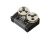
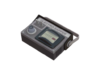

# Spy Sappers

## Red-Tape Recorder   

| Attributes                                                                                                                                                                                                                                                              |
| ----------------------------------------------------------------------------------------------------------------------------------------------------------------------------------------------------------------------------------------------------------------------- |
| <mark style="color:blue;">**When Held: +3 Health Regenerated Per Second on Wearer**</mark>                                                                                                                                                                              |
| <mark style="color:red;">**When Held:**</mark> <mark style="color:red;">**+20% Damage Vulnerability on Wearer**</mark>                                                                                                                                                  |
| <mark style="color:red;">**NOTE: Healing does**</mark><mark style="color:red;">**&#x20;**</mark>_<mark style="color:red;">**not**</mark>_<mark style="color:red;">**&#x20;**</mark><mark style="color:red;">**seem to work when equipped through Item Plugins.**</mark> |

The Red-Tape Recorder allows you heal yourself for **3** hp per second after a gradual ramp-up. This can be useful for regenerating hp lost when surviving a zombie hit through a Dead Ringer proc. You'll be able to heal back to full hp then hop back into the enemy backlines to keep stabbing. Additionally, this serves as another healing source for when you can't rely on any other sources of healing to save you, such as when healing is nerfed for boss fights or is just generally unavailable. An item like this can encourage dangerous playstyles, so just make sure to not get hit too often.

## Sapper   

| Attributes                                                                                                             |
| ---------------------------------------------------------------------------------------------------------------------- |
| <mark style="color:blue;">**When Held: +2% Faster Move Speed on Wearer**</mark>                                        |
| <mark style="color:red;">**When Held:**</mark> <mark style="color:red;">**+20% Damage Vulnerability on Wearer**</mark> |

A useful tool for doorhugging, the 2% faster move speed from the Sapper is barely a noticeable difference generally speaking, but can at least provide enough of a momentum gain to outspeed non-BFB Scouts to important items. The Red Tape Recorder is simply a much better option though in terms of versatility as it comes into play more often.
