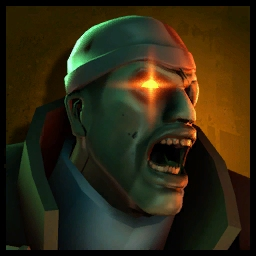

# Zombie Demoman

<figure><figcaption></figcaption></figure>

<mark style="color:yellow;">**Speed:**</mark> _**254.50v HU/s (84.8% base TF2 speed)**_\
<mark style="color:red;">**Damage:**</mark> _**163**_

<mark style="color:blue;">**Pros**</mark>

* **Double Shield Charge **_**(via Enzyme)**_** is decent chase tool against lone, fleeing Humans**
* **Can overcome base damage weakness via shield charge minicrits**

<mark style="color:red;">**Cons**</mark>

* **Weak Base Damage **_**(2x Hits to Infect 200+ HP Human)**_
* **Shield Charge halted upon taking any damage**
  * **Shield Charge also halted by any elevating geometry **_**(ramps/slopes)**_
* **Slowest Base Zombie Class in the gamemode**


### _<mark style="color:yellow;">**Note:**</mark>_ Trimping mechanics are disabled, though **you **_<mark style="color:blue;">**can**</mark>_** still get a movement increase** from the Ali Baba's Wee Booties/Bootlegger as Zombie Demoman _(as long as a shield is equipped.)_



Those accustomed to TF2 might be familiar with the Demoknight - a man restricted to only his intense desire to slash, wack, and slice with his melees, bash people with his shields, and float around in his booties. While he may get to play around with these three in vanilla TF2, Demo here gets half the fun.\
\
As a Demoman, you have access to his versatile melee weapons and his booties. Although, if the item has a head collecting attribute, **you won't actually get heads on kills**. Next up are the shields. They do work... to an _extent_. You can charge, but not in midair. Plus, getting shot _immediately_ negates it.&#x20;

The **Tide Turner** really makes a huge difference in getting zombie demo kills/infects; as the **full turn control** helps a lot in surprising humans around corners and in dodging projectiles. With the right charge _(or double charge via enzyme)_ and melee timing, you can even dish out a minicrit high enough to take out someone with your weakened base damage.

The other shields can't really compare despite their higher resistances and/or recharge rate. This is due to the aforementioned shields, but they can only do so much. Playing Demo will be really niche where it's best for you to focus on soloing out overdefenders or stragglers. Charge at them as soon as they turn and least expect it; and if they're unprepared for a second charge, _do it again!_

<figure><figcaption></figcaption></figure>
