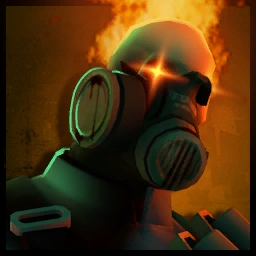

# Zombie Pyro

<figure><figcaption></figcaption></figure>

<mark style="color:yellow;">**Speed:**</mark> _**272.50 HU/s (90.8% base TF2 speed)**_\
<mark style="color:red;">**Damage:**</mark> _**208**_

<mark style="color:blue;">**Pros**</mark>

* **Deal ranged damage via Enzyme**
  * **Can also infect via Enzyme at range**
* **Access to** [**Backscratcher**](../meet-the-humans-outdated-+weapons/pyro/melees.md#backscratcher) **for Extra Damage**
* **Access to** [**Powerjack**](../meet-the-humans-outdated-+weapons/pyro/melees.md#powerjack) **for Extra Speed**

<mark style="color:red;">**Cons**</mark>

* **Enzyme shrugged off by Humans with consistent/constant Healing**&#x20;

As a zombie, the pyro has a lot of utility at his disposal with the different effects provided by his melee items. Aside from that, he's relatively fast, so he can try to weasel his way through humans while still being able to one-shot most of them.

* On using his Mutation, Pyro will drastically drop in health gain **a giant bomb head** _(with a timer to automatically explode if not shot at.)_
* On death, and depending on how long your enzyme charged (5s max) - he will explode, causing scaling fire damage _(50 damage max)_ to up to 10 humans.
* Alone, this won't offer much due to the many healing sources at the Human team's disposal. As a result, it's best to use it in tandem with Mutations to stack damage.
* Weakened players via enzyme can be infected at range via pyro's bomb - _(and can destroy an entire team from the backlines after getting infected.)_
* <mark style="color:red;">**If the bomb head is NOT shot at and manages to fuse all the way down naturally,**</mark><mark style="color:red;">** **</mark>_<mark style="color:red;">**among getting close enough to Humans**</mark>_<mark style="color:red;">** **</mark><mark style="color:red;">**- the explosion can launch both Zombies and Humans alike; sending either into unfavorable positions where Humans might get killed.**</mark><mark style="color:red;">** **</mark>_<mark style="color:red;">**You can use this to your advantage by timing your explosion to go off just before specific teleports.**</mark>_

Given that most people don't like being will panic if they lose too much health, you can generally use this enzyme as a tool to disrupt the Human team. You'll be able to take care of backtracking overdefenders if they miss their shots, as the bomb will very likely trim someone off at point-blank by pushing them somewhere undesirable.\
\
_For melee weapons, there is a few picks to play around with;_

* &#x20;If you need to **move** **fast** but can handle the knockback from the damage vulnerability, you can use the Powerjack.&#x20;
* If you want to **take out Medics healing any overdefenders**, use the Third Degree to damage both the defender _and_ the Medic.&#x20;
* If you want **increased damage**, use the Back Scratcher to reliably one-shot classes with extra health.

<figure><figcaption>
Here's a gif of a pyro getting the full timer explosion at pointblank (without) being shot at to have a (second) pyro boosted up and blow the team away.
</figcaption></figure>
