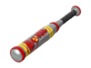
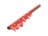

# Zombie Scout

<figure><figcaption></figcaption></figure>

<mark style="color:yellow;">**Speed:**</mark> _**295.50 HU/s (98.5% base TF2 speed)**_\
<mark style="color:red;">**Damage:**</mark> _**88**_


## <mark style="color:red;">**The Atomizer, Wrap Assassin, Sandman, and Fan O' War are banned and unable to be used.**</mark>

&#x20;    .png>)   .png>)


<mark style="color:blue;">**Pros**</mark>

* **Fastest base speed Zombie class**
* **Good flank potential via speed**
  * **Good Zombie Item candidate&#x20;**_**(can close gap between humans quicker to use item on them)**_
* **Useful at pressuring Overdefenders**

<mark style="color:red;">**Cons**</mark>

* **Weak Base Damage&#x20;**_**(3x Hits to Infect 200+ HP Human)**_
* **High Knockback Received**

\
Similar to being the fastest human, Scout is also the fastest zombie. Sacrificing for speed, Scout has his damage towards humans lessened.\
\
**Scout's Mutation gives him a speed boost, indicated by a&#x20;**_**banner effect**_**&#x20;underneath the user.** This is useful for closing in on stallers unexpectedly to make them panic. Do note that this will lower your health significantly, so you will more than likely be shot dead before reaching the humans. This doesn't mean it isn't a great support tool as it can be used effectively to apply mild pressure on fallbacks.

#### _\[Scout Enzyme Gif Missing]_
