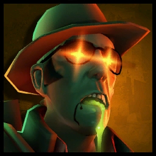
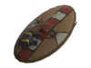

# Zombie Sniper

<figure><figcaption></figcaption></figure>


### _<mark style="color:yellow;">**Note:**</mark>_ The Razorback typically does not function while playing as a Human against stabs; _<mark style="color:blue;">however, it does work when playing Zombie!</mark>_&#x20;

### You can utilize it as a means of anti-backstab when holding [Zombie Items](../../elements-of-zombie-escape/items/common-items.md#zombie-items) and generally wall off cheeky chainstab-farming spies.



<mark style="color:yellow;">**Speed:**</mark> _**272.5v HU/s (90.8% base TF2 speed)**_\
<mark style="color:red;">**Damage:**</mark> _**208**_

<mark style="color:blue;">**Pros**</mark>

* **Excellent Zombie Item Candidiate&#x20;**_**(Won't get backstabbed in most cases via**_ [_**Razorback**_](../meet-the-humans-outdated-+weapons/sniper/secondaries.md#razorback) _**equip)**_
* **Enzyme effectively shuts down&#x20;**_**(reveals)**_**&#x20;cloaked spies/can take out DR spies/overhealed classes**
  * **Enzyme can make Map Hazards/NPCs deal more damage against Humans**
* **Access to** [**Tribalman's Shiv**](../meet-the-humans-outdated-+weapons/sniper/melees.md#tribalmans-shiv) **for** <mark style="color:red;">**Bleed Infect**</mark>**&#x20;to kill humans from range after a melee hit.**.png>)

<mark style="color:red;">**Cons**</mark>

* **No movement increasing weapons**

The Sniper acts like your standard zombie, there's not many gimmicks he can rely on until his enzyme charges, but when this happens, you'll see how his insane damage as a human translates. Oh, and if you got the memo from the note above, he's a perfect zombie class to go when grabbing items - although you might take more knockback, you'll have a good counter against spies that you can't keep track of on every corner.\
\
On using his Mutation, humans within a radius around him will be coated in Jarate for several seconds. **Their visibility will be impaired while they take increased damage from most sources of damage, such as from zombie hits, explosions, and even map-sourced damage.**

**Most dangerously, however, is going be his Bushwacka.** Pair that with his ability and you can one-shot kill any class regardless of overheal. When you kill a human rather than infect them, you won't be stunned. So, if you're able to pop your Mutation and launch yourself into a crowd of humans, expect a big trim. Note that you will take more knockback and damage with it equipped though.

<figure><figcaption>
Insta-killing (no infect) a soldier who otherwise might've had extra HP
</figcaption></figure>
