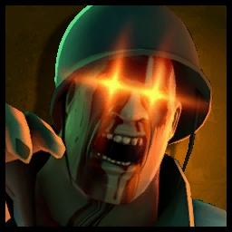

# Zombie Soldier

<figure><figcaption></figcaption></figure>

<mark style="color:yellow;">**Speed:**</mark> _**259 HU/s (86.3% base TF2 speed)**_\
<mark style="color:red;">**Damage:**</mark> _**208**_


## <mark style="color:red;">**The Disciplinary Action is banned and unable to be used.**</mark>

.png>)


<mark style="color:blue;">**Pros**</mark>

* _**...Minicrit on demand?**_

<mark style="color:red;">**Cons**</mark>

* **Second-slowest Zombie Class**
* **Gimmick severely overshadowed by other Zombie Classes**

As a zombie the Soldier doesn't really offer anything at all. The only gimmick he has is the Half-Zatoichi to oneshot any human Demomen or Soldiers using them.&#x20;

His Mutation isn't the best either as it is _very_ situational with Soldier being one of the _**slowest**_ Zombie classes. The pain-train speed boost does not function on him to circumvent this.

The Soldier Enzyme simply has **one** function - and that's beefing up your melee damage (by giving yourself minicrits.) This will last for about <mark style="color:yellow;">**(8 seconds)**</mark> before wearing out. That's all it does.

**The use of minicrits as a zombie when in most instances you'll be one-shotting base HP Humans anyway...?** _Not that good._ Especially with Zombie Heavy still around in town to dish out _even higher_ defense breaking potential for less effort.\
\
Mostly left in the mud enzyme-wise after the removal of their prior enzyme.

~~_\[Enzyme gif never]_~~
