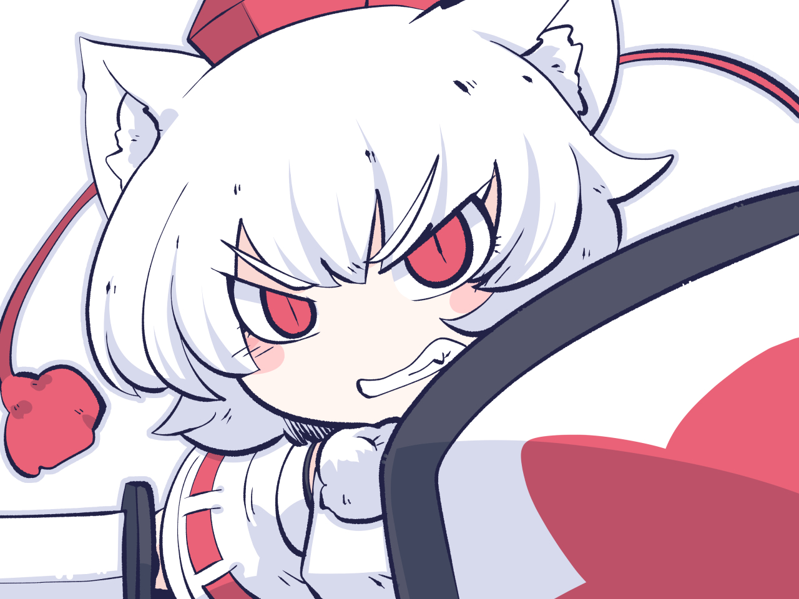

# ⭐Afterword⭐

**Hey, thanks for reading this or stopping by! There's a lot to cover and so much nuance to explore, but we hope this guide covered at least some of the things that make Zombie Escape fun for us in a wacky game like TF2. We hope you find it just as enjoyable or something that can pique your interest from time to time. At the end of the day, it is just a gamemode of meeting new people, getting lost in the chaos, and having fun!**\
\
**A very special thanks to FreedVoid and Tranquility for making this all possible, this guide wouldn't be possible without them!**

<figure><figcaption></figcaption></figure>

<figure><figcaption></figcaption></figure>

"momiji best touhou, fight me" - _infamous_ _last words of a **noob**_
