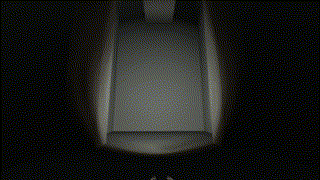

# Better Flashlight

Did you know there is existing support for flashlights in TF2? It is restricted under sv\_cheats 0, which most servers use. However, it's not entirely restricted on the Skial ZE servers, so we are able to use the flashlight at the very least.\
\
To use it, you can either type out these commands in the TF2 console before joining the server or include them in your autoexec.cfg. If you don't know what an autoexec.cfg is, we suggest you search for a guide for setting one up. There are many guides for them out there, and they are fairly simple to set up.

_You don't have to type out the comments (i.e. the // and text following it)._

```
mat_supportflashlight 1  // enables support for flashlights 
mp_flashlight 1          // enable the built-in flashlight on the map
r_shadows 1              // must be enabled for lighting effects to show
```

_Then, you can bind a key to the following command. For this example, we'll use ( f ):_

```
bind f "impulse 100"
```

### The results of this are depicted below:

<figure><figcaption><p><strong>No Flashlight</strong></p></figcaption></figure>

<figure><figcaption><p><strong>Plugin Flashlight</strong></p></figcaption></figure>

<figure><figcaption><p><strong>MP Flashlight</strong></p></figcaption></figure>

<figure><figcaption><p><strong>Plugin + MP Flashlight</strong></p></figcaption></figure>


<mark style="color:yellow;">**You can also use the built-in flashlight**</mark><mark style="color:yellow;">** **</mark>_<mark style="color:yellow;">**with**</mark>_<mark style="color:yellow;">** **</mark><mark style="color:yellow;">**the plugin flashlight!**</mark>


Pretty neat, right? Note that when using them on the server, the HL2 flashlight is much brighter and will stay in-place on your screen, whereas the plugin flashlight will follow along the surfaces in front of you. Feel free to explore other variables you can modify for the flashlight. You won't be able to use them on the server, but you can play around with them on a local server if you wish.

<figure><figcaption></figcaption></figure>
