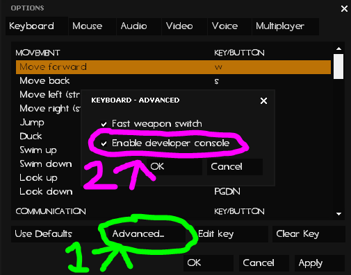

# Useful Console Commands and Keybinds

## Commands


_<mark style="color:yellow;">**Note:**</mark>_ Unlike the plugin commands mentioned earlier, these commands are meant to be entered in the console simply as is <mark style="color:red;">**without any prefixes.**</mark>&#x20;

In the event that you have never enabled your console, or _somehow_ have forgotten where it is; you can activate it through this ->[<mark style="color:purple;">**pathing.**</mark>](#user-content-fn-1)[^1]<-&#x20;


<table><thead><tr><th width="217">Command</th><th>Description</th></tr></thead><tbody><tr><td><strong>snd_restart</strong></td><td>Restarts the sound system. This is useful if your sound is bugging out, you wish to mute any sounds or music, or if you want to reset the sound system if the music you <em>want</em> to hear isn't playing. The current music track will not load again, so you will hopefully be able to hear music when the next track loads in.</td></tr><tr><td><strong>snd_soundmixer Default_Mix</strong></td><td>Usually used to fix sounds being broken in demo recordings due to skipping ticks. Typing this in should fix it by essentially resetting the initial parameter. This command may also be useful in fixing music not playing during a map if used after snd_restart.</td></tr><tr><td><strong>snd_musicvolume &#x3C;0-1></strong></td><td>Adjusts map music through console commands if you don't like certain map music volumes.</td></tr><tr><td><strong>voice_overdrive</strong><br><strong>&#x3C;value></strong></td><td>Dampens the volume of the in-game environment by the amount of dB provided in the value argument. Essentially, this will make it easier to hear voice chat by reducing all other noise by the value provided.</td></tr><tr><td><strong>mat_colorcorrection 0</strong></td><td><p>This can be used to disable any color correction a mapper has applied to their map. This can have good or bad intentions, as usually one would want to keep it on to maintain the intended atmosphere set up by the mapper. However, sometimes color correction may not be working properly or it makes differentiating between RED and BLU players hard to see. Disabling it should help with this if it's too much of an issue.<br></p><p>To reenable it, you can type the command again with a '1' instead of a '0.'</p></td></tr><tr><td><strong>cl_showpos 1</strong></td><td><p>Shows your current position and orientation on the map as well as your current velocity. Note that your velocity will be a maximum of both horizontal and vertical values as there is no separation between the two. This command is especially useful for reporting bugs.<br></p><p>To disable it, you can type the command again with a '0' instead of a '1.'</p></td></tr><tr><td><strong>demo &#x3C;file_name></strong><br><strong>stop</strong></td><td><p>The <strong>demo</strong> command allows you to record gameplay for later review. To stop recording, either leave the server or type stop. If a map ends and you haven't stopped the recording session, a new file will be generated with the same name entered postfixed with a number for differentiating.<br></p><p>Refer to the <a href="https://developer.valvesoftware.com/wiki/Demo_Recording_Tools"><strong>Valve Software Wiki</strong></a> for any other demo related commands.</p></td></tr></tbody></table>

## Keybinds

Recall that you make keybinds by doing the following:

```
bind <key> <command>
```

If the command you wish to enter takes arguments, you can contain both the command and the arguments within semicolons.

But _what can_ we use this for?

⠀⠀⠀o.☆✼★ ━━━━━━━━━━━━━━━━━━━━━━━━━━━━━━━━━━━━━━━━━━━━━━━━━━━━━━━━━━━━━━━━━━ ★✼☆.o ⠀⠀ ⠀(୨ ͡° ͜ʖ ͡°) ୨ ✧_✧･ﾟ:_ 𝓨𝓸𝓾 𝓴𝓷𝓸𝔀 𝔀𝓱𝓪𝓽 ( ͡° ͜ʖ ͡° ) 𝓽𝓱𝓮𝔂'𝓻𝓮 𝓾𝓼𝓮𝓭 𝓯𝓸𝓻 _:･ﾟ✧_✧୧( ͡° ͜ʖ ͡° ୧) ⠀⠀⠀o.☆✼★ ━━━━━━━━━━━━━━━━━━━━━━━━━━━━━━━━━━━━━━━━━━━━━━━━━━━━━━━━━━━━━━━━━━ ★✼☆.o

Yep, for **"say"** binds! Or, well, that and any other command you might need to pop on the fly.

Most people usually are uncomfortable with talking on mic but might need to alert the team of something important like falling back.

Typing monotone text like this might generally be disregarded:

<mark style="color:blue;">**User1:**</mark> fall back

But typing in text like this is sure to get someone's attention:

<mark style="color:blue;">**User1:**</mark> ||>=))=> FALL BACK <=((=<|| <mark style="color:red;">**User2:**</mark> ( ͡° ͜ʖ ͡° ) no

To perform this example, we can type the following:

```
bind p "say ||>=))=> FALL BACK <=((=<||" 
```

Just be mindful of character limits and the keys you use for the bind.

To make plugin commands or any commands in general less of a hassle to use, we can bind them to keys for quick use.

```
bind f sm_flashlight
bind f "say /flashlight" 
```

```
bind h "say /hideteam"
```

```
bind / "say /3"
```

Also note that some triggers like buttons and levers are activated via "**+use.**" It is activated via **"mouse1" by default.** If it's _not_ working for you feel free to bind it to a separate key.

```
bind "mouse4" +use
```

## Voting UI Broken

These are commands you can use to fix the voting UI if it remains on your screen after voting.

**Immediate fix:** `cl_vote_non_input_alpha 0` // make UI fully transparent \
\
**To prevent the issue:** `cl_vote_ui_active_after_voting 0` // prevent the UI from staying on-screen after vote

[^1]: **Options > Keyboard > Advanced >Check 'Enable Developer Console'**

    
